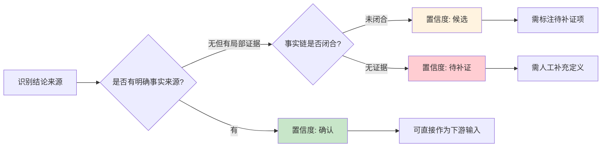

# 置信度分级定义（glossary-confidence-level）

> 本文件定义骨架中统一的置信度分级标准，用于标注结论、规则、定义的可信程度。
> 目标是消除多个模板中置信度定义的重复，形成统一的引用源。

---

## 一、置信度分级标准

| 置信度 | 说明 | 标注条件 | 典型来源 |
|--------|------|----------|----------|
| **确认** | 已找到明确事实来源，可作为后续分析、设计、开发的直接输入 | 有代码/枚举/数据库字段/配置文件/人工定义支撑 | 枚举类定义、数据库字段注释、人工确认定义 |
| **候选** | 有局部证据但事实链尚未闭合，必须显式标注低置信度、证据不足点与待补证项 | 有推断依据但需人工确认或补充证据 | 状态字段推断、配置项推断、代码逻辑推断 |
| **待补证** | 当前范围内未找到足够依据，应明确写为未知/待补证，不得使用模板示例、通用框架常识或常识推断补洞 | 无明确来源，需人工补充定义文档 | 无代码/枚举/字段支撑的场景 |

---

## 二、置信度判断流程



---

## 三、禁止事项

| 禁止项 | 说明 |
|--------|------|
| ❌ 禁止将推断性结论标注为"确认"置信度 | 推断结论必须标注为"候选"或"待补证" |
| ❌ 禁止使用通用框架常识替代项目特定定义 | 不同项目的业务定义可能不同，不得使用通用常识 |
| ❌ 禁止跳过置信度标注 | 所有结论必须标注置信度 |
| ❌ 禁止将模板示例写成既定事实 | 模板示例仅为占位格式，不得标注为"确认" |

---

## 四、适用范围

本置信度定义适用于以下场景：

| 场景类型 | 适用模板/文件 |
|----------|--------------|
| 校验规则结构化 | `validation-rule-structuring-template.md` |
| 业务场景定义索引 | `business-scenario-index-template.md` |
| 架构约束候选结论 | `database-cross-access-rule.md`、`layer-decoupling-channel.md` |
| 其他需要标注可信度的结论 | 各阶段产物、候选规则 |

---

## 五、引用方式

其他文件引用本置信度定义时，使用以下写法：

```markdown
> 置信度定义见：`.opencode/references/mes-ai-reference/reference/glossary-confidence-level.md`
```

---

## 六、与置信度相关的待补证事项处理

当结论标注为"候选"或"待补证"时，必须：

1. **显式标注待补证事项**：明确需要补充确认的具体内容
2. **标注证据来源**：说明当前推断依据是什么
3. **标注升级路径**：说明如何从"候选"升级为"确认"

**示例**：

```markdown
置信度：候选
证据来源：从 t_order.label_print_count 字段推断，打印次数 > 0 可能表示"补打"
待补证事项：
- 需确认"打印次数 > 0"是否等于业务表述"补打标签"
- 需确认是否有枚举类明确定义"补打"状态
升级路径：人工确认后更新为"确认"置信度
```

---

## 七、置信度升级流程

| 步骤 | 操作 | 责任人 |
|------|------|--------|
| 1 | 识别候选/待补证结论 | Agent |
| 2 | 人工确认业务语义 | 架构负责人/业务负责人 |
| 3 | 补充定义文档或代码证据 | 人工补充 |
| 4 | 更新置信度为"确认" | Agent |
| 5 | 更新骨架修改日志留痕 | Agent |

---

## 八、证据来源类型速查

| 来源类型 | 置信度 | 说明 |
|----------|--------|------|
| 枚举类定义 | **确认** | 枚举类中明确定义的场景值 |
| 数据库字段注释 | **确认** | 数据库字段注释明确标注业务含义 |
| 配置文件定义 | **确认** | 配置文件中明确定义的场景参数 |
| 人工定义 | **确认** | 业务人员口头定义或文档定义 |
| 状态字段推断 | **候选** | 从状态字段值推断业务含义 |
| 配置项推断 | **候选** | 从配置项命名推断业务含义 |
| 代码逻辑推断 | **候选** | 从Service方法逻辑推断业务含义 |
| 无明确来源 | **待补证** | 缺少证据，需人工补充定义 |

---

## 九、统一引用写法

"涉及置信度标注、候选结论升级、证据来源判断时，必须符合 `.opencode/references/mes-ai-reference/reference/glossary-confidence-level.md`。"