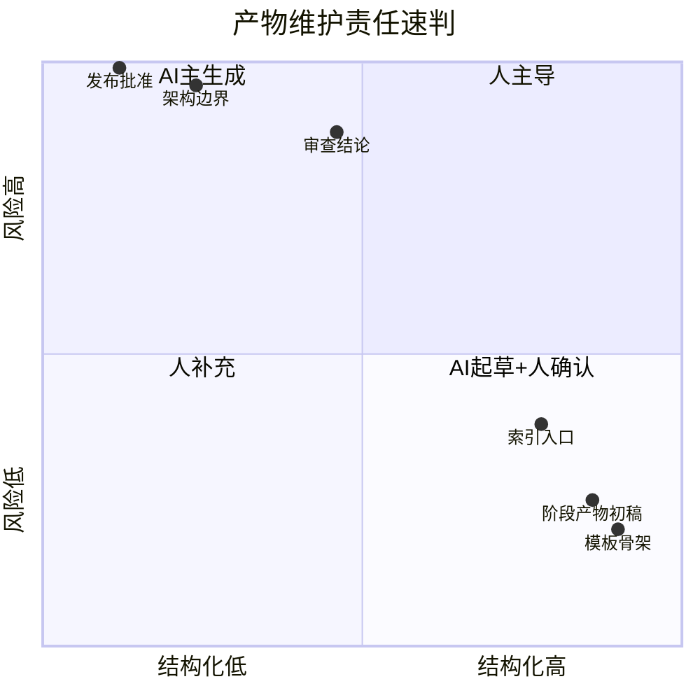
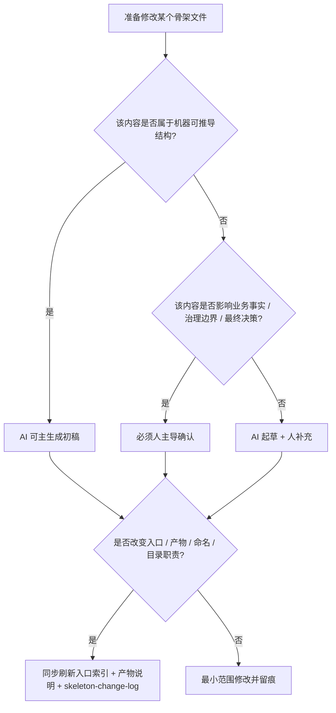
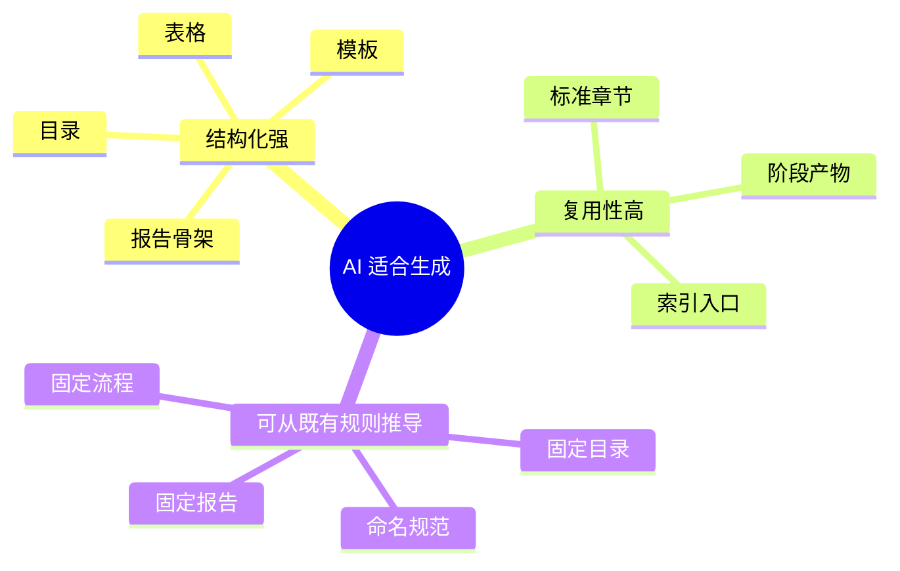
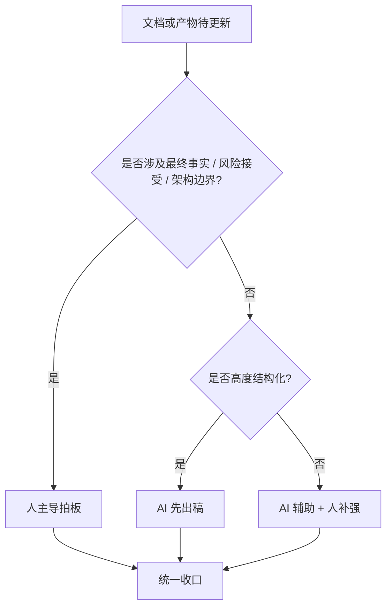
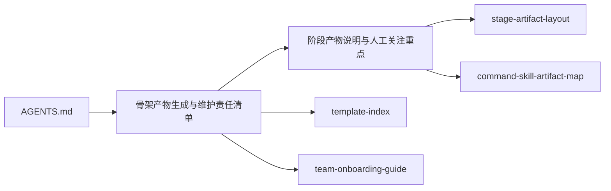

# 骨架产物生成与维护责任清单

> 用途：面向维护者说明“整个骨架里哪些文件通常由 AI 生成、哪些需要人补充、哪些必须由人主导”，并给出推荐补充方式、提示词示例与同步刷新要求。  
> 适用范围：`AGENTS.md`、`.opencode/commands/`、`.opencode/skills/`、`mes-ai-dev/knowledge/`、`.opencode/references/mes-ai-reference/templates/`、`mes-ai-dev/workspace/examples/`、`mes-ai-dev/workspace/refresh/` 下的骨架文件。  
> 配套规则：`.opencode/references/mes-ai-reference/rules/skeleton-change-governance.md`

---

## 一、阅读导航

### 1.1 这份文档适合谁看

| 角色 | 建议重点阅读 | 目的 |
|---|---|---|
| 骨架维护者 | 全文 | 判断某类文件应该由谁主导维护 |
| 新接手成员 | 第一、二、四、八、十章 | 快速理解 AI / 人的责任边界 |
| 阶段执行者 | 第八、九、十章 | 确认“怎么补文档、怎么补产物” |
| 审查者 | 第二、七、十、十一章 | 检查是否存在责任越界和入口漏刷 |

### 1.2 一页结论卡片

> **先记这 4 句：**
>
> 1. **结构化初稿，优先让 AI 生成。**
> 2. **边界、例外、拍板结论，必须人确认。**
> 3. **骨架规则、阶段产物、入口索引，不能只改正文不改导航。**
> 4. **凡是改到产物体系，都要同步刷新说明文档、入口和日志。**

### 1.3 视觉提示卡

> ✅ **优先让 AI 做的**：索引、表格、初稿、模板骨架、阶段产物初稿  
> ⚠️ **必须人工补强的**：例外边界、真实经验、入口解释、风险说明  
> ❌ **不能让 AI 独自拍板的**：最终事实、架构边界、风险接受、发布批准  

---

## 二、先看结论

### 2.1 三类责任边界总览

| 类别 | 定义 | 典型对象 | 人的动作重点 |
|---|---|---|---|
| AI 主生成 | 结构、初稿、目录化产物可由 AI 主导生成 | 阶段产物、模板实例、规则草稿、索引草稿、审查报告初稿 | 审核事实、纠正歧义、补业务判断 |
| 人补充 | AI 可生成骨架，但关键语义、边界、例外、入口链接需要人补强 | 参考文档、约束说明、示例、手册、变更说明 | 补真实经验、补边界条件、补入口导航 |
| 人主导 | 若没有人确认，AI 不能把它当作最终事实 | 架构决策、业务规则确认、发布批准、历史迁移判断、骨架升级策略 | 明确拍板、给结论、给例外、给优先级 |

### 2.2 责任边界速判图



### 2.3 最重要的判断原则



### 2.4 常见误判提示

| 容易误判的情况 | 错误做法 | 正确做法 |
|---|---|---|
| AI 生成的内容结构很完整 | 直接当最终事实 | 仍需人工确认语义和边界 |
| 文档只是“说明文” | 只改正文，不补入口 | 说明文也是入口的一部分，要同步检查导航 |
| 修改了产物名 | 只改单个规则文件 | 还要改映射总表、说明文档和日志 |

---

## 三、责任分类说明

### 3.1 AI 主生成

适用于：

- 目录结构清单
- 阶段产物初稿
- 模板初稿
- 规则整理稿
- 审查报告初稿
- 导航索引初稿

特点：

1. 格式可以标准化。
2. 结构可以复用。
3. 主要依赖现有骨架规则、模板和命名约定。
4. 允许 AI 先搭骨架，再由人做修订。

### 3.2 人补充

适用于：

- 文档里“为什么这样设计”的解释
- 真实落地经验
- 常见误区
- 人工决策点说明
- 入口导航和阅读顺序
- 真实示例中的上下文补充

特点：

1. AI 能产出 60%~80% 的结构化内容。
2. 但缺少现场经验、组织习惯、例外边界时，必须由人补齐。

### 3.3 人主导

适用于：

- 业务事实最终定义
- 架构边界最终拍板
- 是否采用某条强制规则
- 迁移策略与回滚策略
- 发布、验收、接管、风险接受结论
- 骨架是否新增某类标准产物

特点：

1. AI 可以辅助整理、对比和起草。
2. 但最终结论必须由人确认，不能把 AI 推断直接当最终事实。

### 3.4 三种模式怎么配合


> **推荐做法**：让 AI 负责“搭框架”，让人负责“定边界”。

> **不要这样做**：让 AI 在没有人工确认的情况下，直接改写硬规则、阶段边界或最终业务结论。

---

## 四、按目录看的责任清单

### 4.1 总表

| 路径 | 主要内容 | 默认责任归类 | 推荐维护方式 | 备注 |
|---|---|---|---|---|
| `AGENTS.md` | 常驻总则、执行模型、入口索引 | 人主导，AI 辅助 | 人明确规则 → AI 起草整理 → 人确认 | 属于骨架最高层入口 |
| `.opencode/commands/` | Command 说明文档 | 人主导，AI 辅助 | 先定流程边界，再让 AI 补文档 | 涉及阶段编排与门禁 |
| `.opencode/skills/` | Skill 说明文档 | 人主导，AI 辅助 | 人给职责边界，AI 补步骤与模板引用 | 涉及执行细节 |
| `.opencode/references/mes-ai-reference/rules/` | 硬规则、阶段规则、治理规则 | 人主导，AI 辅助 | 人定规则，AI 帮收敛与互链 | 不允许双重口径 |
| `.opencode/references/mes-ai-reference/reference/` | 面向人阅读的说明、索引、手册 | AI 主生成 + 人补充 | 先 AI 生成结构化说明，再人工补经验与判断 | 本次新增文档主要落在这里 |
| `templates/` | 标准模板 | AI 主生成 + 人补充 | AI 起草模板结构，人补字段解释与适用边界 | 需进 `template-index.md` |
| `mes-ai-dev/workspace/examples/` | 示例产物 | AI 主生成 + 人补充 | AI 造样例，人校对是否贴近真实流程 | 不得替代真实规则 |
| `mes-ai-dev/workspace/refresh/` | 变更留痕、审查、回归、刷新报告 | AI 主生成 + 人确认 | AI 写日志报告初稿，人确认影响和结论 | 必须可追溯 |

### 4.2 目录优先级建议

| 优先级 | 目录 | 理由 |
|---|---|---|
| 高 | `AGENTS.md`、`.opencode/references/mes-ai-reference/rules/` | 会直接改变骨架执行方式 |
| 高 | `.opencode/references/mes-ai-reference/reference/` 核心 guide / index | 会影响人如何理解和使用骨架 |
| 中 | `templates/` | 会影响标准产物长相和字段完整性 |
| 中 | `.opencode/commands/`、`.opencode/skills/` | 会影响执行路径与产物生成 |
| 中 | `mes-ai-dev/workspace/refresh/` | 会影响留痕与审计 |
| 低 | `mes-ai-dev/workspace/examples/` | 更多是演示，不应反向定义规则 |

### 4.3 目录维护红黄绿

| 颜色 | 含义 | 典型目录 |
|---|---|---|
| 绿 | AI 可高比例参与 | `.opencode/references/mes-ai-reference/reference/`、`templates/`、`mes-ai-dev/workspace/examples/` |
| 黄 | AI 可起草，但必须人复核 | `.opencode/commands/`、`.opencode/skills/`、`mes-ai-dev/workspace/refresh/` |
| 红 | 必须人主导拍板 | `AGENTS.md`、`.opencode/references/mes-ai-reference/rules/` 关键规则 |

---

## 五、哪些文件通常由 AI 生成

### 5.1 AI 主生成清单

| 文件类型 | 典型文件 / 目录 | AI 可做什么 | 人需要确认什么 |
|---|---|---|---|
| 阶段产物初稿 | `mes-ai-dev/workspace/*/REQ-*/deliverable/`、`mes-ai-dev/workspace/report/`、`handoff/`、`mes-ai-dev/workspace/memory/` | 按模板产出初稿 | 事实、结论、是否通过门禁 |
| 审查报告初稿 | `*-review-report.md`、`stage-output-report.md` | 按标准结构汇总证据 | 审查结论是否成立 |
| 参考说明文档 | `.opencode/references/mes-ai-reference/reference/*.md` | 做导航、表格、流程图、解释结构 | 真实经验、入口是否合理 |
| 模板初稿 | `templates/**/*.md` | 生成模板章节、表格字段、说明骨架 | 是否过度抽象、是否缺关键字段 |
| 索引清单文档 | `template-index.md`、各类 index 文档 | 汇总文件清单、阅读顺序、链接 | 是否漏链、是否误导 |
| 骨架修改日志初稿 | `mes-ai-dev/workspace/refresh/skeleton-change-log.md` | 根据实际变更汇总影响 | 影响说明、后续动作是否准确 |

### 5.2 适合 AI 生成的原因



### 5.3 适合让 AI 先起草的典型场景

| 场景 | 为什么适合 AI 起稿 | 人后续要补什么 |
|---|---|---|
| 新增索引文档 | 结构固定、链接密集 | 阅读顺序、入口边界 |
| 新增阶段说明 | 表格化强、可按阶段列举 | 组织实践与关注重点 |
| 审查报告初稿 | 字段固定、模板清晰 | 是否真的成立、风险级别 |
| 模板初稿 | 章节和字段可复用 | 必填项、例外、适用边界 |

> ✅ **经验法则**：只要“结构先于结论”，通常都适合 AI 先起草。

---

## 六、哪些文件通常由人补充

### 6.1 人补充清单

| 文件类型 | 典型文件 / 目录 | AI 通常先产出什么 | 人重点补什么 |
|---|---|---|---|
| onboarding / guide 类文档 | `team-onboarding-guide.md`、新 guide 文档 | 结构、表格、流程图 | 组织分工、团队习惯、常见坑 |
| 示例类文档 | `mes-ai-dev/workspace/examples/` | 样例目录与示例内容 | 是否贴合真实项目 |
| 规则解释文档 | `.opencode/references/mes-ai-reference/reference/*.md` | 条款说明、索引链接 | 例外边界、禁区、决策口径 |
| 模板说明 | `template-index.md`、模板正文 | 模板字段与用途说明 | 哪些字段必须人填、哪些不能 AI 确认 |
| 变更留痕 | `skeleton-change-log.md` | 变更摘要 | 影响说明、迁移动作、阻断级风险 |

### 6.2 什么时候必须人工补充

- 文档将被团队长期当作操作手册使用时
- 涉及“必须 / 禁止 / 例外”的条款时
- 涉及真实业务历史、组织角色、责任边界时
- AI 无法从现有文件中推导出最终结论时

### 6.3 人补充最常见的内容类型

- 真实项目历史包袱
- 为什么这个入口要放在这里
- 哪些例外情况不能套模板
- 哪些结论虽然结构对，但语义还不够准

> ⚠️ **常见遗漏**：AI 草稿已经把表格写全了，但没有写“为什么这样定”，这通常就是人要补的部分。

---

## 七、哪些文件必须由人主导

### 7.1 人主导清单

| 内容类型 | 典型承载位置 | 为什么必须人主导 |
|---|---|---|
| 最高层骨架约束 | `AGENTS.md`、核心 governance 规则 | 影响全局执行方式 |
| 业务事实最终定义 | 需求规格、设计结论、验收结论 | AI 不能替代业务拍板 |
| 架构边界最终决策 | 设计文档、ADR、治理规则 | 影响后续全链路实现 |
| 发布 / 验收 / 风险接受 | 交付报告、审查结论 | 涉及真实责任归属 |
| 新增 / 删除标准产物 | 规则、索引、产物说明 | 会改变团队工作方式 |

### 7.2 人主导并不等于必须手写

人主导 = **人拍板**，不等于必须逐字手写。推荐方式：

1. 人先给目标与边界。
2. AI 起草文档。
3. 人审核并确认最终结论。

### 7.3 一张图看懂“谁拍板”



### 7.4 拍板事项提示卡

> 以下内容默认都属于“要人拍板”：  
> - 是否新增一类标准产物  
> - 是否把某个文档升级为硬规则  
> - 是否允许某种例外流程长期存在  
> - 是否接受风险继续推进  

---

## 八、怎么补：直接改文件、Skill、Command、提示词

### 8.1 推荐决策表

| 场景 | 推荐方式 | 说明 |
|---|---|---|
| 只改一个明确文档 | 直接改文件 | 最快、最可控 |
| 需要生成标准阶段产物 | 用对应阶段 Command / Skill | 保持产物命名和流程一致 |
| 需要批量生成同类模板实例 | 优先 Skill / Command | 避免手工漂移 |
| 需要新增骨架规则、索引、手册 | 先直接改文件，再补入口 | 这是骨架维护，不是普通业务产物生成 |
| 需要让 AI 批量整理“谁负责什么” | 先写提示词生成草稿，再人工校对 | 适合说明型文档 |

### 8.2 直接改文件——适用场景

适用于：

- 新增 guide 文档
- 修改索引入口
- 修正文案口径
- 补图表、表格、说明文字

优点：

- 精准
- 可控
- 适合骨架维护

### 8.3 通过 Skill / Command——适用场景

适用于：

- 生成阶段标准产物
- 按固定链路推进需求、设计、开发、测试、交付
- 基于模板批量落盘

说明：

- **Command** 更适合整阶段编排。
- **Skill** 更适合单能力执行。
- **骨架规则、手册、索引的维护**，通常还是直接改文件更合适。

### 8.4 最常用的维护路径

| 你要做什么 | 最推荐路径 |
|---|---|
| 新增“给人看的说明文档” | 直接改文件 + 补入口 |
| 调整阶段标准产物命名 | 改规则 / 映射总表 / 产物说明 / 日志 |
| 生成某次需求的阶段产物 | 走对应 Command / Skill |
| 新增模板 | 改模板正文 + `template-index.md` + 相关说明 |

### 8.5 推荐 / 不推荐做法对照

| 推荐 | 不推荐 |
|---|---|
| 先改主定义，再补入口 | 先改 README，再回头补规则 |
| 让 AI 出初稿，人收口 | 人脑内确认但不落文档 |
| 把同步刷新当标准动作 | 改完正文就宣告完成 |

---

## 九、提示词示例

### 9.1 让 AI 补“给人看的说明文档”

```text
请补一份给人看的骨架说明文档，要求：
1. 用中文
2. 结构化，先给总览结论，再给分项清单
3. 用表格区分：AI生成 / 人补充 / 人主导
4. 给出每类文件的推荐维护方式
5. 给出“改完后必须同步刷新哪些入口”的清单
6. 文档风格要像内部工程手册，不要只写抽象原则
```

### 9.2 让 AI 补“阶段产物说明”

```text
请输出一份阶段产物说明文档，要求：
1. 按阶段列出具体产物
2. 区分过程产物和最终产物
3. 标明哪些产物是人工必看，哪些可抽查
4. 结合 workspace 目录结构说明
5. 用总表 + 分阶段表 + mermaid 图
6. 最后补“骨架修改后若新增、修改、删除产物，必须同步刷新哪些文件”
```

### 9.3 让 AI 帮你补变更留痕

```text
基于本次骨架修改，帮我生成 skeleton-change-log 的一条记录草稿。
要求包含：修改范围、受影响文件、变更摘要、影响说明、后续动作。
强调新增、修改、删除了哪些产物说明、入口索引和规则链接。
```

---

## 十、维护动作清单

### 10.1 骨架修改后的同步刷新清单

若本次修改涉及**新增、修改、删除产物**，至少检查以下文件：

| 类别 | 需同步检查的文件 |
|---|---|
| 最高层约束 | `AGENTS.md` |
| 治理规则 | `.opencode/references/mes-ai-reference/rules/skeleton-change-governance.md` |
| 产物说明 | `.opencode/references/mes-ai-reference/reference/stage-artifact-guide.md` |
| 责任清单 | `.opencode/references/mes-ai-reference/reference/skeleton-artifact-ownership-guide.md` |
| 阶段产物布局 | `.opencode/references/mes-ai-reference/rules/governance/stage-artifact-layout.md` |
| 结构入口 | `.opencode/references/mes-ai-reference/reference/knowledge-structure.md`、`.opencode/references/mes-ai-reference/reference/workspace-structure.md` |
| 加载 / 导航入口 | `.opencode/references/mes-ai-reference/reference/skeleton-loading-matrix.md`、`.opencode/references/mes-ai-reference/reference/team-onboarding-guide.md` |
| 模板导航 | `templates/template-index.md` |
| 映射总表 | `.opencode/references/mes-ai-reference/reference/command-skill-artifact-map.md` |
| 变更留痕 | `mes-ai-dev/workspace/refresh/skeleton-change-log.md` |

### 10.2 最容易漏的点

1. 新增了文档，但没有进入入口索引。
2. 新增了标准产物，但没有更新产物说明。
3. 修改了命名，但没有更新映射总表。
4. 改了规则，但没有写变更日志。
5. 改了模板，但没有说明“谁来填、怎么填”。

### 10.3 骨架维护检查清单

在提交“骨架已修改完成”之前，至少逐项确认：

- [ ] 正文是否改对了
- [ ] 入口索引是否补了
- [ ] 产物说明是否补了
- [ ] 责任边界是否仍一致
- [ ] 映射总表是否需要同步
- [ ] `skeleton-change-log.md` 是否已留痕

### 10.4 最后 30 秒自问

1. 我这次改的是“正文”，还是“规则 + 入口 + 映射”一起改了？
2. 新人如果只看入口，能不能找到我刚改的内容？
3. 如果下周另一个人继续维护，会不会因为这次漏刷入口而误读？

---

## 十一、建议的阅读顺序



---

## 十二、结论

对骨架维护者来说，最实用的记忆方式只有三句：

1. **结构和初稿，优先让 AI 生成。**
2. **边界、例外、拍板结论，必须由人确认。**
3. **凡是改到产物体系，就要同步刷新入口、清单和日志。**
