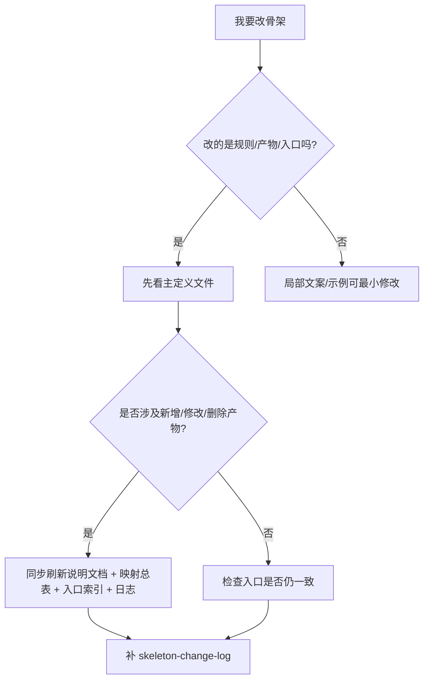
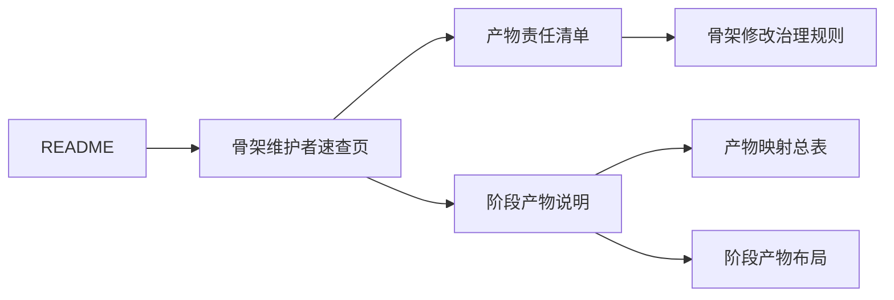

# 骨架维护者速查页

> 用途：给第一次接手骨架维护的人一页式答案。  
> 定位：这是“先看什么、先改什么、改完别漏什么”的速查页，不替代正式规则。  
> 详细说明入口：
> - `.opencode/references/mes-ai-reference/reference/skeleton-artifact-ownership-guide.md`
> - `.opencode/references/mes-ai-reference/reference/stage-artifact-guide.md`
> - `.opencode/references/mes-ai-reference/rules/skeleton-change-governance.md`

---

## 一、先记这 6 句

> 1. **结构化初稿，优先让 AI 生成。**  
> 2. **最终事实、架构边界、风险接受，必须人拍板。**  
> 3. **`deliverable/` 和核心 `mes-ai-dev/workspace/report/` 优先看。**  
> 4. **`working/` 一般不是正式结论。**  
> 5. **改了产物体系，就必须同步刷说明、入口、映射、日志。**  
> 6. **先改主定义，再改入口导航，不要反过来。**

> ✅ **一句速记**：先改主定义，再补入口；先看结论，再看证据。

---

## 二、维护任务速判图

---

## 三、最常用入口

| 你现在想做什么 | 先看哪里 |
|---|---|
| 判断某个文件该由 AI 还是人来维护 | `.opencode/references/mes-ai-reference/reference/skeleton-artifact-ownership-guide.md` |
| 判断某阶段有哪些产物、该优先看哪些 | `.opencode/references/mes-ai-reference/reference/stage-artifact-guide.md` |
| 判断某个 Command / Skill 对应什么产物名 | `.opencode/references/mes-ai-reference/reference/command-skill-artifact-map.md` |
| 判断某阶段该加载哪些规则 | `.opencode/references/mes-ai-reference/reference/skeleton-loading-matrix.md` |
| 判断骨架修改是否还要同步刷新别的文件 | `.opencode/references/mes-ai-reference/rules/skeleton-change-governance.md` |
| 判断阶段目录怎么放文件 | `.opencode/references/mes-ai-reference/rules/governance/stage-artifact-layout.md` |

---

## 四、改文件时的责任边界

| 类型 | 优先方式 | 原则 |
|---|---|---|
| 索引、表格、初稿 | AI 主生成 | 人复核 |
| 手册、说明、经验总结 | AI 起草 + 人补充 | 别让 AI 独自拍板 |
| 规则、边界、结论 | 人主导 | AI 只能辅助整理 |

### 4.1 红黄绿提示卡

> 🟢 **绿色**：索引、清单、模板初稿，AI 可以多做。  
> 🟡 **黄色**：手册、说明、审查初稿，AI 起草后必须人补强。  
> 🔴 **红色**：规则、边界、结论，必须人主导。  

---

## 五、产物阅读优先级

| 优先级 | 先看什么 | 为什么 |
|---|---|---|
| P0 | `stage-output-report.md`、主交付物、详细审查报告 | 决定能否进入下一阶段 |
| P1 | 当前阶段 OpenSpec 主交接文档、关键中间稿 | 快速理解上下文与风险 |
| P2 | `evidence/`、`mes-ai-dev/workspace/memory/`、`working/` | 有疑点再下钻 |

---

## 六、最容易漏的同步刷新

如果你改了**标准产物、文件名、目录职责、模板对应关系**，至少检查：

- `AGENTS.md`
- `.opencode/references/mes-ai-reference/reference/skeleton-artifact-ownership-guide.md`
- `.opencode/references/mes-ai-reference/reference/stage-artifact-guide.md`
- `.opencode/references/mes-ai-reference/reference/command-skill-artifact-map.md`
- `.opencode/references/mes-ai-reference/reference/knowledge-structure.md`
- `.opencode/references/mes-ai-reference/reference/workspace-structure.md`
- `.opencode/references/mes-ai-reference/reference/skeleton-loading-matrix.md`
- `.opencode/references/mes-ai-reference/reference/team-onboarding-guide.md`
- `templates/template-index.md`
- `mes-ai-dev/workspace/refresh/skeleton-change-log.md`

> ⚠️ **高频漏项**：README、飞行员手册、映射总表。

---

## 七、交付前 8 项检查

- [ ] 主定义文件是否已经更新
- [ ] 新文档或新规则是否已进入入口索引
- [ ] 产物说明是否已同步刷新
- [ ] 映射总表是否需要同步更新
- [ ] 是否新增了阅读歧义或双重口径
- [ ] 是否写了 `skeleton-change-log.md`
- [ ] README / 飞行员手册是否需要补轻量导航
- [ ] 新人第一次读这套文档，是否能在 3 分钟内找到入口

### 7.1 30 秒收尾卡

1. 这次是否只改了正文，没改入口？
2. 这次是否改了产物名，却没改映射表？
3. 这次是否写了规则，却没写日志？

### 7.2 常见错误案例

| 错误案例 | 表面看起来 | 实际问题 |
|---|---|---|
| 只改 `AGENTS.md` 不改说明文档 | 好像规则已经变了 | 新人入口仍是旧口径 |
| 只改说明文档不改映射总表 | 好像文档更完整了 | 执行链路仍会用旧命名 |
| 只写变更日志不补入口 | 好像已经留痕 | 用户还是找不到新内容 |

---

## 八、推荐阅读顺序

---

## 九、结论

如果只记一句话：

> **骨架维护不是“把正文改对”就结束，而是“正文、入口、映射、日志一起收口”。**
