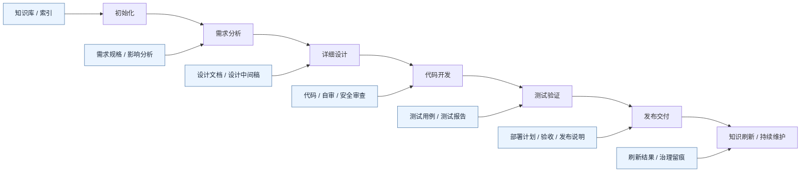
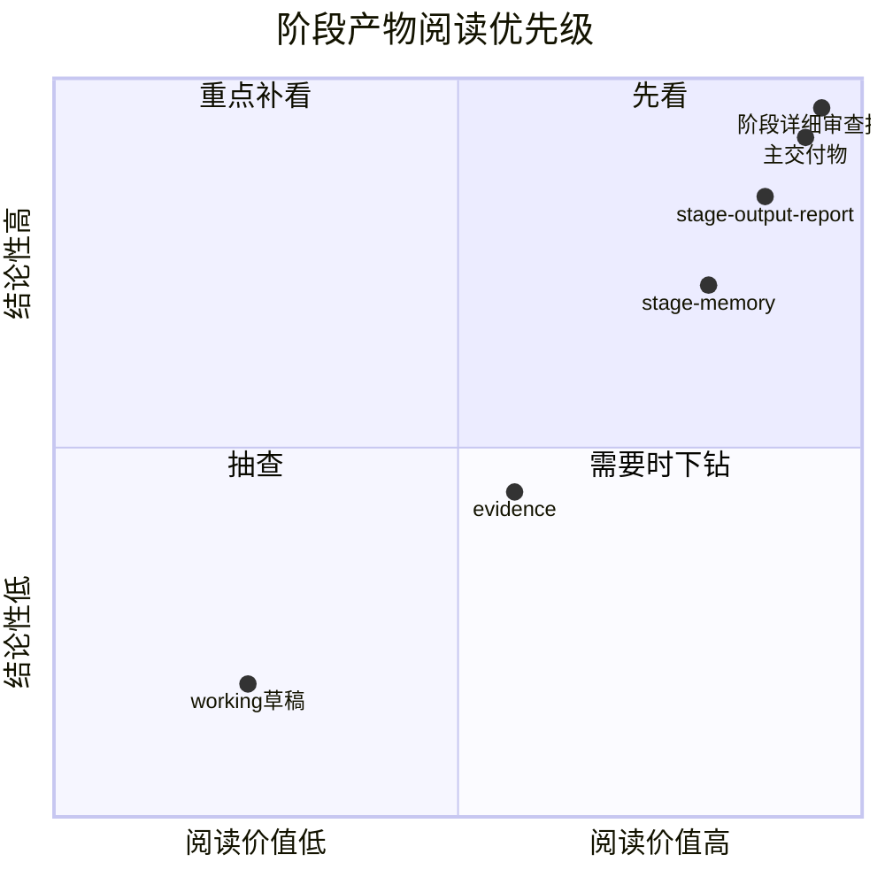
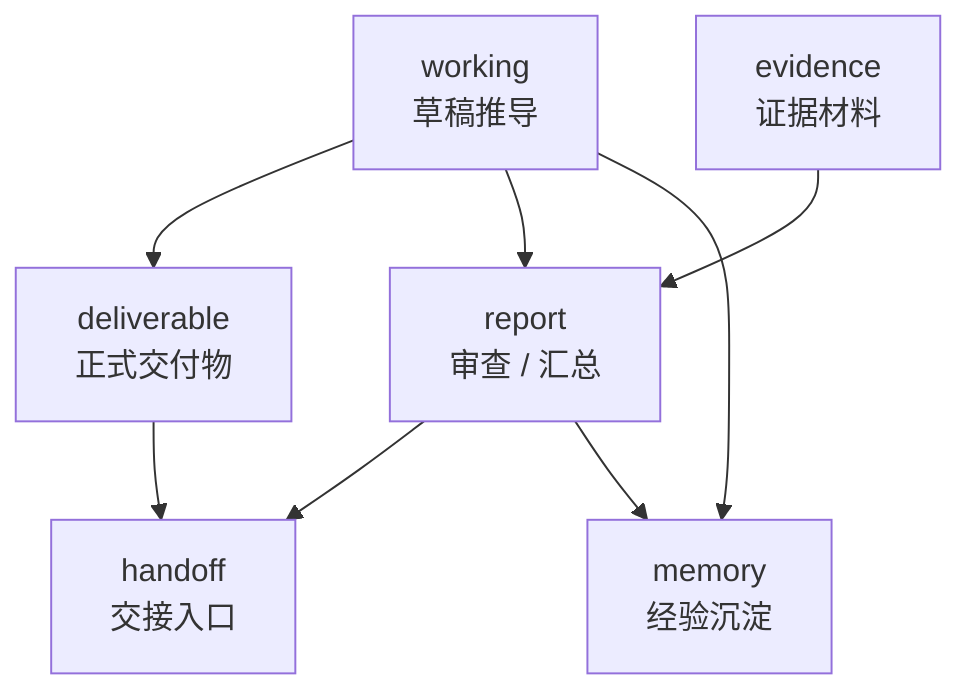
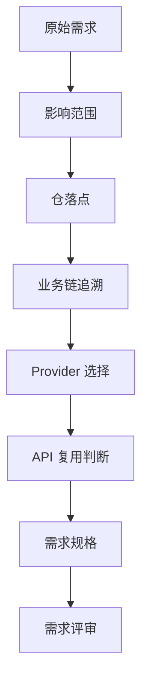
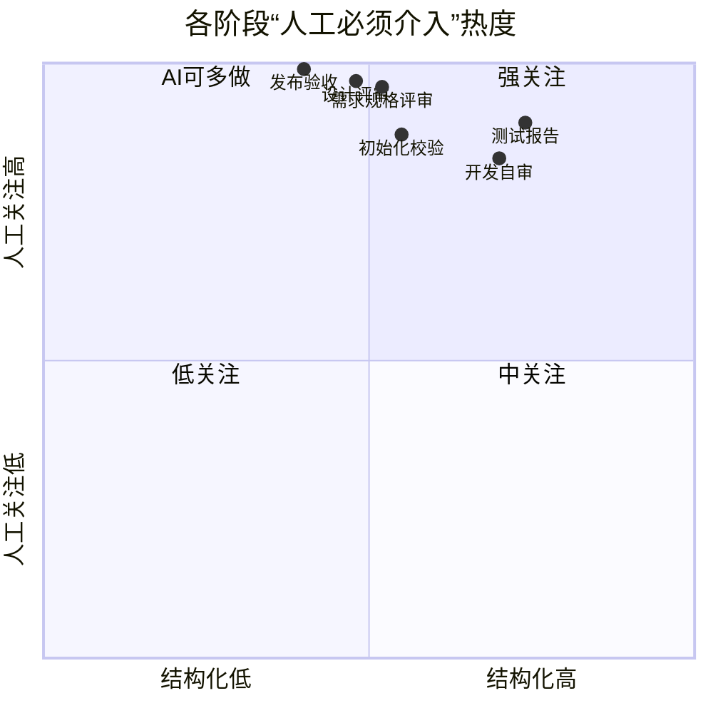
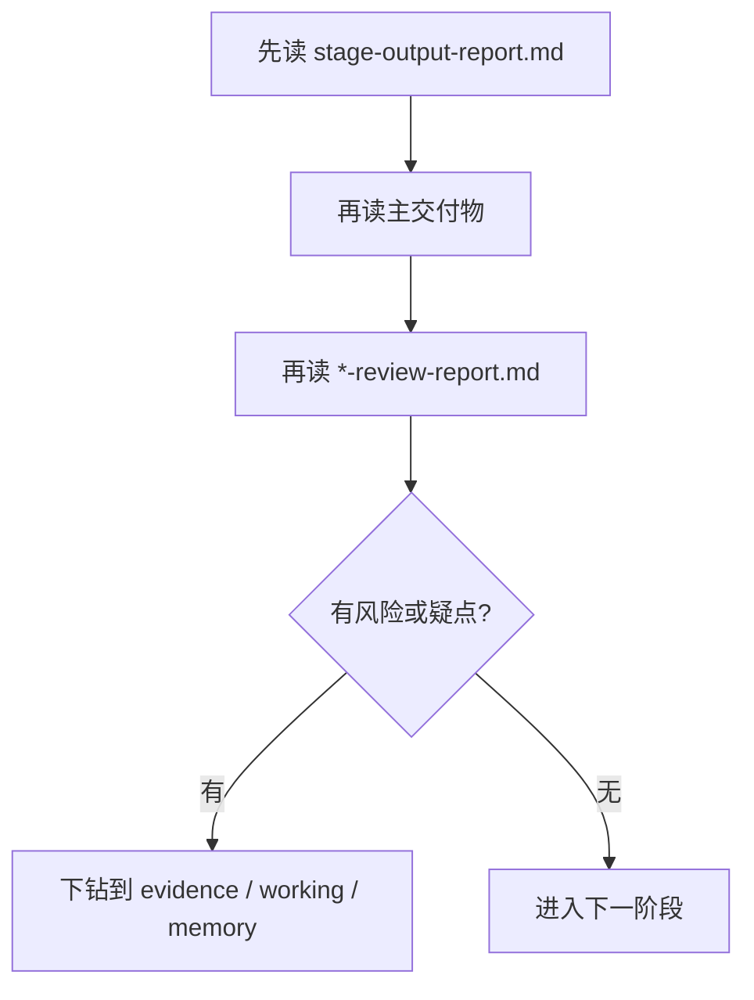
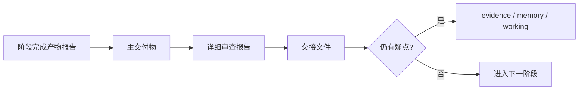
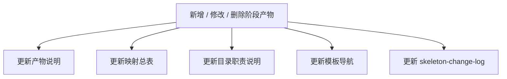

# 阶段产物说明与人工关注重点

> 用途：说明各阶段有哪些具体产物、哪些属于过程产物、哪些属于最终产物，以及人应优先关注哪些产物。  
> 配套规则：`.opencode/references/mes-ai-reference/rules/governance/stage-artifact-layout.md`  
> 配套映射：`.opencode/references/mes-ai-reference/reference/command-skill-artifact-map.md`

---

## 一、阅读导航

### 1.1 这份文档怎么用

| 你想解决的问题 | 直接看哪一节 |
|---|---|
| 某阶段到底会产出什么 | 第四章 |
| 哪些是过程产物，哪些是最终产物 | 第二章 |
| 人应该先看什么 | 第二章、第五章 |
| 哪些产物最容易被误用 | 第六章 |
| 改了产物体系之后要同步刷什么 | 第七章 |

### 1.2 一页结论卡片

> **先记 4 句：**
>
> 1. **`deliverable/` 和核心 `mes-ai-dev/workspace/report/` 是优先看的。**
> 2. **`working/` 通常是过程材料，不应当作正式结论。**
> 3. **阶段详细审查报告是“能不能进入下一阶段”的关键文件。**
> 4. **只要改了产物体系，就必须同步刷新映射、说明和日志。**

### 1.3 视觉提示卡

> ✅ **优先看**：主交付物、阶段详细审查报告、阶段完成产物报告  
> ⚠️ **按需看**：关键中间稿、当前阶段 OpenSpec 主交接文档、高风险 evidence  
> ❌ **不要误用**：把 `working/` 或单条 evidence 当正式结论  

---

## 二、先看总览

### 2.1 一张图看懂阶段产物

### 2.2 过程产物 vs 最终产物

| 类型 | 定义 | 常见目录 | 是否必须长期保留 |
|---|---|---|---|
| 过程产物 | 为了推导、分析、校验、交接而产生的中间材料 | `working/`、部分 `mes-ai-dev/workspace/report/`、部分 `evidence/` | 视治理需要保留 |
| 最终产物 | 作为阶段正式输出、下一阶段输入或正式交付依据的产物 | `deliverable/`、核心 `mes-ai-dev/workspace/report/`、`handoff/` | 通常必须保留 |

### 2.3 人工关注优先级

| 优先级 | 人应重点看什么 | 为什么 |
|---|---|---|
| P0 必看 | 主交付物、阶段详细审查报告、阶段完成产物报告、当前阶段 OpenSpec 主交接文档 | 决定是否能进入下一阶段 |
| P1 建议看 | 中间关键设计稿、专项决策、Provider / 边界 / 复用类产物 | 决定方案是否走偏 |
| P2 抽查看 | `working/` 草稿、局部证据、临时分析 | 主要用于问题回溯 |

### 2.4 一张四象限图看“先看什么”

### 2.5 先看 / 后看 / 抽查看板

| 档位 | 典型对象 | 阅读目标 |
|---|---|---|
| 先看 | 主交付物、详细审查报告 | 判断是否通过 |
| 后看 | 关键中间稿、交接文件 | 判断有没有遗漏 |
| 抽查 | evidence、working、memory 台账 | 排查问题与追证 |

---

## 三、目录视角：产物放在哪里

### 3.1 标准目录职责

| 目录 | 主要类型 | 更偏过程还是结果 | 人的关注建议 |
|---|---|---|---|
| `deliverable/` | 正式交付物 | 最终产物 | 必看 |
| `mes-ai-dev/workspace/report/` | 审查、汇总、门禁报告 | 最终产物为主 | 必看 |
| `evidence/` | 日志、截图、验证材料 | 过程产物为主 | 按需抽查 |
| `handoff/` | 阶段交接入口 | 最终产物 | 必看 |
| `mes-ai-dev/workspace/memory/` | 坑点、决策、阻塞沉淀 | 过程与沉淀混合 | 建议看 |
| `working/` | 草稿、中间推导 | 过程产物 | 一般不必逐篇细看 |

### 3.2 一张关系图

### 3.3 目录阅读顺序建议

| 步骤 | 优先阅读 | 目的 |
|---|---|---|
| 1 | `mes-ai-dev/workspace/report/stage-output-report.md` | 先知道这阶段到底交了什么 |
| 2 | `deliverable/` 主交付物 | 判断主结论是否成立 |
| 3 | `*-review-report.md` | 判断是否真的通过门禁 |
| 4 | 当前阶段 OpenSpec 主交接文档 | 了解下阶段的阅读入口 |
| 5 | `evidence/`、`mes-ai-dev/workspace/memory/`、`working/` | 有问题时再下钻 |

> **阅读口诀**：先汇总、再结论、后证据。

---

## 四、按阶段看的具体产物

## 4.1 初始化阶段

### 产物总表

| 类别 | 典型产物 | 类型 | 人工关注 |
|---|---|---|---|
| 知识总览 | `backend-overview.md`、`frontend-overview.md` | 结果产物 | 建议看 |
| 依赖 / 接口索引 | `service-dependencies.md`、`api-registry.md`、`database-registry.md` | 结果产物 | 建议看 |
| 代码地图 | `patterns.md`、`business-flows.md`、`ownership.md` | 过程沉淀 + 结果产物 | 建议看 |
| 初始化校验 | 初始化校验报告、收敛报告 | 结果产物 | 必看 |
| 状态与片段 | `state.yaml`、state detail / fragment | 过程事实源 | 人主导抽查 |

### 人要重点看

1. 知识库是否覆盖关键仓、关键服务、关键表。
2. 是否存在空模板、占位文档被误当事实源。
3. 初始化结论能否支撑后续 analyze / design 阶段。

---

## 4.2 需求分析阶段

### 产物总表

| 产物 | 类型 | 作用 | 人工关注级别 |
|---|---|---|---|
| `raw-requirement.md` | 过程产物 | 承载原始需求、影响分析、差异分析 | 建议看 |
| `exploration.md` | 条件过程产物 | 承载探索、歧义拆解、方案比较、边界排查 | 命中时必看 |
| `proposal.md` | 条件过程产物 | 承载推荐方案、取舍理由、待确认决策 | 命中时必看 |
| `repo-impact-list.md` | 过程产物 | 明确受影响仓与仓角色 | 必看 |
| `repo-placement-decision.md` | 过程产物 | 决定需求落在哪个仓 | 必看 |
| `business-flow-trace.md` | 过程产物 | 追溯业务链、服务链、数据链 | 建议看 |
| `provider-selection.md` | 过程产物 | 冻结 provider 选择 | 必看 |
| `api-reuse-decision.md` | 过程产物 | 决定复用、扩展或新增 | 必看 |
| `spec.md` | 最终产物 | OpenSpec 正式需求规格主文档 | 必看 |
| `nfr-checklist.md` | 过程产物 | 非功能约束清单 | 建议看 |
| `spec-review-report.md` | 最终产物 | 阶段详细审查报告 | 必看 |

### 这一阶段最关键的不是“写得多”，而是“边界定得准”

### 人要重点看

1. `repo-placement-decision.md`
2. `provider-selection.md`
3. `api-reuse-decision.md`
4. `spec.md`
5. `spec-review-report.md`

---

## 4.3 详细设计阶段

### 产物总表

| 产物 | 类型 | 作用 | 人工关注级别 |
|---|---|---|---|
| `tech-approach.md` | 过程产物 | 技术方案与实现路径 | 必看 |
| `database-design.md` | 过程产物 | 数据库设计 | 必看 |
| `api-design.md` | 过程产物 | 接口设计 | 必看 |
| `frontend-design.md` | 过程产物 | 前端交互与页面设计 | 建议看 |
| `service-chain-design.md` | 过程产物 | 服务调用链设计 | 建议看 |
| `cross-service-consistency.md` | 过程产物 | 跨服务一致性校验 | 必看 |
| `architecture-boundary-decision.md` | 过程产物 | 边界冻结与约束 | 必看 |
| `design.md` | 最终产物 | 正式设计文档 | 必看 |
| `design-review-report.md` | 最终产物 | 阶段详细审查报告 | 必看 |

### 人要重点看

- `tech-approach.md`
- `database-design.md`
- `api-design.md`
- `cross-service-consistency.md`
- `design.md`
- `design-review-report.md`

### 推荐阅读顺序

| 顺序 | 文档 | 关注点 |
|---|---|---|
| 1 | `tech-approach.md` | 路线对不对 |
| 2 | `api-design.md` / `database-design.md` | 外部契约和数据结构对不对 |
| 3 | `cross-service-consistency.md` | 是否存在链路断层 |
| 4 | `design.md` | 是否完成收口 |
| 5 | `design-review-report.md` | 是否真的可进入开发 |

---

## 4.4 开发阶段

### 产物总表

| 产物 | 类型 | 作用 | 人工关注级别 |
|---|---|---|---|
| `task-plan.md` | 过程产物 | 拆分开发任务 | 建议看 |
| `test-cases.md` | 过程产物 | TDD 用例计划、用户补充区与确认结论 | 必看 |
| 数据库脚本 / DDL | 最终产物 | 数据落地 | 必看 |
| 后端 / 前端代码 | 最终产物 | 实现需求 | 必看 |
| `self-review-report.md` | 最终产物 | 自审结论 | 必看 |
| `security-review-report.md` | 最终产物 | 安全审查结论 | 必看 |
| `development-review-report.md` | 最终产物 | 阶段详细审查报告 | 必看 |
| `verify-object-change-list.md` | 过程产物 | 开发到测试的验证对象变化清单 | 建议看 |
| `refresh-hints.md` | 过程产物 | 开发到刷新提示 | 按需看 |

### 人要重点看

1. 改动代码是否符合设计。
2. `test-cases.md` 是否先于代码生成形成，且已记录用户补充与确认。
2. `self-review-report.md` 是否覆盖关键风险。
3. `security-review-report.md` 是否指出真实问题。
4. 是否存在“顺手重构”破坏 bugfix 最小变更原则。
5. 是否明确给出本轮测试全绿与覆盖率 100% 结论。

---

## 4.5 测试验证阶段

### 产物总表

| 产物 | 类型 | 作用 | 人工关注级别 |
|---|---|---|---|
| `test-cases.md` | 过程产物 | TDD 测试设计清单、用户补充与确认结论 | 必看 |
| 单元 / 集成测试代码 | 过程 + 结果混合 | 自动化验证资产 | 建议看 |
| `integration-tests.md` | 过程产物 | 集成测试方案或结果 | 建议看 |
| `performance-analysis.md` | 过程产物 | 性能风险分析 | 视场景看 |
| `test-report.md` | 最终产物 | 测试结果结论 | 必看 |
| `test-review-report.md` | 最终产物 | 阶段详细审查报告 | 必看 |

### 人要重点看

- `test-report.md`：是否真的覆盖了需求承诺。
- `test-cases.md`：是否保留用户补充与确认后的最终计划，且未通过删测换覆盖率。
- `test-review-report.md`：是否有未关闭高风险项。
- 高风险场景下的 `performance-analysis.md`。

---

## 4.6 发布交付阶段

### 产物总表

| 产物 | 类型 | 作用 | 人工关注级别 |
|---|---|---|---|
| `deploy-plan.md` | 过程产物 | 部署与回滚计划 | 必看 |
| `acceptance-report.md` | 最终产物 | 验收结论 | 必看 |
| `deploy-log.md` | 证据产物 | 部署执行记录 | 建议看 |
| `release-note.md` | 最终产物 | 发布说明 | 必看 |
| `handover-doc.md` | 最终产物 | 交付交接文档 | 必看 |
| `delivery-scope.md` | 最终产物 | 交付范围界定 | 建议看 |
| `delivery-review-report.md` | 最终产物 | 阶段详细审查报告 | 必看 |

### 人要重点看

1. `deploy-plan.md`：是否可回滚。
2. `acceptance-report.md`：是否真满足业务标准。
3. `release-note.md`：是否说清风险与变更。
4. `handover-doc.md`：运维与接手团队是否能读懂。

---

## 4.7 知识刷新阶段

### 产物总表

| 产物 | 类型 | 作用 | 人工关注级别 |
|---|---|---|---|
| `detected-changes.json` | 过程产物 | 变更检测结果 | 抽查 |
| `update-plan.md` | 过程产物 | 刷新计划 | 建议看 |
| `update-results.md` | 最终产物 | 刷新结果 | 必看 |
| `semantic-drift-report.md` | 过程 / 审计产物 | 语义漂移检测 | 视场景看 |
| `state-migration-report-*.md` | 审计产物 | 状态迁移校验 | 视场景看 |
| `skeleton-change-review-*.md` | 审查产物 | 骨架修改正式审查 | 必看 |
| `skeleton-change-log.md` | 治理留痕 | 骨架变更日志 | 必看 |

---

## 4.8 紧急修复阶段

### 产物总表

| 产物 | 类型 | 作用 | 人工关注级别 |
|---|---|---|---|
| 问题定位记录 | 过程产物 | 说明故障根因与定位过程 | 建议看 |
| 修复方案 / 回滚方案 | 最终产物 | 说明如何止血与恢复 | 必看 |
| 验证证据 | 证据产物 | 证明修复有效 | 必看 |
| `emergency-review-report.md` | 最终产物 | 紧急修复详细审查报告 | 必看 |

### 4.9 各阶段产物速查总表

| 阶段 | 最重要的最终产物 | 最值得人工优先看的过程产物 | 最容易被忽略的关键点 |
|---|---|---|---|
| 初始化 | 初始化校验 / 收敛结果 | 代码地图、依赖索引 | 空模板与占位文件不能当事实源 |
| 需求分析 | `spec.md`、`spec-review-report.md` | `provider-selection.md`、`api-reuse-decision.md` | 边界与落点判断最关键 |
| 详细设计 | `design.md`、`design-review-report.md` | `tech-approach.md`、`cross-service-consistency.md` | 设计收口不能只看中间稿 |
| 开发 | 代码、`development-review-report.md` | `task-plan.md`、`self-review-report.md` | 不能用代码量代替完成度 |
| 测试 | `test-report.md`、`test-review-report.md` | `test-cases.md`、`performance-analysis.md` | 单条测试记录不能替代测试结论 |
| 交付 | `acceptance-report.md`、`release-note.md`、`handover-doc.md` | `deploy-plan.md` | 可回滚性必须明确 |
| 刷新 | `update-results.md`、骨架审查结论 | `update-plan.md` | 入口与留痕要跟上 |
| 紧急修复 | 修复方案、`emergency-review-report.md` | 问题定位记录 | 修复有效性必须有证据 |

### 4.10 各阶段人工关注热力图

---

## 五、人应该如何看这些产物

## 5.1 三层阅读法

| 层级 | 应看内容 | 目标 |
|---|---|---|
| 第 1 层 | 主交付物 + 详细审查报告 | 判断是否通过 |
| 第 2 层 | 关键中间稿 + 阶段完成产物报告 + 当前阶段 OpenSpec 主交接文档 | 判断有没有遗漏 |
| 第 3 层 | evidence / working / memory 台账 | 需要追责或排查时再深入 |

## 5.2 典型阅读路线

### 5.3 一张图看阅读路径

### 5.4 常见阅读误区

| 误区 | 结果 | 正确做法 |
|---|---|---|
| 直接翻 `working/` | 看了很多，但没抓住结论 | 先看 `stage-output-report.md` |
| 只看主交付物，不看评审报告 | 不知道是否真正通过门禁 | 主交付物和评审报告一起看 |
| 只看 evidence | 只看到证据，没看到判断 | evidence 用于追证，不替代结论 |

---

## 六、哪些产物最容易被误用

| 容易误用的对象 | 错误用法 | 正确理解 |
|---|---|---|
| `working/` 草稿 | 当作正式结论 | 只能作为推导材料 |
| `evidence/` | 当作审查结论 | 它只是证据，不是结论 |
| `mes-ai-dev/workspace/memory/` | 当作阶段交付物 | 它是经验沉淀和交接辅助 |
| 中间设计稿 | 替代 `design.md` | 中间稿服务于主设计文档 |
| 单个测试记录 | 替代 `test-report.md` | 需要统一测试结论 |

### 6.1 误用风险提示卡

> **最常见的 3 个误用：**
>
> 1. 把 `working/` 当正式结论。  
> 2. 把 `evidence/` 当审查结论。  
> 3. 只看中间稿，不看正式评审报告。  

> **简单判断法**：如果一个文件不能单独回答“这一阶段是否通过”，它大概率不是最优先阅读对象。

---

## 七、骨架修改后的同步刷新要求

若骨架新增、修改、删除了阶段产物、标准文件名、目录职责、模板映射，必须同步检查：

1. `.opencode/references/mes-ai-reference/reference/command-skill-artifact-map.md`
2. `.opencode/references/mes-ai-reference/rules/governance/stage-artifact-layout.md`
3. `.opencode/references/mes-ai-reference/reference/workspace-structure.md`
4. `.opencode/references/mes-ai-reference/reference/skeleton-artifact-ownership-guide.md`
5. `.opencode/references/mes-ai-reference/templates/template-index.md`
6. `mes-ai-dev/workspace/refresh/skeleton-change-log.md`

未同步刷新，上述变更不得视为完成。

### 7.1 同步刷新动作图

---

## 八、结论

对人来说，阶段产物的阅读重点不是“全看”，而是：

1. **先看主交付物。**
2. **再看详细审查报告。**
3. **有疑点再下钻 evidence / working / memory。**
4. **一旦改了产物体系，必须同步刷新入口、映射和日志。**
