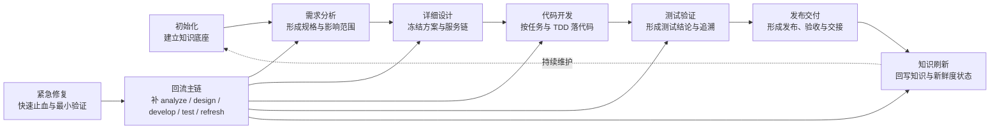
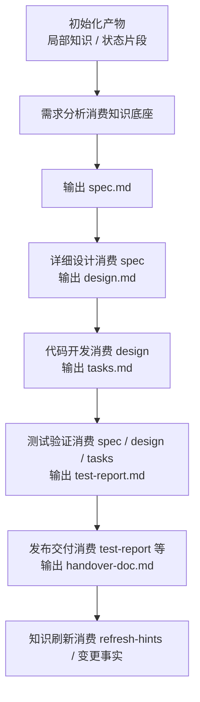

# MES-AI-DEV 八阶段培训总览

## 1. 总览定位

这份总览页用于培训开场，帮助团队先建立对 MES-AI-DEV 八阶段治理链路的整体认知，再进入各阶段分文件下钻。

> 建议培训顺序：先讲这份总览，再按 `01-init.md` 到 `08-emergency.md` 逐阶段展开。

## 2. 为什么要按阶段治理

MES-AI-DEV 的核心目标，不是让 AI “多生成一点内容”，而是让 AI 进入正式研发主链路后，具备：

- 可治理
- 可审查
- 可追溯
- 可持续接续

因此，骨架把研发活动拆成多个阶段，每个阶段都强调：

- 有明确目标
- 有进入条件
- 有标准产物
- 有退出门禁
- 有可交接的主文档

这意味着团队培训时，不应把它讲成“AI 提示词集合”，而应讲成“可控研发链路”。

## 3. 八阶段总体流程图



## 4. 每个阶段解决什么问题

| 阶段 | 核心问题 | 主交接文档 / 关键输出 |
|---|---|---|
| 初始化 | 代码仓到底是什么结构、有哪些契约、哪些知识可被下游消费？ | 局部知识产物、状态片段、`mes-ai-dev/workspace/{phase}/{REQ-ID}/report/stage-output-report.md` |
| 需求分析 | 业务想要什么、影响哪里、应由谁负责、验收标准是什么？ | `spec.md`、`spec-review-report.md` |
| 详细设计 | 这件事应该怎么做、在哪做、服务链怎么走、接口和数据怎么定？ | `design.md`、`design-review-report.md` |
| 代码开发 | 怎样把设计落实成代码，并保证可验证、可自审、可交接？ | `tasks.md`、`self-review-report.md` |
| 测试验证 | 结果是否真的满足预期、覆盖率是否达标、能否支撑交付？ | `test-report.md`、`test-review-report.md` |
| 发布交付 | 能不能发、怎么发、怎么回滚、交给谁接？ | `handover-doc.md`、`go-nogo.md`、`release-note.md` |
| 知识刷新 | 代码变了以后，哪些知识要更新、哪些要收口、哪些暂不更新？ | 变更检测结果、刷新结论、`mes-ai-dev/workspace/{phase}/{REQ-ID}/report/stage-output-report.md` |
| 紧急修复 | 线上事故如何最小修复、最小验证，并回流到正式治理链？ | `incident-report.md`、`postmortem.md` |

## 5. 主研发链说明

主研发链是团队最常使用的标准路径：

```text
初始化 → 需求分析 → 详细设计 → 代码开发 → 测试验证 → 发布交付 → 知识刷新
```

### 培训讲解重点
- **初始化** 解决“有没有知识底座”
- **分析** 解决“要做什么、影响什么”
- **设计** 解决“怎么做、在哪做、为什么这么做”
- **开发** 解决“按什么任务和验证计划落代码”
- **测试** 解决“结果是否可证明正确”
- **交付** 解决“能否上线与如何交接”
- **刷新** 解决“知识是否与现实代码一致”

## 6. 例外链说明：紧急修复不是旁路，而是快路径

紧急修复阶段不是主链的替代品，而是线上故障场景下的**最小闭环快路径**。

```text
故障发生 → 紧急修复 → 最小验证 → 事件留痕 → 回流 analyze/design/develop/test/refresh
```

### 培训讲解重点
- 热修允许快，但不允许失真
- 热修完成后，必须判断需要补哪些正式阶段产物
- 否则代码和知识会长期漂移，治理链会断掉

## 7. 阶段之间的关键交接关系



## 8. 培训阅读顺序建议

### 第一层：先建立全景认知
先读：

- `00-overview.md`

目标：先让团队知道八阶段为什么存在、前后依赖关系是什么。

### 第二层：按主链下钻
建议顺序：

1. `01-init.md`
2. `02-analyze.md`
3. `03-design.md`
4. `04-develop.md`
5. `05-test.md`
6. `06-deliver.md`
7. `07-refresh.md`

目标：建立标准研发闭环认知。

### 第三层：补充例外路径
最后再讲：

- `08-emergency.md`

目标：说明线上故障如何走最小修复与回流治理。

## 9. 培训时建议重点强调的四条主线

### 9.1 产物主线
每个阶段都不是只做动作，而是要留下标准产物。

### 9.2 门禁主线
每个阶段都不是“做完就过”，而是要经过进入 / 退出门禁判断。

### 9.3 交接主线
每个阶段都要给下游一个可直接消费的主文档，而不是靠口头交接。

### 9.4 回写主线
开发、交付、紧急修复完成后，要考虑知识刷新，不然知识库会失真。

## 10. 配套文件索引

- `01-init.md`：初始化阶段培训流程图
- `02-analyze.md`：需求分析阶段培训流程图
- `03-design.md`：详细设计阶段培训流程图
- `04-develop.md`：代码开发阶段培训流程图
- `05-test.md`：测试验证阶段培训流程图
- `06-deliver.md`：发布交付阶段培训流程图
- `07-refresh.md`：知识刷新阶段培训流程图
- `08-emergency.md`：紧急修复阶段培训流程图

## 11. 总览页节点依据来源

| 总览节点 / 结论 | 依据来源 |
|---|---|
| 八阶段总链路 | `.opencode/references/mes-ai-reference/rules/phases/index.md` |
| 初始化 | `phase-init.md`、`phase-gates/init.md`、`stage-artifact-guide.md`、`command-skill-artifact-map.md` |
| 需求分析 | `phase-analyze.md`、`phase-gates/analyze.md`、`command-skill-artifact-map.md` |
| 详细设计 | `phase-design.md`、`phase-design-detail.md`、`phase-gates/design.md`、`command-skill-artifact-map.md` |
| 代码开发 | `phase-develop.md`、`phase-develop-detail.md`、`phase-gates/develop.md`、`command-skill-artifact-map.md` |
| 测试验证 | `phase-test.md`、`phase-test-detail.md`、`phase-gates/test.md`、`command-skill-artifact-map.md` |
| 发布交付 | `phase-deliver.md`、`phase-deliver-detail.md`、`phase-gates/deliver.md`、`command-skill-artifact-map.md` |
| 知识刷新 | `phase-refresh.md`、`phase-gates/refresh.md`、`stage-artifact-guide.md` |
| 紧急修复 | `phase-emergency.md`、`phase-gates/emergency.md`、`stage-artifact-guide.md` |
| 主研发链顺序 | `phases/index.md`、`workspace-structure.md`、`stage-artifact-guide.md` |
| 紧急修复回流链 | `phase-emergency.md`、`phase-gates/emergency.md` |
