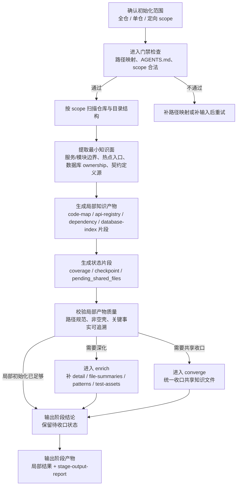

# 初始化阶段培训流程图

## 1. 阶段目标

初始化阶段的目标不是直接“开始开发”，而是先建立后续阶段可消费的知识底座。它负责识别仓库/服务/模块边界、关键调用链、数据库 ownership、契约定义源、公共依赖与测试资产，并优先产出**局部结果、状态片段与待收口信息**。

> 培训要点：初始化强调“先建图、后消费”，并且遵循“局部产物先落盘，统一共享知识后收口”的原则。

## 2. 进入条件

- 目标仓真实路径已确认，默认示例目录 `jalor/`、`web/`、`dbscript/` 存在，或已完成映射
- `AGENTS.md` 存在且可读
- 当前任务属于知识库初始化、单仓/多仓扫描、初始化深化、断点续传或 converge 前准备

## 3. 详细流程图

## 4. 核心步骤说明

### 4.1 确认范围
- 判断是全仓初始化、单仓初始化、模块初始化还是数据库专项初始化
- 明确是否只是建立局部知识，还是要进一步执行 `/mes-init-converge`

### 4.2 扫描与建图
- 扫描后端、前端、数据库脚本与公共契约源
- 识别服务边界、模块边界、Schema 边界、API 与依赖关系
- 识别统一响应、错误码、认证、MQ、SDK/shared/common 等契约定义点

### 4.3 生成局部产物
- 优先落盘局部 code-map、dependency、database-index、reference 片段
- 记录热点候选、待确认事实、候选结论与未知项

### 4.4 状态与收口
- 通过 `knowledge/state/fragments/*.yaml` 记录覆盖范围、checkpoint、pending shared files
- 仅在需要统一共享视图时进入 `/mes-init-converge`

## 5. 标准产物

### 5.1 关键输出
- 局部知识产物：code-map / api-registry / dependency graph / database-index 片段
- `knowledge/state/fragments/*.yaml`
- `mes-ai-dev/workspace/init/{scope}/report/stage-output-report.md`

### 5.2 常见补充产物
- `detail.md`
- `file-summaries.md`
- `patterns.md`
- `test-assets.md`
- `runtime.md`
- `repo-profile.md`
- `hot-services.md` / `hot-apis.md` / `hot-tables.md`

## 6. 退出门禁

### must-pass
- 当前 scope 的局部产物已生成
- 若包含 Schema，相关 `index.md` 已生成且不是空壳
- 后续阶段消费所需的最小结构化事实已补齐
- `mes-ai-dev/workspace/init/{scope}/report/stage-output-report.md` 已生成
- `knowledge/state/fragments/*.yaml` 已生成并记录 `coverage` / `checkpoint` / `pending_shared_files`
- 关键契约对象已识别定义点，或明确标记为候选/未知
- 阶段评审结论为 `✅通过` 或 `⚠️有条件通过`

### should-check
- 小仓全量模式下，detail/file-summaries/business-flows/ownership/patterns/test-assets/runtime 已补齐
- `rules/api-conventions.md` 与 `rules/coding-standards.md` 已完成基础填充

## 7. 培训讲解要点与常见风险

### 讲解要点
- 初始化不是写代码前的形式主义，而是整个骨架的“事实基线建立阶段”
- 局部初始化与共享收口分离，是为了支持大仓、断点续传和并行初始化
- 契约级知识必须从定义点提取，不能从使用点反推后当事实

### 常见风险
- 把模板或框架常识当成项目事实
- 未识别变更范围就直接覆盖共享知识文件
- 跳过状态片段，只生成文档不记录收口状态
- 单仓初始化越界扫描未指定对象

## 8. 节点依据来源

| 流程节点 | 依据来源 |
|---|---|
| 确认初始化范围 / 进入门禁 | `phase-init.md`、`phase-gates/init.md` |
| 扫描仓库与目录结构 | `phase-init.md`、`workspace-structure.md`、`stage-artifact-guide.md` |
| 提取最小知识面 | `phase-init.md`、`stage-artifact-guide.md`、`command-skill-artifact-map.md` |
| 生成局部知识产物 / 状态片段 | `phase-init.md`、`phase-gates/init.md`、`command-skill-artifact-map.md` |
| 校验局部产物质量 / 进入 enrich 或 converge | `phase-init.md`、`phase-gates/init.md` |
| 输出阶段产物 / stage-output-report | `phase-init.md`、`workspace-structure.md` |
