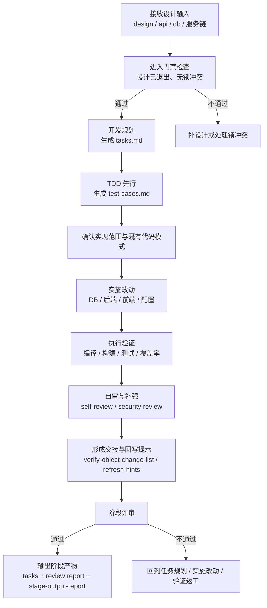

# 代码开发阶段培训流程图

## 1. 阶段目标

开发阶段的目标，是把已确认的设计、修复目标或具体变更需求，落实为代码与相关交接产物，并完成验证、自审和阶段收尾。

> 培训要点：开发阶段不是“直接写代码”，而是要先有 `tasks.md`，先有 `test-cases.md`，再按既有结构落代码并完成自审闭环。

## 2. 进入条件

- 详细设计阶段已退出
- 设计文档已包含实现所需的 API / 数据模型信息
- 不存在未处理的并发锁冲突
- 当前任务明确要求实现、修改或修复

## 3. 详细流程图

## 4. 核心步骤说明

### 4.1 开发规划
- 基于 `design.md` 生成 `tasks.md`
- 拆清楚实现单元、影响范围、依赖顺序和验证对象

### 4.2 TDD 先行
- 必须先生成 `test-cases.md`
- 显式区分 AI 初始规划、用户补充区、确认后的最终计划
- 未确认测试计划前，不应进入代码生成

### 4.3 实施改动
- 后端：模型、DAO、Service、Controller、配置
- 前端：API、组件、页面/路由
- 数据库：脚本 / DDL / 迁移材料
- 存量项目必须贴合既有目录、命名、分层、异常模式、测试组织和实现骨架

### 4.4 验证与自审
- 运行与本次改动直接相关的编译、构建、测试与静态检查
- 优先验证本轮新生成测试用例全部通过
- 检查纳入验证范围的行覆盖率、分支覆盖率、方法覆盖率是否均达到 100%
- 输出 `self-review-report.md`，命中高风险时补 `security-review-report.md`

## 5. 标准产物

### 5.1 核心输出
- `tasks.md`
- `test-cases.md`
- `self-review-report.md`
- `security-review-report.md`（按需）
- `development-review-report.md`
- `mes-ai-dev/workspace/development/{REQ-ID}/report/stage-output-report.md`

### 5.2 常见补充产物
- `verify-object-change-list.md`
- `refresh-hints.md`
- `impact-ledger.md`
- `verification-evidence.md`
- `db-migration.md`

## 6. 退出门禁

### must-pass
- `tasks.md` 已生成
- `test-cases.md` 已先于代码生成形成
- `mes-ai-dev/workspace/development/{REQ-ID}/report/stage-output-report.md` 已生成
- 计划内代码文件已完成
- 后端编译通过（如适用）
- 前端构建通过（如适用）
- 本轮新生成测试用例全部通过
- 本轮纳入验证范围的行覆盖率、分支覆盖率、方法覆盖率均达到 100%
- `self-review-report.md` 已生成且无严重未解决问题
- `tasks.md` 未重定义仓级责任边界与 provider 选择
- 已列出本次实现引用的项目私有契约/范式
- 阶段评审结论为 `✅通过` 或 `⚠️有条件通过`

### should-check
- `refresh-hints.md`、`impact-ledger.md`、`verification-evidence.md` 等按需生成
- 若进入测试阶段，验证对象变化清单已形成

## 7. 培训讲解要点与常见风险

### 讲解要点
- `tasks.md` 是开发阶段主交接文档，不是可有可无的过程稿
- 开发阶段必须体现 TDD 先行与用户补充确认闭环
- 代码要反向对应测试计划，不能脱离用例自由扩写

### 常见风险
- 没有 `test-cases.md` 就直接写代码
- 为了生成方便新造一套并行目录结构
- 用类型压制、删测试、跳验证伪造完成
- 改动完成但没有 `refresh-hints.md` 等下游交接信息

## 8. 节点依据来源

| 流程节点 | 依据来源 |
|---|---|
| 接收设计输入 / 进入门禁 | `phase-develop.md`、`phase-gates/develop.md` |
| 开发规划 | `phase-develop-detail.md`、`command-skill-artifact-map.md` |
| TDD 先行 | `phase-develop-detail.md`、`command-skill-artifact-map.md`、`phase-gates/develop.md` |
| 实施改动 | `phase-develop-detail.md`、`phase-gates/develop.md` |
| 执行验证 | `phase-develop.md`、`phase-develop-detail.md`、`phase-gates/develop.md` |
| 自审与补强 / 回写提示 | `phase-develop.md`、`phase-develop-detail.md`、`command-skill-artifact-map.md` |
| 阶段评审 / 输出阶段产物 | `phase-develop.md`、`phase-gates/develop.md`、`stage-artifact-guide.md` |
