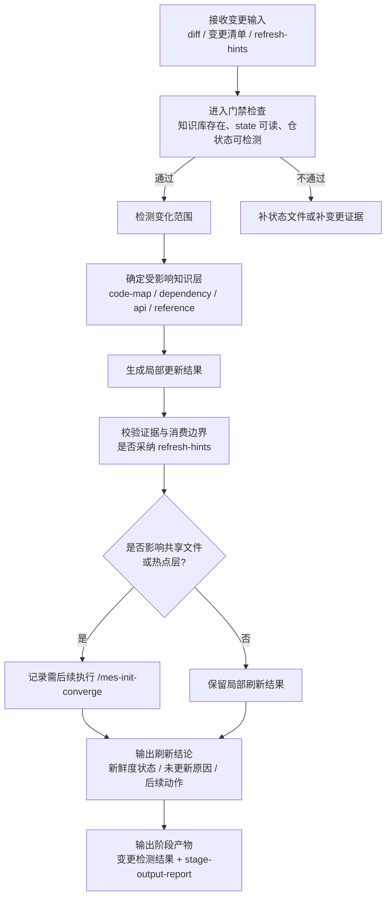

# 知识刷新阶段培训流程图

## 1. 阶段目标

知识刷新阶段的目标，是识别代码与知识之间的差异，更新局部知识结果，并在需要时通过主控统一收口共享知识文件。

> 培训要点：刷新不是“再扫一遍全仓”，而是基于变更证据进行增量判断与增量更新。

## 2. 进入条件

- 知识库已初始化
- `mes-ai-dev/knowledge/state/state.yaml` 存在且可读取
- 代码仓库状态可用于检测变更
- 已具备最小变更输入，如 diff、变更清单、`refresh-hints.md` 或等价证据

## 3. 详细流程图

## 4. 核心步骤说明

### 4.1 检测变化范围
- 根据代码、配置、数据库脚本、契约和交付事实变化确定刷新边界
- 优先使用 `refresh-hints.md`，而不是重新无边界推断所有影响范围

### 4.2 更新局部知识
- 按需更新 code-map、dependency graph、API registry、reference 片段
- 记录哪些文件被更新、哪些未更新及原因

### 4.3 判断是否需要共享收口
- 若变化影响共享文件或热点层，需要明确是否执行 `/mes-init-converge`
- 若只是局部变化，可保留局部刷新结果

## 5. 标准产物

### 5.1 核心输出
- 变更检测结果
- 受影响知识文件更新结果
- `mes-ai-dev/workspace/refresh/{refresh-id}/report/stage-output-report.md`

### 5.2 常见补充产物
- `summary.md`
- 受影响的 overview / registry / map 文件
- `refresh-review-report.md`
- 后续 converge / 人工补录建议

## 6. 退出门禁

### must-pass
- 变更检测结果已生成
- 受影响的知识文件已更新，或已明确记录未更新原因
- `mes-ai-dev/workspace/refresh/{refresh-id}/report/stage-output-report.md` 已生成
- 若 develop / deliver 已产出 `refresh-hints.md`，已消费或说明不采纳原因
- 若刷新影响全局共享文件或热点层，已明确记录是否需要后续执行 `/mes-init-converge`
- 阶段评审结论为 `✅通过` 或 `⚠️有条件通过`

### should-check
- `summary.md`、受影响 overview / registry / map 文件已同步更新
- manual-review-queue 的增量影响已评估
- 已说明开发/交付侧“知识不受影响”判断是否成立

## 7. 培训讲解要点与常见风险

### 讲解要点
- refresh 是增量刷新，不是全量重建
- `refresh-hints.md` 是开发/交付回写给刷新阶段的重要边界输入
- refresh 阶段要回答“改了什么、更新了什么、为什么没更新某些东西”

### 常见风险
- 绕过 `refresh-hints.md`，重新无边界推断
- 未识别变更范围就直接覆盖共享知识
- 只更新文档，不记录未更新原因和后续动作
- 影响全局共享文件却没有明确 converge 计划

## 8. 节点依据来源

| 流程节点 | 依据来源 |
|---|---|
| 接收变更输入 / 进入门禁 | `phase-refresh.md`、`phase-gates/refresh.md` |
| 检测变化范围 | `phase-refresh.md`、`phase-gates/refresh.md` |
| 确定受影响知识层 | `phase-refresh.md`、`knowledge-consumption/code-map.md`、`knowledge-consumption/dependency-graph.md` |
| 局部更新结果 | `phase-refresh.md`、`stage-artifact-guide.md` |
| 校验证据与消费边界 / 是否 converge | `phase-refresh.md`、`phase-gates/refresh.md`、`command-skill-artifact-map.md` |
| 刷新结论 / 阶段产物 | `phase-refresh.md`、`phase-gates/refresh.md` |
