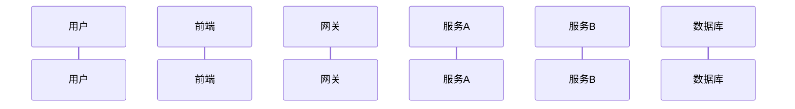

# 业务流程追溯

## 基本信息
- **需求编号**：REQ-YYYYMMDD-XXX
- **追溯日期**：YYYY-MM-DD

## 主流程
### 流程名称：[流程名]

## 流程步骤
| 序号 | 步骤名称 | 执行者 | 输入 | 输出 | 异常处理 |
|------|---------|--------|------|------|---------|
| 1 | [步骤名] | [角色/系统] | [输入数据] | [输出数据] | [异常场景] |

## 关键决策点
| 决策点 | 条件 | 分支A | 分支B |
|--------|------|-------|-------|
| [决策描述] | [判断条件] | [走A分支时] | [走B分支时] |

## 涉及服务调用链
1. [服务A] → [API] → [服务B] → [API] → [服务C]

## 数据流转
| 数据 | 来源 | 去向 | 转换规则 |
|------|------|------|---------|
| [数据名] | [表/API] | [表/API] | [转换说明] |
