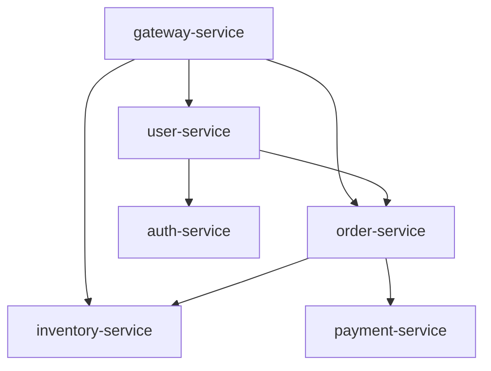

# 一、服务调用关系图

## 一、服务调用关系图

### 1.1 调用关系矩阵

| 调用方 \ 被调用方 | user-service | order-service | inventory-service | auth-service |
|------------------|-------------|---------------|------------------|-------------|
| gateway-service | ✓ | ✓ | ✓ | ✓ |
| user-service | - | ✓ | - | ✓ |
| order-service | ✓ | - | ✓ | - |

### 1.2 服务层级架构

```
Level 0: gateway-service（网关层）
Level 1: user-service, order-service, inventory-service（业务层）
Level 2: auth-service, payment-service（基础服务层）
```

### 1.3 调用链路图（Mermaid）



### 1.4 循环依赖检测

- 无循环依赖 ✅

### 1.5 共享服务标注

#### 共享服务列表

| 服务名 | 消费者数量 | 影响等级 | 变更通知 | 主要消费者 |
|--------|-----------|---------|---------|-----------|
| auth-service | 15个服务 | 高 | 必须 | gateway, user, order, inventory, report, ... |
| user-service | 12个服务 | 高 | 必须 | order, report, workflow, notification, ... |
| notification-service | 8个服务 | 中 | 建议 | order, user, workflow, ... |
| config-service | 6个服务 | 中 | 建议 | gateway, user, order, ... |
| report-service | 2个服务 | 低 | 可选 | gateway, admin |

#### 影响传导关系图

当共享服务变更时的影响链：

```
auth-service 变更
└── 影响 [gateway-service, user-service, order-service, inventory-service, 
         report-service, workflow-service, payment-service, notification-service, ...]
    → 必须评估下游兼容性
    → 必须通知所有消费者服务
    → 高优先级变更窗口

user-service 变更
└── 影响 [order-service, report-service, workflow-service, notification-service, ...]
    → 必须检查用户数据结构变更
    → 必须通知关联服务
    → 中等优先级变更窗口
```

#### 影响等级说明

- **影响等级**：
  - 高：消费者>10个，变更必须评估下游影响，强制通知
  - 中：消费者5-10个，变更需通知下游，建议提前沟通
  - 低：消费者<5个，常规变更流程

- **变更通知**：
  - 必须：变更前必须通知所有消费者服务负责人
  - 建议：变更前建议通知主要消费者服务
  - 可选：按需通知即可
