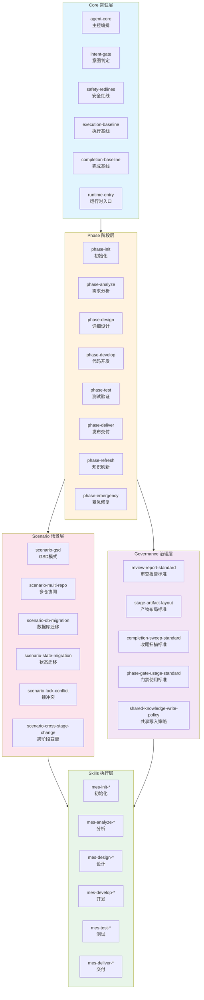
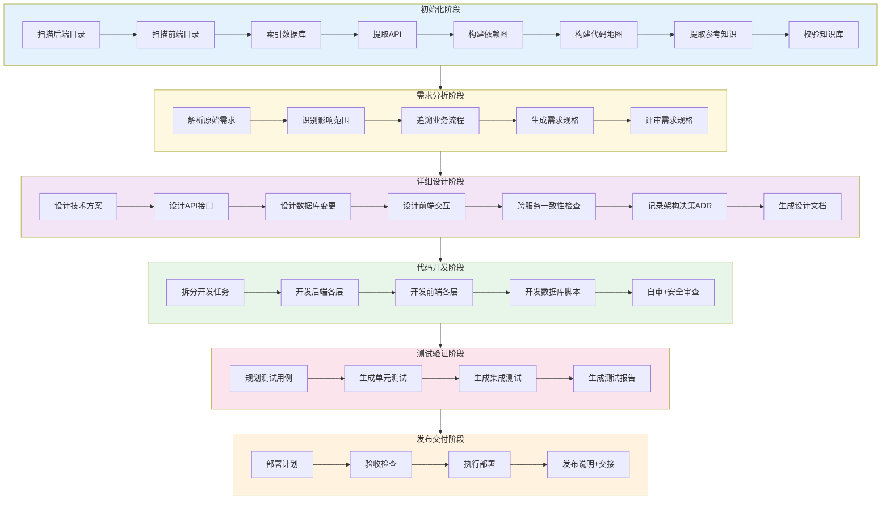
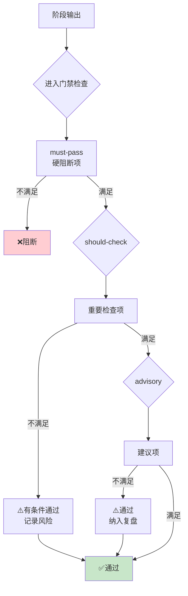
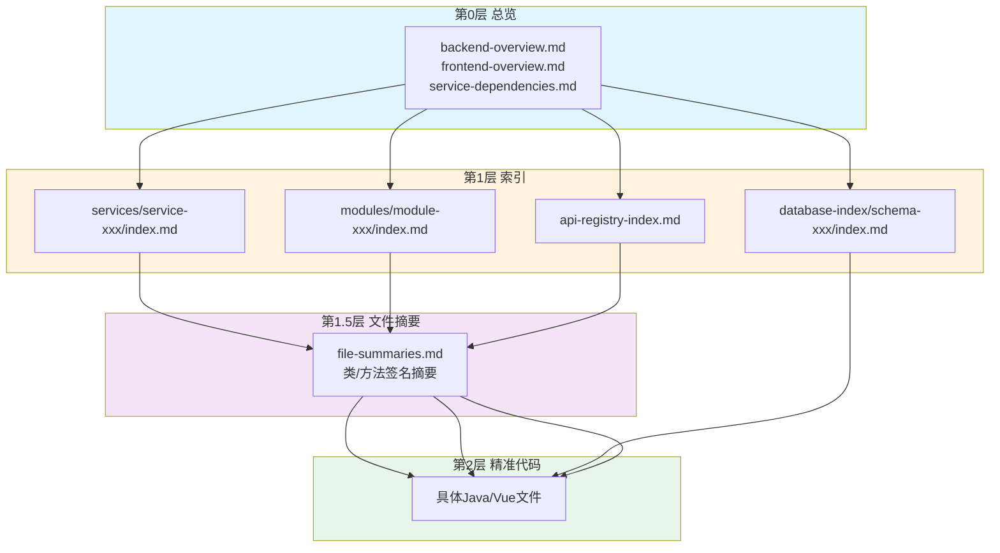

# MES-AI-DEV

> 面向复杂企业研发场景的 AI 工程治理骨架

---

## 一、定位与概述

**MES-AI-DEV** 不是单点的 AI 写代码工具，也不是只会生成文档的流程壳子，而是一套让 AI 能进入正式研发主链路、持续接管更多工程工作单元的治理骨架。

它覆盖完整研发链路：

- 初始化 / 知识建图
- 需求分析
- 详细设计
- 代码开发
- 测试验证
- 发布交付
- 知识刷新
- 紧急修复

它的目标不是"让 AI 多生成一点内容"，而是：

> **让 AI 在团队协作、大仓 / 超大仓、复杂业务环境中可治理、可审查、可追溯、可持续接续地工作。**

---

## 二、核心能力速览

| 能力 | 标识 | 应用阶段 | 如何使用 | 核心价值 |
|------|------|----------|----------|----------|
| 规格驱动开发 | 📐 SDD | 分析 → 设计 → 开发 → 测试 → 交付 | 按 `spec.md → design.md → tasks.md / code → test-report.md → handover-doc.md` 主链路推进 | 先规格、后实现，把 AI 从“直接写代码”约束为阶段化研发执行单元 |
| Harness 工程治理 | 🧰 HE | 全阶段 | 通过 Command / Skill / 模板 / 门禁 / 状态 / 审查报告协同运行 | 把 AI 纳入可检查、可复盘、可追责的执行支架，而不是自由发挥 |
| 四个执行原则 | 4P | 全阶段 | 始终按“编码前思考、简洁优先、精准修改、目标驱动执行”检查计划、实现和审查结论 | 用统一执行哲学压住隐藏假设、过度复杂、无关改动和不可验证完成感 |
| TDD 强制前置 | ✅ TDD | 开发 / 测试 | 先通过 `mes-test-plan-cases` 形成并确认 `test-cases.md`，再进入代码生成与验证 | 把测试计划前置到编码前，避免“代码先写、测试补票” |
| 覆盖率闭环验证 | 💯 COV | 开发 / 测试 | 对本轮纳入验证范围的代码执行测试、断言与覆盖率闭环校验 | 不只要求能跑通，还要求验证充分、证据完整、回归范围明确 |
| Hook 治理护栏 | 🪝 HOOK | 全阶段 / 治理 | 通过 Reminder / Guard / Sync / Guard+Sync 在计划缺失、阶段门禁、知识消费、留痕、Strict 升级等场景触发 | 用轻量运行时护栏减少高频遗漏，但不替代正式流程与审查 |
| 三层门禁机制 | 🚦 GATE | 全阶段 | 执行进入门禁、步骤门禁、退出门禁，并在 must-pass 场景强制返工 | 把“做完了”改成“通过检查了”，防止未校验结果流入下游 |
| 双轨执行模式 | 🚀 GSD | 全阶段 | 高风险场景自动维持 Strict；目标明确且风险可控时按 GSD 输出最小可交付 | 在不牺牲治理真实性的前提下兼顾效率与现场推进能力 |
| 决策留痕与 ADR | 🧭 ADR | 设计 / 开发 / 交付 | 对关键设计、边界冻结、取舍与影响记录 ADR / 决策说明 | 让关键判断可追溯、可复盘、可解释，而不是留在聊天记录里 |
| 长上下文分层消费 | 🧠 LKC | 初始化 / 分析 / 设计 / 刷新 | 按“总览 → 索引 → 文件摘要 → 精准代码”逐层消费知识，不暴力读全仓 | 面向大仓/超大仓控制上下文成本，提升搜索精度与消费稳定性 |
| GitNexus 类代码图谱 | 🕸️ GNX | 初始化 / 分析 / 设计 / 开发 / 刷新 / 交付 / 应急 | 按需用于调用链、依赖关系、影响范围、消费者、回归路径等辅助分析 | 为复杂代码关系提供证据导航与定位增强，但不替代事实源和门禁结论 |
| graphify 类关系导读 | 🗺️ GFX | 初始化 / 分析 / 设计 / 测试 / 交付 / 应急 | 按需生成需求、设计、测试、交接、事故材料之间的关系导读 | 提高复杂材料可理解性与交接效率，但正式结论仍回写主产物 |
| 空模板阻断 | 🚫 TMP | 初始化 / 分析 / 设计 / 测试 | 对占位态、空模板、未真实填充文档一律视为不可消费，命中 must-pass 时直接阻断下游使用 | 防止“文件存在就被当成规范存在”，避免 AI 从空壳文档推导出伪事实 |
| 阶段记忆持久化 | 📝 MEM | 分析 / 设计 / 开发 / 测试 / 交付 | 将 blocker、决策、坑点、代偿动作和交接信息持续沉淀到阶段记忆 | 让骨架具备跨需求、跨 session、跨人员持续演进的执行记忆 |
| 共享知识写入边界 | 🔒 SWP | 初始化 / 深化 / 刷新 / 治理 | 并行 Agent 先写局部片段，最终共享知识只允许由主控或 converge 串行收口 | 防止并行直写污染共享事实源，保证全局知识一致性与可追溯性 |
| 状态分片与全局收敛 | 🧩 CONV | 初始化 / 刷新 / 治理 | 先写 `state/fragments/*.yaml` 与局部知识，再收敛到 `state.yaml` 这一唯一已合并机器事实源 | 支持单仓补录、断点续传和大仓分批初始化，同时避免运行中片段被误当成正式全局事实 |
| 产物分类与证据链 | 🗂️ EVI | 全阶段 | 按 deliverable / report / evidence / handoff / memory / working 分类落盘，并强制生成详细审查报告与阶段完成产物报告 | 让正式结论、验证证据、审查结果和交接信息形成完整闭环，不再混存混用 |
| 真实结构与契约对齐 | 🏗️ REAL | 初始化 / 设计 / 开发 / 测试 | 以真实代码仓、真实分层、真实契约事实源、契约三态、真实 Provider 路径为唯一依据 | 不另造虚拟结构，不把占位模板、通用常识或图谱推断当成真实规范，并约束服务链冻结后的实现边界 |

> **详细说明**：见 [`.opencode/references/mes-ai-reference/reference/feature-details.md`](../.opencode/references/mes-ai-reference/reference/feature-details.md)

---

## 三、解决的问题

| 常见问题 | MES-AI-DEV 的对应能力 |
|----------|----------------------|
| AI 输出快，但过程不可控 | 规格驱动研发链 + 阶段门禁 + 步骤门禁 |
| 多团队协作时阶段之间容易断层 | 阶段交接文件 + 阶段记忆 + 标准产物承接 |
| 大仓 / 超大仓下 AI 容易失控、易爆上下文 | 四层索引架构 + 热点优先 + 上下文预算守卫 |
| 审查流于形式，缺少证据链 | 详细审查报告 + 阶段完成产物报告 + evidence 承载 |
| 项目知识、治理经验散落难以复用 | 项目级 / 治理级 / 阶段级记忆持久化 |
| AI 只能局部辅助，难以进入正式交付流程 | Command / Skill / Agent / 模板 / 门禁 / 状态联动 |

---

## 四、适用场景

### ✅ 更适合

- 🏭 制造业 / MES / ERP / 工业软件 / 企业平台
- 👥 中大型研发团队、多角色协作团队
- 🧩 多阶段、多仓、多服务联动项目
- 🔍 对交付质量、审查留痕、追溯有要求的组织
- 🤖 希望逐步建立 AI 接管能力的团队

### ⚠️ 不太适合

- 🪶 极轻量、低流程、低治理要求的小团队
- ⚡ 只追求"AI 快速生成代码"的场景
- 🧪 对阶段审查、交接、留痕几乎没有要求的实验项目

---

## 五、横向对比

| 对比维度 | 通用 AI Coding Agent | 通用知识库骨架 | 流程文档方案 | MES-AI-DEV |
|----------|:--------------------:|:--------------:|:------------:|:----------:|
| 规格驱动研发链 | 🔴 | 🟡 | 🟡 | 🟢 |
| 阶段门禁与步骤门禁 | 🔴 | 🟠 | 🟡 | 🟢 |
| 阶段交接与文件化承载 | 🔴 | 🟡 | 🟡 | 🟢 |
| 长上下文与大仓控制 | 🔴 | 🟡 | 🔴 | 🟢 |
| 目标仓真实结构贴合 | 🟡 | 🟡 | 🔴 | 🟢 |
| 阶段记忆持久化 | 🔴 | 🟠 | 🔴 | 🟢 |
| GSD blocker 治理 | 🔴 | 🔴 | 🟡 | 🟢 |
| ADR / 决策沉淀 | 🔴 | 🟡 | 🟡 | 🟢 |
| 大仓 / 超大仓可操作性 | 🔴 | 🟠 | 🔴 | 🟢 |
| 面向企业级持续接管 | 🔴 | 🟡 | 🟡 | 🟢 |

> 🟢 强 | 🟡 中 | 🟠 弱/中 | 🔴 弱

**直观理解**：MES-AI-DEV 的重点不是"会写文档"或"会写代码"，而是让 AI 在复杂项目里逐步成为可治理、可审查、可接续的工程执行单元。

---

## 六、架构与流程总览

### 6.1 分层规则结构



**加载顺序**：Core 常驻 → Phase 按阶段加载 → Scenario/Governance 按需加载 → Skill/Template 按需加载

> 详细加载矩阵：[`.opencode/references/mes-ai-reference/reference/skeleton-loading-matrix.md`](../.opencode/references/mes-ai-reference/reference/skeleton-loading-matrix.md)

### 6.2 全链路研发阶段



### 6.3 门禁检查机制



> 门禁详细定义：[`.opencode/references/mes-ai-reference/reference/phase-gates/index.md`](../.opencode/references/mes-ai-reference/reference/phase-gates/index.md)

### 6.4 知识消费架构



**消费原则**：总览 → 索引 → 文件摘要 → 精准代码，按需逐层深入

> 消费详细规则：[`.opencode/references/mes-ai-reference/reference/knowledge-consumption/index.md`](../.opencode/references/mes-ai-reference/reference/knowledge-consumption/index.md)

### 6.5 上下文预算控制

各阶段默认加载范围：5K-10K token，复杂场景上限 16K，超过 20K 强制回退。

> 详细估算与优化策略：[`.opencode/references/mes-ai-reference/reference/context-budget-guide.md`](../.opencode/references/mes-ai-reference/reference/context-budget-guide.md)

---

## 七、落地与试点

### 7.1 快速导航

首次进入骨架，建议按以下顺序：

| 序号 | 内容 | 位置 |
|:----:|------|------|
| 1 | 整体定位 | 本 README |
| 2 | 常驻总则 | [`AGENTS.md`](../AGENTS.md) |
| 3 | 骨架加载矩阵 | [`.opencode/references/mes-ai-reference/reference/skeleton-loading-matrix.md`](../.opencode/references/mes-ai-reference/reference/skeleton-loading-matrix.md) |
| 4 | 阶段规则 | [`.opencode/references/mes-ai-reference/rules/phases/`](../.opencode/references/mes-ai-reference/rules/phases/) |
| 5 | 场景规则 | [`.opencode/references/mes-ai-reference/rules/scenarios/`](../.opencode/references/mes-ai-reference/rules/scenarios/) |
| 6 | 模板库 | [`.opencode/references/mes-ai-reference/templates/template-index.md`](../.opencode/references/mes-ai-reference/templates/template-index.md) |
| 7 | 团队学习指南 | [`.opencode/references/mes-ai-reference/reference/team-onboarding-guide.md`](../.opencode/references/mes-ai-reference/reference/team-onboarding-guide.md) |
| 8 | 人类操作手册 | [`.opencode/references/mes-ai-reference/reference/operator-flight-manual.md`](../.opencode/references/mes-ai-reference/reference/operator-flight-manual.md) |

### 7.1.1 给维护者的两份新增导航

如果你现在最关心的是“哪些东西该由 AI 生成、哪些需要人补、阶段产物该重点看什么”，建议直接先读这两份：

| 文档 | 适合什么时候读 | 你会得到什么 |
|------|----------------|--------------|
| [`.opencode/references/mes-ai-reference/reference/skeleton-artifact-ownership-guide.md`](../.opencode/references/mes-ai-reference/reference/skeleton-artifact-ownership-guide.md) | 想判断某类文件该由谁主导维护时 | AI 主生成 / 人补充 / 人主导的责任边界、推荐维护方式、提示词示例、同步刷新清单 |
| [`.opencode/references/mes-ai-reference/reference/stage-artifact-guide.md`](../.opencode/references/mes-ai-reference/reference/stage-artifact-guide.md) | 想快速看懂各阶段产物和阅读重点时 | 各阶段具体产物、过程 / 最终产物区分、人工阅读优先级、目录阅读路径 |

如果你只想先看一页速查，再决定深入哪份文档，先看：

- [`.opencode/references/mes-ai-reference/reference/skeleton-maintainer-quick-reference.md`](../.opencode/references/mes-ai-reference/reference/skeleton-maintainer-quick-reference.md)

### 7.2 落地指南

完整的 adoption 内容见：

- [`.opencode/references/mes-ai-reference/reference/adoption-guide.md`](../.opencode/references/mes-ai-reference/reference/adoption-guide.md)

包含：典型落地路径、采用前后对比、最小试点建议、失败模式、成功判定标准、角色分工。

### 7.3 REQ 目录示例

需求目录分类结构示例：

- [`mes-ai-dev/workspace/examples/example-req-directory-classification.md`](workspace/examples/example-req-directory-classification.md)

---

## 八、仓库结构

```text
jalor/                  # 后端代码仓（默认示例路径）
web/                    # 前端代码仓（默认示例路径）
dbscript/               # 数据库脚本仓（默认示例路径）
mes-ai-dev/
├── knowledge/          # 规则、状态、索引、治理记忆、阶段记忆库
├── workspace/          # 各阶段产物、报告、交接、证据、刷新记录
├── templates/          # 模板库
└── ...
```

> `jalor/`、`web/`、`dbscript/` 为默认示例路径；初始化后以目标仓真实结构为准。

---

## 九、当前状态与总结

### 当前能力

- ✅ 规格驱动开发能力
- ✅ 流程 / 状态 / 审查 / 交接支架
- ✅ 文件化阶段推进与追溯
- ✅ 项目级与治理级记忆持久化
- ✅ 大仓 / 超大仓知识消费控制

### 定位

> **已具备企业级试点与 Design Partner 落地能力，正在向更成熟的标准化产品演进。**

### 一句话总结

> **MES-AI-DEV 是一套面向团队协作、大仓控制、审查追溯、阶段记忆持久化与长期 AI 接管的工程治理骨架。**
