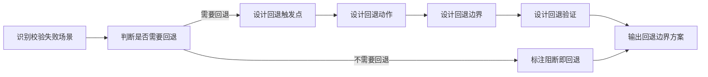

# 校验失败回退边界设计模板（validation-fallback-template）

> 用于设计校验失败后的回退边界和业务处理流程，形成完整的校验→失败→回退闭环。
> 目标是弥合"校验失败"与"业务回退处理"之间的断层，防止校验失败后业务状态悬空。

## 一、模板定位

- **文件角色**：方法论模板（不依赖具体业务）
- **适用阶段**：需求分析 / 详细设计
- **使用时机**：当校验规则设计完成后，需设计校验失败后的回退边界
- **输入**：校验规则结构化结果（来自 `validation-rule-structuring-template.md`）
- **输出**：校验失败回退边界方案（含回退触发点、回退动作、回退边界）

---

## 二、校验失败场景分类

### 2.1 校验失败场景类型

| 场景编号 | 场景类型 | 说明 | 示例 |
|----------|----------|------|------|
| FALLBACK-001 | 硬阻断校验失败 | 校验条件满足，强制阻断执行 | 已发货订单不允许履行 → 校验失败，阻断履行 |
| FALLBACK-002 | 跨库校验失败 | 跨库校验调用失败（限定通道不可用） | 限定通道服务不可用 → 校验失败，无法获取跨库数据 |
| FALLBACK-003 | 数据不一致校验失败 | 跨库数据不一致导致校验失败 | 前处理订单状态与现场执行不一致 → 校验失败 |
| FALLBACK-004 | 业务规则校验失败 | 业务规则校验失败（如状态不允许流转） | 订单状态未流转到"已发货" → 校验失败，不允许履行 |
| FALLBACK-005 | 预警确认后失败 | 预警确认后执行失败（如操作失败） | 补打标签确认后打印失败 → 回退到预警状态 |

### 2.2 校验失败类型与回退关系

| 失败类型 | 是否阻断执行 | 是否需要回退 | 回退必要性 | 说明 |
|----------|--------------|--------------|------------|------|
| 硬阻断校验失败 | ✅ 是 | ❌ 不需要回退 | 阻断即回退 | 校验失败直接阻断，不执行后续操作，无需额外回退 |
| 跨库校验失败 | ✅ 是 | ✅ 需要回退 | 返回错误状态 | 返回错误码，提示用户"校验服务不可用" |
| 数据不一致校验失败 | ✅ 是 | ✅ 需要回退 | 返回错误状态 | 返回错误码，提示用户"数据不一致，请同步数据" |
| 业务规则校验失败 | ✅ 是 | ❌ 不需要回退 | 阻断即回退 | 校验失败直接阻断，不执行后续操作 |
| 预警确认后失败 | ❌ 否（已执行） | ✅ 需要回退 | 必须回退 | 已执行操作后失败，必须回退到原状态 |

---

## 三、校验失败回退边界设计流程

### 3.1 设计流程总览



### 3.2 详细设计步骤

#### 步骤一：识别校验失败场景

**目标**：确认当前校验失败属于哪种场景类型

**判断流程**：

| 判断项 | 判断依据 | 输出 |
|--------|----------|------|
| 校验失败类型 | 硬阻断/跨库失败/数据不一致/业务规则/预警确认后失败 | 失败类型编号 |
| 是否阻断执行 | 校验失败是否阻断后续执行 | 是/否 |
| 是否已执行部分操作 | 校验前是否已执行部分业务操作（如预警确认后执行） | 是/否 |

**输出**：
```markdown
校验失败场景识别：
- 校验规则ID：[规则ID]
- 校验规则名称：[业务语义名称]
- 校验失败类型：[FALLBACK-001/FALLBACK-002/FALLBACK-003/FALLBACK-004/FALLBACK-005]
- 是否阻断执行：是/否
- 是否已执行部分操作：是/否
- 是否需要回退：是/否（判断依据：若已执行部分操作，则必须回退）
```

#### 步骤二：判断是否需要回退

**目标**：判断校验失败后是否需要执行回退动作

**判断原则**：

| 原则编号 | 原则说明 | 判断依据 |
|----------|----------|----------|
| PRINCIPLE-001 | 阻断即回退，不需要额外回退动作 | 校验失败直接阻断，不执行后续操作 |
| PRINCIPLE-002 | 已执行部分操作，必须回退 | 校验前已执行部分操作（如预警确认后执行），失败后必须回退 |
| PRINCIPLE-003 | 跨库校验失败，返回错误状态 | 限定通道不可用，返回错误码，提示用户重试或联系管理员 |

**输出**：
```markdown
回退必要性判断：
- 是否阻断执行：[是/否]
- 是否已执行部分操作：[是/否]
- 是否需要回退：[是/否]
- 回退必要性说明：[根据PRINCIPLE判断]
```

#### 步骤三：设计回退触发点

**目标**：明确回退动作在哪个时机触发

**回退触发点分类**：

| 触发点编号 | 触发点位置 | 说明 | 适用场景 |
|------------|------------|------|----------|
| TRIGGER-001 | Service方法入口校验失败后 | Service方法入口校验失败，返回错误码 | 硬阻断校验失败 |
| TRIGGER-002 | 跨库调用失败后 | 限定通道服务调用失败，返回错误码 | 跨库校验失败 |
| TRIGGER-003 | 业务操作执行失败后 | 业务操作执行失败（如打印失败），回退状态 | 预警确认后失败 |
| TRIGGER-004 | 数据不一致校验失败后 | 数据不一致校验失败，返回错误码 | 数据不一致校验失败 |

**回退触发点设计模板**：
```markdown
回退触发点：
- 触发点位置：[Service方法入口/跨库调用失败后/业务操作执行失败后]
- 触发时机：[校验失败立即触发/操作失败立即触发]
- 触发条件：[触发回退的条件表达式]
```

#### 步骤四：设计回退动作

**目标**：设计回退时执行的具体动作

**回退动作分类**：

| 动作编号 | 动作类型 | 说明 | 适用场景 | 实现方式 |
|----------|----------|------|----------|----------|
| ACTION-001 | 返回错误码 | 返回错误码和提示信息 | 硬阻断/跨库/数据不一致 | `throw new BusinessException(ErrorCode.XXX)` |
| ACTION-002 | 状态回退 | 回退业务状态字段到原状态 | 预警确认后失败 | `UPDATE status = old_status` |
| ACTION-003 | 记录失败日志 | 记录失败日志用于审计 | 所有失败场景 | `log.error()` |
| ACTION-004 | 通知管理员 | 通知管理员处理异常 | 跨库校验失败（限定通道不可用） | MQ消息/邮件通知 |
| ACTION-005 | 提示用户重试 | 提示用户稍后重试 | 跨库校验失败（短暂不可用） | 返回提示信息 |

**回退动作设计模板**：
```markdown
回退动作设计：
- 动作类型：[返回错误码/状态回退/记录失败日志/通知管理员/提示用户重试]
- 动作实现：
  ```java
  // 返回错误码示例
  throw new BusinessException(ErrorCode.VALIDATION_FAILED, "校验失败提示");
  
  // 状态回退示例
  order.setStatus(oldStatus);
  orderDao.update(order);
  
  // 记录失败日志示例
  log.error("校验失败：规则ID={}, 失败原因={}", ruleId, reason);
  ```
- 动作执行顺序：[如：先记录日志，再返回错误码]
```

#### 步骤五：设计回退边界

**目标**：明确回退后的业务状态边界

**回退边界分类**：

| 边界编号 | 边界类型 | 说明 | 适用场景 | 业务状态 |
|----------|----------|------|----------|----------|
| BOUNDARY-001 | 返回入口状态 | 回退到操作入口前的状态 | 预警确认后失败 | 恢复到预警触发前的状态 |
| BOUNDARY-002 | 返回错误状态 | 返回错误码，业务状态不变 | 硬阻断/跨库/数据不一致 | 业务状态不变，返回错误码 |
| BOUNDARY-003 | 返回中间状态 | 回退到中间稳定状态 | 部分操作已执行 | 回退到最近的稳定状态 |
| BOUNDARY-004 | 返回初始状态 | 回退到初始状态 | 全部操作失败 | 清空所有执行痕迹 |

**回退边界设计模板**：
```markdown
回退边界：
- 边界类型：[返回入口状态/返回错误状态/返回中间状态/返回初始状态]
- 边界状态描述：[回退后的业务状态是什么]
- 边界状态字段：[回退后状态字段的值]
- 边界验证方式：[如何验证回退成功]
```

#### 步骤六：设计回退验证

**目标**：设计回退后的验证机制，确保回退成功

**回退验证分类**：

| 验证编号 | 验证类型 | 说明 | 适用场景 | 实现方式 |
|----------|----------|------|----------|----------|
| VERIFY-001 | 状态字段验证 | 验证状态字段是否回退到预期值 | 状态回退 | `SELECT status FROM t WHERE id = ?` |
| VERIFY-002 | 日志验证 | 验证失败日志是否记录 | 所有失败场景 | 检查日志文件 |
| VERIFY-003 | 错误码验证 | 验证错误码是否返回正确 | 硬阻断/跨库/数据不一致 | 前端检查响应错误码 |
| VERIFY-004 | 操作痕迹验证 | 验证操作痕迹是否清除 | 返回初始状态 | 检查是否无执行记录 |

**回退验证设计模板**：
```markdown
回退验证：
- 验证类型：[状态字段验证/日志验证/错误码验证/操作痕迹验证]
- 验证时机：[回退动作执行后立即验证]
- 验证方式：[具体验证实现]
- 验证失败动作：[若验证失败，如何处理]
```

---

## 四、校验失败回退边界方案输出模板

### 4.1 完整方案输出模板

```markdown
## 校验失败回退边界方案设计

### 1. 校验失败场景识别
| 维度 | 内容 |
|------|------|
| 校验规则ID | [规则ID] |
| 校验规则名称 | [业务语义名称] |
| 校验失败类型 | [FALLBACK-001/FALLBACK-002/FALLBACK-003/FALLBACK-004/FALLBACK-005] |
| 是否阻断执行 | 是/否 |
| 是否已执行部分操作 | 是/否 |

### 2. 回退必要性判断
| 维度 | 内容 |
|------|------|
| 是否需要回退 | 是/否 |
| 回退必要性说明 | [根据PRINCIPLE判断] |

### 3. 回退触发点（若需要回退）
| 维度 | 内容 |
|------|------|
| 触发点位置 | [Service方法入口/跨库调用失败后/业务操作执行失败后] |
| 触发时机 | [校验失败立即触发/操作失败立即触发] |
| 触发条件 | [触发回退的条件表达式] |

### 4. 回退动作设计（若需要回退）
| 维度 | 内容 |
|------|------|
| 动作类型 | [返回错误码/状态回退/记录失败日志/通知管理员] |
| 动作实现 | [代码实现] |
| 动作执行顺序 | [动作执行顺序] |

### 5. 回退边界（若需要回退）
| 维度 | 内容 |
|------|------|
| 边界类型 | [返回入口状态/返回错误状态/返回中间状态/返回初始状态] |
| 边界状态描述 | [回退后的业务状态是什么] |
| 边界状态字段 | [回退后状态字段的值] |

### 6. 回退验证（若需要回退）
| 维度 | 内容 |
|------|------|
| 验证类型 | [状态字段验证/日志验证/错误码验证] |
| 验证时机 | [回退动作执行后立即验证] |
| 验证方式 | [具体验证实现] |
| 验证失败动作 | [若验证失败，如何处理] |

### 7. 阻断即回退说明（若不需要回退）
| 维度 | 内容 |
|------|------|
| 阻断即回退说明 | 校验失败直接阻断，不执行后续操作，无需额外回退动作 |
| 返回错误码 | [错误码] |
| 返回提示信息 | [提示信息] |
```

---

## 五、使用示例（模板占位）

> 以下示例为占位格式，实际使用时需填充具体项目的真实规则。

### 示例一：硬阻断校验失败（阻断即回退）

**输入**：规则 VAL-001 结构化结果

| 维度 | 内容 |
|------|------|
| 规则ID | VAL-001 |
| 规则名称 | 阻止已发货订单履行 |
| 校验动作 | 硬阻断 |

**校验失败回退边界方案设计输出**：

```markdown
## 校验失败回退边界方案设计：阻止已发货订单履行

### 1. 校验失败场景识别
| 维度 | 内容 |
|------|------|
| 校验规则ID | VAL-001 |
| 校验规则名称 | 阻止已发货订单履行 |
| 校验失败类型 | FALLBACK-001（硬阻断校验失败） |
| 是否阻断执行 | 是 |
| 是否已执行部分操作 | 否 |

### 2. 回退必要性判断
| 维度 | 内容 |
|------|------|
| 是否需要回退 | 否 |
| 回退必要性说明 | 校验失败直接阻断，不执行后续操作，阻断即回退，无需额外回退动作（符合PRINCIPLE-001） |

### 7. 阻断即回退说明
| 维度 | 内容 |
|------|------|
| 阻断即回退说明 | 校验失败直接阻断，不执行后续操作，无需额外回退动作 |
| 返回错误码 | `ErrorCode.ORDER_ALREADY_SHIPPED` |
| 返回提示信息 | "订单已发货，不允许履行" |
```

### 示例二：预警确认后失败（需要回退）

**输入**：规则 VAL-002 预警机制方案

| 维度 | 内容 |
|------|------|
| 规则ID | VAL-002 |
| 规则名称 | 补打标签预警提示 |
| 校验动作 | 预警提示（软阻断） |

**校验失败回退边界方案设计输出**：

```markdown
## 校验失败回退边界方案设计：补打标签预警确认后失败

### 1. 校验失败场景识别
| 维度 | 内容 |
|------|------|
| 校验规则ID | VAL-002 |
| 校验规则名称 | 补打标签预警提示 |
| 校验失败类型 | FALLBACK-005（预警确认后失败） |
| 是否阻断执行 | 否（用户确认后已执行打印操作） |
| 是否已执行部分操作 | 是（用户确认后已调用打印API） |

### 2. 回退必要性判断
| 维度 | 内容 |
|------|------|
| 是否需要回退 | 是 |
| 回退必要性说明 | 用户确认后已执行部分操作（打印API调用），若打印失败必须回退到预警触发前的状态（符合PRINCIPLE-002） |

### 3. 回退触发点
| 维度 | 内容 |
|------|------|
| 触发点位置 | LabelPrintService.print()方法执行失败后 |
| 触发时机 | 打印API调用返回失败后立即触发 |
| 触发条件 | `printResult.success == false` |

### 4. 回退动作设计
| 维度 | 内容 |
|------|------|
| 动作类型 | 状态回退 + 记录失败日志 + 返回错误码 |
| 动作实现 | ```java
  // 打印失败回退
  if (!printResult.isSuccess()) {
      // 1. 记录失败日志
      log.error("补打标签失败：orderId={}, error={}", orderId, printResult.getError());
      
      // 2. 状态回退（如需要）
      // 若打印前已修改状态字段，需回退
      
      // 3. 返回错误码
      throw new BusinessException(ErrorCode.LABEL_PRINT_FAILED, "标签打印失败，请稍后重试");
  }
  ``` |
| 动作执行顺序 | 1. 记录失败日志 → 2. 状态回退（如有） → 3. 返回错误码 |

### 5. 回退边界
| 维度 | 内容 |
|------|------|
| 边界类型 | 返回入口状态 |
| 边界状态描述 | 回退到打印操作前的状态，订单补打标记不变 |
| 边界状态字段 | `order.labelPrintCount` 不变（打印失败不增加计数） |

### 6. 回退验证
| 维度 | 内容 |
|------|------|
| 验证类型 | 状态字段验证 + 日志验证 |
| 验证时机 | 回退动作执行后立即验证 |
| 验证方式 | ```java
  // 1. 验证状态字段是否回退成功
  Order order = orderDao.selectById(orderId);
  assert order.getLabelPrintCount() == oldCount;
  
  // 2. 验证失败日志是否记录
  // 检查日志文件是否包含"补打标签失败"日志
  ``` |
| 验证失败动作 | 若验证失败，记录二次错误日志，提示管理员介入 |
```

---

## 六、与其他模板的关系

| 关联模板 | 关系说明 | 使用顺序 |
|----------|----------|----------|
| `validation-rule-structuring-template.md` | 校验规则结构化 | 先结构化规则，再设计回退边界 |
| `validation-placement-decision-template.md` | 校验点归属判断 | 先判断归属，再设计回退边界 |
| `validation-logic-expression-template.md` | 校验逻辑表达式设计 | 先设计表达式，再设计回退边界 |
| `warning-mechanism-template.md` | 预警机制设计 | 预警确认后失败场景需同时设计预警和回退 |

---

## 七、约束规则

### 必须遵守
1. 校验失败后必须判断是否需要回退（遵循PRINCIPLE原则）
2. 若已执行部分操作，必须设计回退动作
3. 回退动作必须明确执行顺序
4. 回退边界必须明确回退后的业务状态
5. 回退验证必须设计验证方式

### 禁止行为
1. ❌ 禁止忽略回退必要性判断
2. ❌ 禁止已执行部分操作后不设计回退动作
3. ❌ 禁止跳过回退边界标注
4. ❌ 禁止跳过回退验证设计

---

## 八、风险提示

- **回退动作缺失**：已执行部分操作后失败，若无回退动作，会导致业务状态悬空
- **回退边界不清**：回退后的业务状态不清，会导致业务数据不一致
- **回退验证缺失**：回退后无验证机制，无法确认回退是否成功

---

## 九、消费建议

1. 需求分析阶段：识别校验失败场景后，使用本模板设计回退边界方案，追加到 `requirement-spec.md`
2. 详细设计阶段：基于回退边界方案设计Service层的回退逻辑
3. 开发阶段：基于回退边界方案实现回退动作和回退验证
4. 测试阶段：基于回退边界方案设计回退测试场景（校验失败→回退→验证）

---

## 十、证据路径示例

| 编号 | 类型 | 路径/命令 | 说明 |
|------|------|-----------|------|
| E-01 | Service | `jalor/service/.../OrderFulfillmentService.java` | 硬阻断校验失败返回错误码位置 |
| E-02 | Service | `jalor/service/.../LabelPrintService.java` | 预警确认后失败回退位置 |
| E-03 | 错误码 | `jalor/service/.../constants/ErrorCode.java` | 错误码定义位置 |
| E-04 | 日志文件 | `logs/application.log` | 失败日志输出位置 |