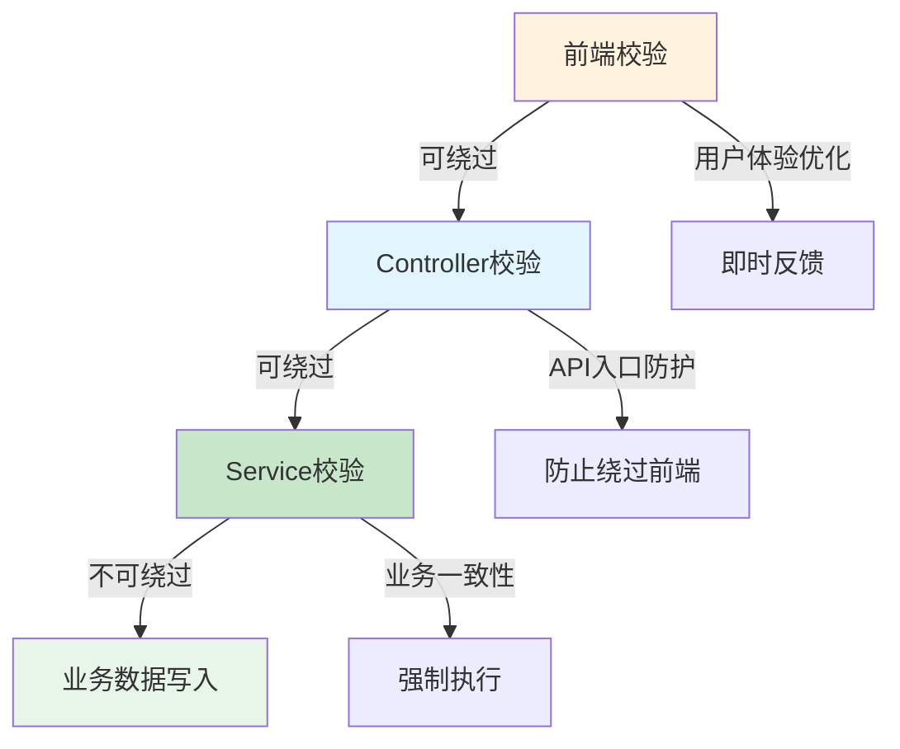

# 校验点归属判断规则模板（validation-placement-decision-template）

> 用于判断校验应该在哪个层次（前端/Controller/Service/跨服务）实现。
> 目标是防止校验点归属错误导致校验可绕过或业务约束失效。

## 一、模板定位

- **文件角色**：方法论模板（不依赖具体业务）
- **适用阶段**：需求分析 / 详细设计
- **使用时机**：当结构化校验规则已形成，需要判断"校验应该在哪个层次实现"
- **输入**：结构化校验规则（来自 `validation-rule-structuring-template.md`）
- **输出**：校验点归属决策表

---

## 二、校验层次分类

### 2.1 四层校验模型

| 层次 | 位置 | 职责 | 可绕过性 | 必要性 |
|------|------|------|----------|--------|
| 前端校验 | Vue页面/API调用层 | 用户体验优化，即时反馈 | **可绕过**（绕过前端直接调API） | 可选 |
| Controller校验 | Java Controller方法入口 | API入口防护，防止绕过前端 | **可绕过**（绕过Controller直接调Service） | **必要** |
| Service校验 | Java Service方法入口 | 业务逻辑一致性保障 | **不可绕过**（业务逻辑强制执行） | **必要** |
| 跨服务校验 | 跨服务调用前 / 数据同步入口 | 跨库数据一致性保障 | 不可绕过（跨库数据强制校验） | 按需 |

### 2.2 层次关系图



---

## 三、归属判断决策表

### 3.1 基于校验特征的归属判断

| 校验特征 | 前端 | Controller | Service | 跨服务 | 决策依据 |
|----------|:----:|:----------:|:-------:|:------:|----------|
| 涉及用户输入格式校验（必填/长度/格式） | ✅必要 | ⚠️可选 | ❌不需要 | ❌不需要 | 格式校验可在前端完成，Controller可选补充 |
| 涉及业务状态校验（已XX/未XX） | ⚠️可选 | ✅必要 | ✅必要 | ❌不需要 | 状态校验必须双重校验，防止绕过 |
| 涉及跨库数据校验 | ❌不需要 | ⚠️可选 | ✅必要 | ✅必要 | 跨库数据必须通过限定通道校验 |
| 涉及业务规则一致性校验 | ⚠️可选 | ✅必要 | ✅必要 | ❌不需要 | 业务规则必须强制执行 |
| 涉及权限校验 | ❌不需要 | ✅必要 | ⚠️可选 | ❌不需要 | 权限校验优先在入口层拦截 |
| 涉及数据完整性校验（外键/关联） | ❌不需要 | ⚠️可选 | ✅必要 | ❌不需要 | 数据完整性必须在业务逻辑层保障 |

### 3.2 基于校验动作的归属判断

| 校验动作 | 前端 | Controller | Service | 跨服务 | 决策依据 |
|----------|:----:|:----------:|:-------:|:------:|----------|
| 硬阻断（不允许继续） | ⚠️可选提示 | ✅必要阻断 | ✅必要阻断 | ✅必要阻断 | 硬阻断必须在后端强制执行，前端可选提示 |
| 软阻断 + 预警（允许但需确认） | ✅必要提示 | ⚠️可选记录 | ⚠️可选记录 | ❌不需要 | 预警提示优先在前端交互层实现 |
| 自动修正（修正后继续） | ❌不需要 | ⚠️可选修正 | ✅必要修正 | ❌不需要 | 自动修正必须在业务逻辑层执行 |
| 记录日志（仅记录不阻断） | ❌不需要 | ⚠️可选记录 | ✅必要记录 | ❌不需要 | 日志记录优先在业务逻辑层执行 |

### 3.3 基于影响范围的归属判断

| 影响范围 | 前端 | Controller | Service | 跨服务 | 决策依据 |
|----------|:----:|:----------:|:-------:|:------:|----------|
| 仅影响本服务内部数据 | ⚠️可选 | ✅必要 | ✅必要 | ❌不需要 | 本服务数据必须双重校验 |
| 涉及跨服务调用 | ❌不需要 | ✅必要 | ✅必要 | ✅必要 | 跨服务数据必须通过限定通道校验 |
| 涉及跨库访问 | ❌不需要 | ⚠️可选 | ✅必要 | ✅必要 | 跨库数据必须通过架构限定通道校验 |

---

## 四、归属判断流程

### 4.1 判断流程图


### 4.2 判断步骤

**步骤一：判断校验特征**
- 从结构化规则中提取"判断对象"和"判断条件"
- 匹配校验特征分类表

**步骤二：判断校验动作**
- 从结构化规则中提取"校验动作"类型
- 匹配校验动作分类表

**步骤三：判断影响范围**
- 从结构化规则中提取"影响范围"
- 判断是否涉及跨服务/跨库

**步骤四：形成归属决策**
- 综合三步判断结果
- 标注必要层次（不可缺失）
- 标注可选层次（可补充但不可替代必要层次）

---

## 五、归属决策输出模板

### 5.1 单条规则归属决策模板

```markdown
### 规则 [规则ID] 归属决策

| 维度 | 决策 | 依据 |
|------|------|------|
| 前端校验 | 必要/可选/不需要 | [判断依据] |
| Controller校验 | 必要/可选/不需要 | [判断依据] |
| Service校验 | 必要/可选/不需要 | [判断依据] |
| 跨服务校验 | 必要/可选/不需要 | [判断依据] |

**必要层次**：[层次列表]
**可选层次**：[层次列表]
**禁止行为**：[禁止用可选层次替代必要层次]
```

### 5.2 归属决策汇总表模板

| 规则ID | 规则名称 | 前端 | Controller | Service | 跨服务 | 必要层次 | 决策依据 |
|--------|----------|:----:|:----------:|:-------:|:------:|----------|----------|
| VAL-001 | [名称] | [决策] | [决策] | [决策] | [决策] | [层次] | [依据] |

---

## 六、使用示例（模板占位）

> 以下示例为占位格式，实际使用时需填充具体项目的真实规则。

### 示例规则归属判断

**输入**：规则 VAL-001 结构化结果

| 维度 | 内容 |
|------|------|
| 规则ID | VAL-001 |
| 规则名称 | 阻止已发货订单履行 |
| 判断对象 | `order.shippingStatus` |
| 判断条件 | `shippingStatus == SHIPPED` |
| 校验动作 | 硬阻断 |
| 影响范围 | 本服务内部数据 |

**归属判断过程**：

1. **判断校验特征**：
   - 特征：涉及业务状态校验
   - 决策：Controller必要 + Service必要

2. **判断校验动作**：
   - 动作：硬阻断
   - 决策：Controller必要阻断 + Service必要阻断

3. **判断影响范围**：
   - 范围：本服务内部数据
   - 决策：不涉及跨服务校验

**归属决策输出**：

| 维度 | 决策 | 依据 |
|------|------|------|
| 前端校验 | 可选 | 用户即时反馈优化，但不可替代后端校验 |
| Controller校验 | **必要** | API入口防护，防止绕过前端直接调API |
| Service校验 | **必要** | 业务逻辑一致性保障，强制执行 |
| 跨服务校验 | 不需要 | 订单数据在本服务内，不涉及跨库 |

**必要层次**：Controller + Service
**可选层次**：前端
**禁止行为**：禁止仅实现前端校验而忽略Controller和Service校验

---

## 七、特殊情况处理

### 7.1 跨库校验归属判断

**特征识别**：
- 判断对象属于其他数据库的表
- 需要通过微服务调用获取数据
- 存在架构限定通道约束

**归属决策**：
| 层次 | 决策 | 依据 |
|------|------|------|
| 跨服务校验 | **必要** | 必须通过限定通道服务校验 |
| Service校验 | **必要** | 跨服务调用结果必须在本服务再次校验 |
| Controller校验 | 可选 | 入口层可选补充 |
| 前端校验 | 可选 | 用户即时反馈优化 |

**原则**：跨库校验必须通过架构限定通道，禁止直接跨库查询。

### 7.2 补打/预警类规则归属判断

**特征识别**：
- 校验动作：软阻断 + 预警
- 需要用户确认后继续执行
- 不强制阻断流程

**归属决策**：
| 层次 | 决策 | 依据 |
|------|------|------|
| 前端校验 | **必要** | 预警提示必须在前端交互层实现 |
| Service校验 | 可选记录 | 后端可选记录预警日志 |
| Controller校验 | 不需要 | 预警不需要入口层拦截 |
| 跨服务校验 | 不需要 | 预警通常不涉及跨服务 |

**原则**：预警类校验优先在前端实现，后端可选补充日志记录。

---

## 八、约束规则

### 必须遵守
1. Controller和Service校验必须同时标注为"必要"（双重校验）
2. 前端校验标注为"必要"时，必须同时标注Controller/Service为"必要"
3. 跨库校验必须标注跨服务校验为"必要"
4. 必须明确标注"必要层次"和"可选层次"

### 禁止行为
1. ❌ 禁止将前端校验标注为"必要"而Controller/Service标注为"不需要"
2. ❌ 禁止将Controller校验标注为"必要"而Service标注为"不需要"
3. ❌ 禁止跨库校验时标注"直接跨库查询"
4. ❌ 禁止将硬阻断规则仅标注前端为"必要"

---

## 九、风险提示

- **前端替代后端**：会导致校验可绕过，业务约束失效
- **Controller替代Service**：会导致业务逻辑层无防护，绕过Controller直接调Service可绕过校验
- **跨库直接查询**：会导致违反架构限定通道约束

---

## 十、与其他模板的关系

| 关联模板 | 关系说明 | 使用顺序 |
|----------|----------|----------|
| `validation-rule-structuring-template.md` | 校验规则结构化 | 先结构化规则，再判断归属 |
| `validation-logic-expression-template.md` | 校验逻辑表达式设计 | 先判断归属，再设计表达式 |
| `cross-db-validation-design-template.md` | 跨库校验方案设计 | 跨库场景专项设计模板 |

---

## 十一、消费建议

1. 需求分析阶段：基于结构化规则判断归属，追加到 `requirement-spec.md`
2. 详细设计阶段：基于归属决策设计校验点位置和实现方式
3. 开发阶段：基于归属决策实现必要层次校验，可选补充可选层次
4. 测试阶段：基于归属决策设计绕过测试（绕过前端、绕过Controller）

---

## 十二、证据路径示例

| 编号 | 类型 | 路径/命令 | 说明 |
|------|------|-----------|------|
| E-01 | Controller | `jalor/service-xxx/.../controller/OrderFulfillmentController.java` | API入口校验位置 |
| E-02 | Service | `jalor/service-xxx/.../service/OrderFulfillmentService.java` | 业务逻辑校验位置 |
| E-03 | 前端页面 | `web/module-xxx/src/views/OrderFulfillment.vue` | 前端校验位置 |
| E-04 | 限定通道服务 | `jalor/channel-service/...` | 跨库校验限定通道 |