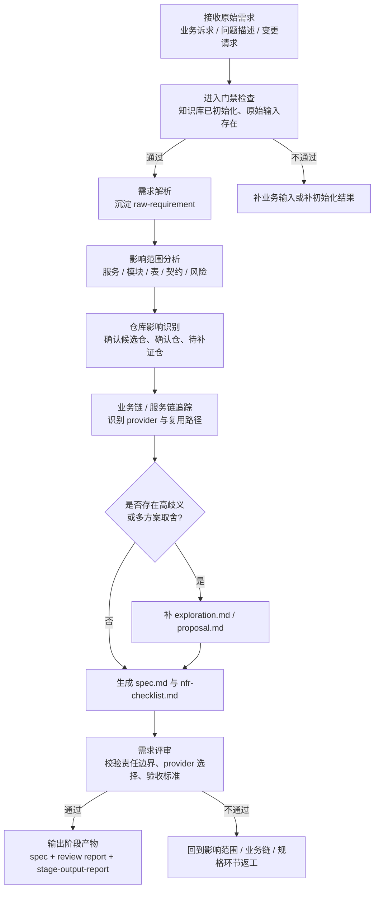

# 需求分析阶段培训流程图

## 1. 阶段目标

需求分析阶段的目标，是把原始业务诉求、问题描述或变更请求，转化为后续设计与开发可消费的**结构化规格说明、影响范围与风险结论**。

> 培训要点：分析阶段不是“讨论想法”，而是把模糊输入压缩成可设计、可验证、可追溯的规格输入。

## 2. 进入条件

- 知识库已初始化
- 已具备原始需求描述、问题背景或变更目标
- 当前目标尚未达到可直接设计或开发的清晰度
- 已完成阶段计划并通过进入门禁

## 3. 详细流程图

## 4. 核心步骤说明

### 4.1 需求解析
- 把业务语言转成结构化输入
- 建立需求范围、目标、约束、非目标与核心歧义列表

### 4.2 影响范围分析
- 识别受影响的服务、模块、表、配置、接口和契约
- 形成仓级责任边界，而不是只给出“可能受影响仓”

### 4.3 业务链与 provider 选择
- 串联关键业务链、服务链与数据链
- 区分技术可达 provider、架构允许 provider、最终选定 provider
- 判断应复用、最小扩展还是新增接口

### 4.4 规格生成与评审
- 生成 `spec.md`
- 明确验收标准、NFR、范围冻结点
- 通过评审确定能否进入设计阶段

## 5. 标准产物

### 5.1 核心输出
- `raw-requirement.md`
- `repo-impact-list.md`
- `repo-placement-decision.md`
- `business-flow-trace.md`
- `provider-selection.md`
- `api-reuse-decision.md`
- `spec.md`
- `nfr-checklist.md`
- `spec-review-report.md`
- `report/stage-output-report.md`

### 5.2 条件产物
- `exploration.md`
- `proposal.md`
- `acceptance-trace-matrix.md`

## 6. 退出门禁

### must-pass
- `spec.md` 已生成
- `impact-scope.md` 或等价影响范围结论已形成
- `report/stage-output-report.md` 已生成，并列出标准产物、已生成文件、未生成文件及原因
- 核心歧义已收敛，无阻断性冲突
- 验收标准已形成可执行表述
- 命中多仓/跨服务场景时，仓级责任边界已形成
- 命中多 provider / 复用场景时，服务链与 provider 选择已形成
- 阶段评审结论为 `✅通过` 或 `⚠️有条件通过`

### should-check
- `exploration.md` / `proposal.md` 已在需要时生成并被吸收进规格
- `nfr-checklist.md`、验收追溯、需求来源可信度、范围冻结点已明确

## 7. 培训讲解要点与常见风险

### 讲解要点
- 分析阶段的交付物不是“讨论纪要”，而是 `spec.md`
- 仓级责任边界是进入设计的硬前提
- provider 选择必须有技术可达、架构允许、最终选定三层判断

### 常见风险
- 只列受影响仓，不形成责任边界
- 只看接口名字，不追业务链和数据链
- 跳过 provider 选择理由，直接进入设计
- 规格没有验收口径，导致后续测试无法闭环

## 8. 节点依据来源

| 流程节点 | 依据来源 |
|---|---|
| 接收原始需求 / 进入门禁 | `phase-analyze.md`、`phase-gates/analyze.md` |
| 需求解析 | `phase-analyze.md`、`command-skill-artifact-map.md` |
| 影响范围分析 | `phase-analyze.md`、`phase-gates/analyze.md`、`command-skill-artifact-map.md` |
| 仓库影响识别 | `phase-analyze.md`、`phase-gates/analyze.md`、`workspace-structure.md` |
| 业务链 / 服务链追踪 | `phase-analyze.md`、`command-skill-artifact-map.md` |
| 高歧义 / 多方案判断 | `phase-analyze.md`、`phase-gates/analyze.md` |
| 需求评审 / 输出阶段产物 | `phase-analyze.md`、`phase-gates/analyze.md`、`stage-artifact-guide.md` |
