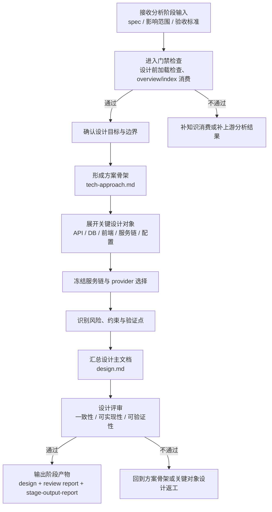

# 详细设计阶段培训流程图

## 1. 阶段目标

详细设计阶段的目标，是把已确认的需求规格转化为**可开发、可验证、可交接**的设计输入，形成明确的服务链、接口、数据模型、前端交互和约束信息。

> 培训要点：设计阶段要从“知道要做什么”推进到“知道该怎么做、在哪做、为什么这样做”。

## 2. 进入条件

- 需求分析阶段已退出
- 已具备 `spec.md`、影响范围与验收标准
- 已完成设计前加载检查
- 已读取 overview 与 index 层知识，不允许跳过全局入口直接出设计

## 3. 详细流程图

## 4. 核心步骤说明

### 4.1 设计前加载检查
- 确认已读取 `backend-overview.md`、`frontend-overview.md`
- 命中参数开关/配置场景时，读取 `parameter-switch-patterns.md`
- 明确后端服务、代码仓、Schema 与前端模块、路由定位

### 4.2 形成方案骨架
- 基于 `spec.md` 先形成主设计思路
- 明确本轮设计覆盖与非覆盖范围
- 明确要不要改 API、DB、前端、配置与服务编排

### 4.3 展开关键设计对象
- API：请求/响应、错误码、统一包装
- DB：新增/修改/复用表、Schema 边界、迁移与回滚考虑
- 服务链：调用路径、provider 选择、禁止路径、契约兼容边界
- 前端：页面、组件、路由、交互与 API 消费方式

### 4.4 审查与收敛
- 形成 `design.md`
- 完成 `design-review-report.md`
- 确保开发与测试阶段可直接消费

## 5. 标准产物

### 5.1 中间设计产物
- `tech-approach.md`
- `database-design.md`
- `api-design.md`
- `frontend-design.md`
- `service-chain-design.md`
- `cross-service-consistency.md`
- `architecture-boundary-decision.md`

### 5.2 核心输出
- `design.md`
- `design-review-report.md`
- `report/stage-output-report.md`

## 6. 退出门禁

### must-pass
- `design.md` 已生成
- `report/stage-output-report.md` 已生成
- 设计文档包含技术方案、数据模型与接口设计
- 新增/变更接口具备请求响应定义
- 涉及数据库变更时，已明确 Schema / 表范围
- 命中多仓/跨服务/多 provider 场景时，服务链已冻结
- 命中私有契约场景时，已显式引用事实源
- 设计文档已显式标注参考的知识库文件
- 命中参数开关场景时，已明确采用哪种参数开关模式
- 阶段评审结论为 `✅通过` 或 `⚠️有条件通过`

### should-check
- ADR 已记录关键决策
- 兼容性、性能、安全、可观测性设计已补充
- 设计到实现映射关系已明确

## 7. 培训讲解要点与常见风险

### 讲解要点
- 设计阶段输出的主文档是 `design.md`，中间设计文件是为了支撑它
- 设计对象必须绑定真实事实来源，不能用通用模板硬套
- 服务链冻结是进入开发的关键分水岭

### 常见风险
- 跳过 overview/index 直接写设计
- 数据库、接口、服务链没有事实来源闭环
- 多个方案并存但未冻结主路径
- 设计只讲抽象思路，开发无法直接消费

## 8. 节点依据来源

| 流程节点 | 依据来源 |
|---|---|
| 接收分析输入 / 进入门禁 | `phase-design.md`、`phase-gates/design.md` |
| 方案骨架 | `phase-design-detail.md`、`command-skill-artifact-map.md` |
| 关键设计对象展开 | `phase-design-detail.md`、`command-skill-artifact-map.md`、`templates/design/design-doc-template.md` |
| 服务链冻结 / provider 选择 | `phase-design.md`、`phase-design-detail.md`、`phase-gates/design.md` |
| 风险与验证点 | `phase-design-detail.md`、`stage-artifact-guide.md` |
| 设计主文档 / 设计评审 | `phase-design.md`、`phase-design-detail.md`、`phase-gates/design.md`、`command-skill-artifact-map.md` |
