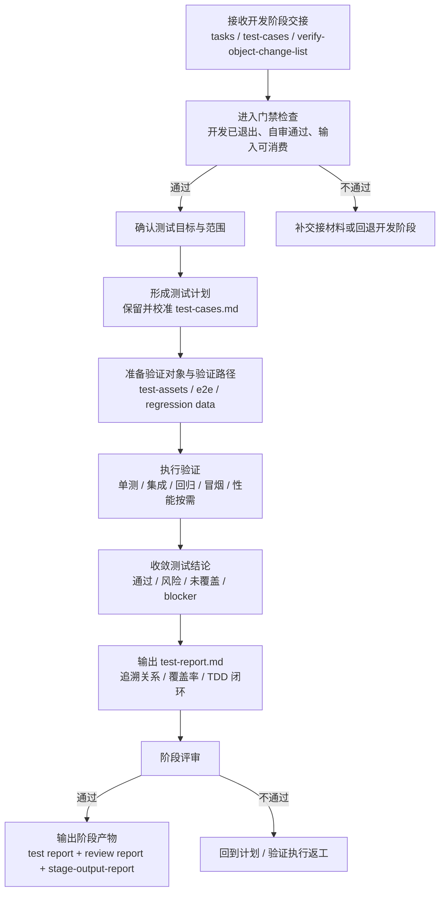

# 测试验证阶段培训流程图

## 1. 阶段目标

测试阶段的目标，是验证当前需求、设计或开发结果是否满足预期目标，识别剩余风险与未覆盖范围，并形成交付阶段可直接消费的测试结论与证据材料。

> 培训要点：测试阶段不是“跑一遍用例”，而是要输出能支持交付判断的测试结论、覆盖率结论和追溯关系。

## 2. 进入条件

- 开发阶段已退出
- 自审无严重未解决问题
- `spec.md` 与 `design.md` 可作为测试输入
- 已具备待验证对象

## 3. 详细流程图

## 4. 核心步骤说明

### 4.1 确认测试范围
- 明确验证的是需求结果、开发结果还是专项修复结果
- 明确关键路径、边界对象与未覆盖范围
- 若承接开发阶段 TDD 计划，先核对 `test-cases.md` 的用户补充区和最终计划

### 4.2 形成与校准测试计划
- 保留开发阶段既有测试范围，不得随意重置
- 可补充缺失用例，但不能通过删减通过用例来“优化结果”

### 4.3 执行验证
- 优先执行关键路径测试
- 视场景执行单元、集成、回归、冒烟、UAT、性能分析
- 对无法执行或未执行项必须明确原因

### 4.4 收敛测试结论
- 汇总通过项、失败项、风险项、未覆盖项
- 明确是否能支撑正式交付判断
- 在 `test-report.md` 中显式记录覆盖率与 TDD 闭环结论

## 5. 标准产物

### 5.1 核心输出
- `test-cases.md`
- `test-report.md`
- `test-review-report.md`
- `report/stage-output-report.md`

### 5.2 常见补充产物
- `integration-tests.md`
- `performance-analysis.md`
- `acceptance-trace-matrix.md`
- `verification-evidence.md`
- `uat-scenarios.md`
- `smoke-and-gray.md`

## 6. 退出门禁

### must-pass
- 测试用例与测试报告已生成
- `report/stage-output-report.md` 已生成
- `test-cases.md` 已保留用户补充与确认后的最终计划
- 本轮新生成测试用例全部通过
- 本轮纳入验证范围的代码行覆盖率达到 100%
- P1 用例全部通过
- P2 用例通过率达到约定阈值
- 无未关闭 P0 缺陷
- 若支撑正式验收或发布判断，需求项到测试结论的追溯关系已形成
- 阶段评审结论为 `✅通过` 或 `⚠️有条件通过`

### should-check
- 单元测试、回归测试数据、UAT 场景、冒烟测试、缺陷跟踪已完成
- 未覆盖需求项、局部验证项与限制条件已显式记录

## 7. 培训讲解要点与常见风险

### 讲解要点
- 测试阶段主交接文档固定为 `test-report.md`
- 测试不只是给“通过/失败”，还要给可交付性判断依据
- 覆盖率、TDD 闭环、追溯关系是培训时必须强调的三条线

### 常见风险
- 重置 `test-cases.md`，导致开发阶段确认过的用例丢失
- 把未覆盖部分默认为通过
- 只跑 happy path，不记录 blocker 与限制条件
- 有测试结果但没有追溯关系，交付阶段无法判断 Go/No-Go

## 8. 节点依据来源

| 流程节点 | 依据来源 |
|---|---|
| 接收开发交接 / 进入门禁 | `phase-test.md`、`phase-gates/test.md` |
| 测试计划 | `phase-test-detail.md`、`command-skill-artifact-map.md` |
| 准备验证对象与路径 | `phase-test-detail.md`、`knowledge-consumption/code-map.md`、`stage-artifact-guide.md` |
| 执行验证 | `phase-test.md`、`phase-test-detail.md`、`phase-gates/test.md` |
| 收敛测试结论 | `phase-test-detail.md`、`phase-gates/test.md` |
| test-report / 阶段评审 | `phase-test.md`、`phase-gates/test.md`、`command-skill-artifact-map.md` |
