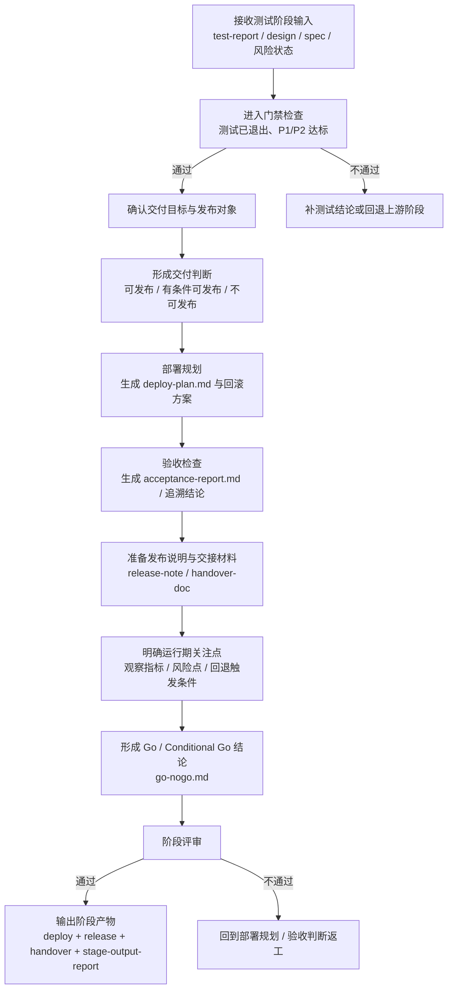

# 发布交付阶段培训流程图

## 1. 阶段目标

发布交付阶段的目标，是把已完成设计、开发、测试并具备基本交付条件的结果，转化为**可执行的发布动作、可审查的验收结论和可恢复的交接状态**。

> 培训要点：交付阶段关注的不只是“能不能发”，还要回答“怎么发、怎么回滚、谁来接、上线后看什么”。

## 2. 进入条件

- 测试验证阶段已退出
- P1 全通过，P2 达到约定阈值
- 当前存在明确交付对象
- 已具备最小交付输入：测试结论、关键产物、风险与 blocker 状态

## 3. 详细流程图

## 4. 核心步骤说明

### 4.1 确认交付对象
- 明确本次交付的是哪个版本、哪个服务、哪个变更集合
- 明确交付范围、排除范围、依赖对象与发布窗口

### 4.2 形成交付判断
- 基于测试结果、风险、回滚边界和依赖状态，判断是否可发布
- 区分全量发布、局部发布或仅继续评估

### 4.3 形成部署与验收材料
- 输出 `deploy-plan.md`
- 输出 `acceptance-report.md`
- 输出 `release-note.md`
- 输出 `handover-doc.md`

### 4.4 运行期关注与交接
- 说明观察指标、告警关注点、兜底动作与回退触发条件
- 更新交付状态并形成可恢复的交接信息

## 5. 标准产物

### 5.1 核心输出
- `deploy-plan.md`
- `acceptance-report.md`
- `go-nogo.md`
- `release-note.md`
- `handover-doc.md`
- `delivery-review-report.md`
- `report/stage-output-report.md`

### 5.2 常见补充产物
- `acceptance-trace-matrix.md`
- `deploy-log.md`
- `delivery-scope.md`
- `refresh-hints.md`

## 6. 退出门禁

### must-pass
- `deploy-plan.md` 已生成且包含回滚方案
- `report/stage-output-report.md` 已生成
- `release-note.md` 已生成
- `go-nogo.md` 已完成并给出 Go / Conditional Go 结论
- 若交付结论依赖需求验收，需求项到测试/验收结论的追溯关系已形成
- 并发锁已释放
- `status-tracker.md` 已更新为交付状态
- 阶段评审结论为 `✅通过` 或 `⚠️有条件通过`

### should-check
- 验收报告、部署日志、交接文档、版本治理记录、发布后观察清单已生成
- `acceptance-trace-matrix.md` 已生成，或已并入验收报告

## 7. 培训讲解要点与常见风险

### 讲解要点
- 交付阶段要把测试结论翻译成发布动作和交接状态
- `go-nogo.md` 是发布判断的关键结论文件
- `handover-doc.md` 是交付阶段主交接文档，不能缺位

### 常见风险
- 只有 release note，没有部署计划和回滚方案
- 交付判断没有验收追溯支撑
- 忘记更新状态跟踪和锁状态
- 没有运行期观察点，交接后无法稳态接手

## 8. 节点依据来源

| 流程节点 | 依据来源 |
|---|---|
| 接收测试输入 / 进入门禁 | `phase-deliver.md`、`phase-gates/deliver.md` |
| 交付目标与发布对象 | `phase-deliver-detail.md`、`phase-gates/deliver.md` |
| 交付判断 | `phase-deliver-detail.md`、`phase-gates/deliver.md` |
| 部署规划 / 验收检查 | `phase-deliver-detail.md`、`command-skill-artifact-map.md` |
| 发布说明与交接材料 | `phase-deliver-detail.md`、`command-skill-artifact-map.md` |
| 运行期关注点 / Go-NoGo | `phase-deliver-detail.md`、`phase-gates/deliver.md` |
| 阶段评审 / 输出阶段产物 | `phase-deliver.md`、`phase-gates/deliver.md`、`stage-artifact-guide.md` |
