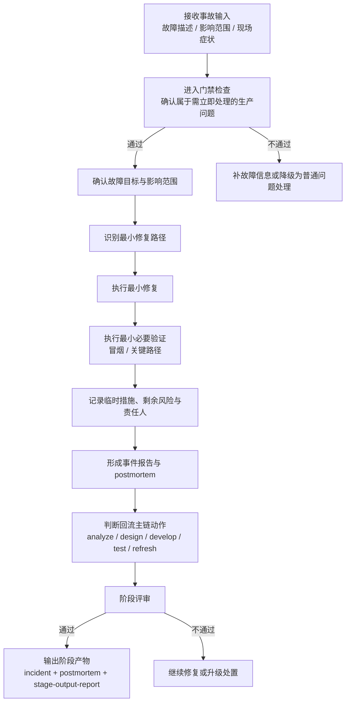

# 紧急修复阶段培训流程图

## 1. 阶段目标

紧急修复阶段的目标，是在明确故障影响与风险边界的前提下，快速定位、最小修复、最小验证，并形成可追溯的紧急修复记录与回流动作。

> 培训要点：紧急修复是“快速但不失真”的治理路径，不是跳过治理的捷径。

## 2. 进入条件

- 存在需要立即处理的生产问题或等价高优先级故障
- 已具备最小故障描述、影响范围或现场症状输入
- 已完成最小阶段计划并通过进入门禁

## 3. 详细流程图

## 4. 核心步骤说明

### 4.1 确认故障范围
- 先识别关键阻断与影响边界
- 明确受影响服务、功能、用户范围与风险级别

### 4.2 最小修复
- 优先选择最小改动、最短恢复路径
- 不以热修为名扩大重构面

### 4.3 最小验证
- 至少完成最小必要冒烟与关键路径验证
- 未验证项必须说明原因和风险

### 4.4 记录与回流
- 形成 `incident-report.md` 与 `postmortem.md`
- 记录临时措施、撤销条件、责任人与后补期限
- 判断是否需要补需求、补设计、补测试、补刷新

## 5. 标准产物

### 5.1 核心输出
- `incident-report.md`
- `postmortem.md`
- `report/stage-output-report.md`

### 5.2 常见补充产物
- `refresh-hints.md`
- 例外记录
- `emergency-review-report.md`
- 回流主链动作清单

## 6. 退出门禁

### must-pass
- 事件报告已生成
- `report/stage-output-report.md` 已生成
- 修复已完成且最小冒烟通过
- `postmortem.md` 已生成
- 回流主链动作已明确
- `status-tracker.md` 已更新

### should-check
- `refresh-hints.md` 已生成
- 例外事项已补记录
- 临时措施的撤销条件或正式化计划已记录

## 7. 培训讲解要点与常见风险

### 讲解要点
- 紧急修复强调“最小修复 + 最小验证 + 完整留痕”
- 热修完成不等于主治理链闭环完成
- 回流 analyze/design/develop/test/refresh 的判断是培训重点

### 常见风险
- 只修代码，不记录临时措施和剩余风险
- 以紧急为名跳过最小验证
- 热修后不回流主链，导致知识与设计长期失真
- 没有 postmortem，事故经验无法沉淀

## 8. 节点依据来源

| 流程节点 | 依据来源 |
|---|---|
| 接收事故输入 / 进入门禁 | `phase-emergency.md`、`phase-gates/emergency.md` |
| 确认故障目标与影响范围 | `phase-emergency.md`、`phase-gates/emergency.md` |
| 最小修复路径 | `phase-emergency.md`、`stage-artifact-guide.md` |
| 最小必要验证 | `phase-emergency.md`、`phase-gates/emergency.md` |
| 记录临时措施 / postmortem | `phase-emergency.md`、`phase-gates/emergency.md` |
| 回流主链动作 | `phase-emergency.md`、`phase-gates/emergency.md`、`phases/index.md` |
| 阶段评审 / 输出阶段产物 | `phase-emergency.md`、`phase-gates/emergency.md`、`stage-artifact-guide.md` |
