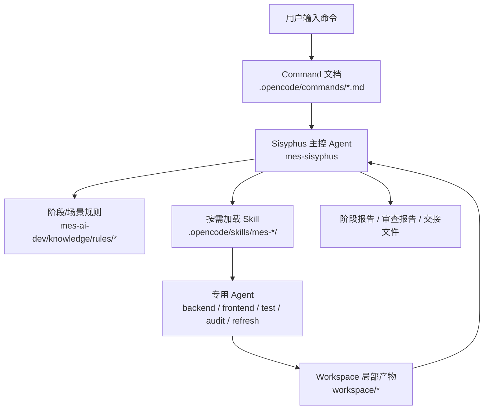
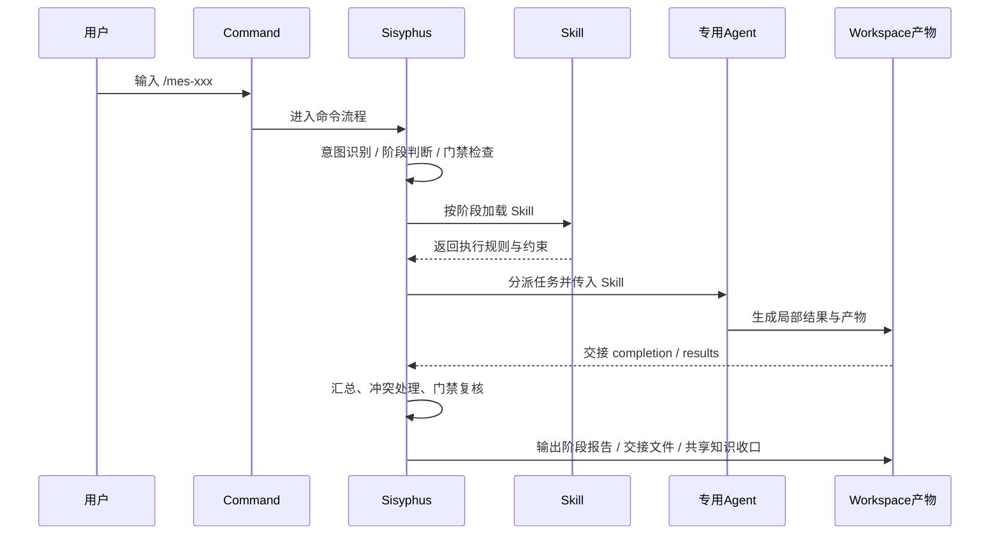

# Command / Agent / Skill 关系说明

## 一、结论

在当前骨架中：

- **Command** 负责定义流程入口、阶段顺序、前置条件、产物与门禁。
- **Agent** 负责执行、编排、审查与收口。
- **Skill** 负责提供阶段能力、执行规则、约束与验证资产。
- **Sisyphus** 是主控编排 Agent，负责拆解、分派、并行协调、冲突仲裁与共享知识串行收口。

整体调用链可以概括为：

> 用户 → Command → Sisyphus → Skill → 专用 Agent → Workspace 产物 → Sisyphus 收口

---

## 二、三者职责

### 1. Command

命令文件位于 `.opencode/commands/*.md`，作用是定义一个骨架流程的入口与执行蓝图。它通常描述：

- 适用场景
- 前置条件
- 分阶段步骤
- 每阶段要加载的 Skill
- 每阶段的标准产物
- 门禁与审查要求

### 2. Agent

Agent 位于 `.opencode/agents/*/AGENT.md`，负责具体执行或审核工作。当前骨架中最核心的是 `mes-sisyphus`，它承担主控编排职责。其他 Agent 多为专用执行器或审查器，例如：

- `mes-backend-developer`
- `mes-frontend-developer`
- `mes-service-analyzer`
- `mes-review-auditor`
- `mes-test-executor`
- `mes-knowledge-refresh`

### 3. Skill

Skill 位于 `.opencode/skills/mes-*/`，是目录化的能力模块。每个 Skill 通常包含：

- `SKILL.md`
- `INDEX.md`
- `modules/`
- `evals/`

读取顺序应为：

> `SKILL.md` → `INDEX.md` → 命中的 `modules/*.md` → 按需进入 `evals/`

---

## 三、Command、Agent、Skill 的关系

---

## 四、调用流程图

---

## 五、命令到 Skill 的典型映射

### 需求分析

- `mes-analyze-requirement`
  - `mes-analyze-parse-requirement`
  - `mes-analyze-impact-scope`
  - `mes-analyze-requirement-diff`
  - `mes-analyze-identify-repos`
  - `mes-analyze-trace-flow`
  - `mes-analyze-generate-spec`
  - `mes-analyze-review-spec`

### 详细设计

- `mes-design-detail`
  - `mes-design-approach`
  - `mes-design-database`
  - `mes-design-api`
  - `mes-design-frontend`
  - `mes-design-service-chain`
  - `mes-design-check-consistency`
  - `mes-design-generate-doc`
  - `mes-design-review-approach`

### 代码开发

- `mes-develop-code`
  - `mes-develop-plan-tasks`
  - `mes-test-plan-cases`
  - `mes-develop-database-script`
  - `mes-develop-backend-model`
  - `mes-develop-backend-dao`
  - `mes-develop-backend-service`
  - `mes-develop-backend-controller`
  - `mes-develop-backend-config`
  - `mes-develop-frontend-api`
  - `mes-develop-frontend-component`
  - `mes-develop-frontend-page`
  - `mes-develop-self-review`
  - `mes-develop-security-review`

### 测试验证

- `mes-test-verify`
  - `mes-test-plan-cases`
  - `mes-test-generate-unit`
  - `mes-test-generate-integration`
  - `mes-test-performance-analysis`
  - `mes-test-generate-report`

### 发布交付

- `mes-deliver-release`
  - `mes-deliver-deploy-plan`
  - `mes-deliver-acceptance-check`
  - `mes-deliver-execute-deploy`
  - `mes-deliver-release-note`
  - `mes-deliver-handover`

---

## 六、骨架中的关键规则

- Command 只是流程说明，不直接承载实现。
- Skill 必须按目录化结构读取，不能整包常驻。
- Agent 负责执行和收口，不直接跳过门禁。
- Sisyphus 统一负责共享知识串行写入。
- 局部结果先产出，再由主控汇总。

---

## 七、文件来源

- `.opencode/commands/*.md`
- `.opencode/agents/*/AGENT.md`
- `.opencode/skills/mes-*/`
- `mes-ai-dev/knowledge/reference/command-skill-artifact-map.md`
- `mes-ai-dev/knowledge/reference/agent-tool-routing-guide.md`
- `mes-ai-dev/knowledge/rules/core/agent-core.md`
- `mes-ai-dev/knowledge/rules/governance/skill-consumption-standard.md`
- `mes-ai-dev/knowledge/rules/governance/skill-structure-standard.md`
- `mes-ai-dev/knowledge/reference/skeleton-loading-matrix.md`
