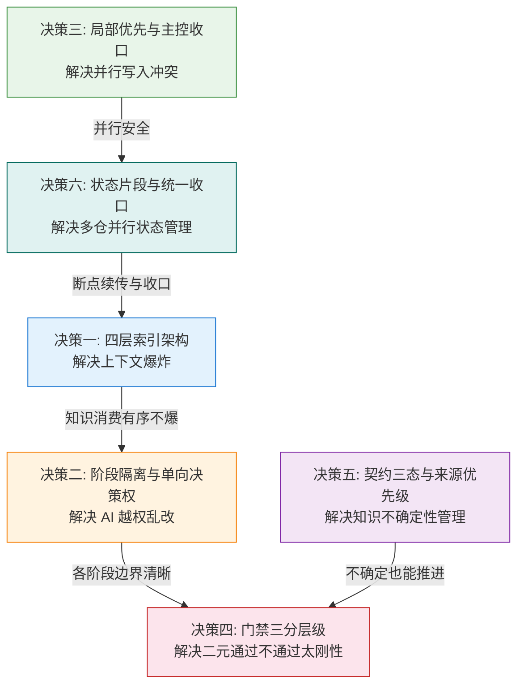

# MES-AI-DEV 骨架详细设计思路

> 本文档用于培训，阐述骨架的六个核心设计决策及其设计动机。

---

## 设计决策一：分层知识架构 —— 为什么是四层索引？

### 要解决的问题

MES 类大仓动辄百万行代码，AI 上下文窗口装不下，直接读源码会爆。

### 错误方案

让 AI 按需读文件 → 每次请求都从头摸索 → 效率极低且不可复现。

### 骨架设计

建立固定的四层索引，消费时从上往下逐层深入，**绝不跳层**：

```
L0 总览层        backend-overview.md / frontend-overview.md
                 1-2 个文件，理解全局架构
                        ↓
L1 索引层        services/service-xxx/index.md
                 每个 service/module 一个，快速定位
                        ↓
L1.5 文件摘要层   services/service-xxx/file-summaries.md
                 不读源码就能理解文件职责
                        ↓
L2 精准源码层     直接读目标 Java/Vue 文件
                 只读当前任务必须的代码
```

### 每层的意图

| 层级 | 回答的问题 | 典型产物 | Token 消耗 |
|------|----------|---------|-----------|
| L0 总览 | "系统长什么样？" | backend-overview.md, frontend-overview.md | 极小 |
| L1 索引 | "去哪里找？" | services/service-xxx/index.md | 小 |
| L1.5 文件摘要 | "这个文件干什么？" | services/service-xxx/file-summaries.md | 中 |
| L2 精准源码 | "具体怎么实现？" | 直接读 Java/Vue 源文件 | 按需控制 |

### 关键约束

骨架规则明确禁止跳层消费——不得跳过 overview 和 index 直接产出设计结论。

---

## 设计决策二：阶段隔离 + 单向决策权 —— 为什么各阶段不能越权？

### 要解决的问题

AI 在写代码时发现"其实用另一个 provider 更好"，如果允许它在开发阶段自行改决策，会导致上游分析/设计阶段的结论被悄悄推翻，且无任何留痕。

### 骨架设计

每个阶段有明确的**决策权边界**，下游阶段不得越权：

| 阶段 | 独占决策权 | 不得越权做的事 |
|------|----------|--------------|
| 初始化 | 仓边界、调用链、数据库归属、契约来源 | 不得替下游决定 API 复用策略 |
| 需求分析 | 仓级责任边界、Provider 选择、API 复用判断 | 不得替设计阶段决定具体接口结构 |
| 详细设计 | 服务链冻结、禁止路径、接口/数据库具体设计 | 不得替开发阶段决定代码实现细节 |
| 代码开发 | 代码实现方式 | **不得重拍上游的仓边界/Provider/服务链决策** |
| 测试验证 | 验证结论 | 不得重定义验证范围 |
| 发布交付 | Go/No-Go 判断 | 不得重拍契约/provider |

### 发现越权时的处理

```
开发阶段发现 Provider 选择有问题
    ↓
不得在开发阶段直接改路线
    ↓
必须回流到设计阶段（或分析阶段）
    ↓
由有权阶段重新决策，记录 ADR
    ↓
开发阶段沿新决策继续
```

### 设计意图

决策权与责任绑定。谁做的决策，谁留下理由和证据。这样任何时刻都可以追溯"为什么选了这个 provider"。

---

## 设计决策三：局部优先 + 主控收口 —— 为什么不让并行 Agent 直接写共享文件？

### 要解决的问题

大仓初始化时需要并行扫描多个服务，如果多个 Agent 同时写同一个全局文件（如 api-registry.md），会产生冲突和覆盖。

### 骨架设计

所有并行工作只写**局部产物**，全局共享文件由**主控 Agent 串行收口**：

```
并行 Agent A 扫描 mes-production
    → 只写 services/mes-production/index.md
    → 只写 state/fragments/repo-mes-production.yaml

并行 Agent B 扫描 mes-quality
    → 只写 services/mes-quality/index.md
    → 只写 state/fragments/repo-mes-quality.yaml

                ↓ 全部完成后

主控 Agent 串行收口
    → 读取所有 fragments
    → 合并写入 api-registry.md（全局）
    → 合并写入 state.yaml（全局）
    → 合并写入 hot-services.md（全局）
```

### 初始化三命令的职责分工

| 命令 | 职责 | 写什么 |
|------|------|--------|
| `mes-init-project` | 基础建图 | 先写局部产物（按仓命名） |
| `mes-init-enrich` | 深度补充 | 先写 scope 级片段 |
| `mes-init-converge` | 全局收敛 | **只有这个命令**写全局共享文件 |

### 设计意图

并发安全 + 可审计。每个局部产物都是独立的，可以独立验证；全局收口是显式动作，不是隐式覆盖。

---

## 设计决策四：门禁三分层级 —— 为什么不是"通过/不通过"二选一？

### 要解决的问题

实际研发中有很多"不完全达标但可以继续推进"的中间状态。如果只有通过/不通过，会导致要么阻塞所有进度，要么放水降低标准。

### 骨架设计

门禁采用**三层分级** + **四种结论口径**：

```
门禁层级：
  must-pass    硬阻断，不满足不得继续
  should-check 重要检查，未满足必须记录风险 + 补偿动作 + 后补计划
  advisory     建议项，纳入评审关注但不阻断

结论口径：
  ✅ 通过
  ⚠️ 有条件通过（满足 GSD Continue Exit 条件）
  ❌ 不通过
  ⚠️ 最小可交付（可继续推进但不可视为完整通过）
```

### 对应到双轨执行模式

```
Strict 模式：完整治理链，所有 must-pass 必须通过
                ↑ 数据库破坏性变更、state.yaml 变更、高风险安全变更等

GSD 模式：  最小可交付 + blocker 分类 + 后补动作
                ↑ 目标明确、范围可控时允许快速推进
                ↑ 但不允许跳过治理，只是记录风险后继续
```

### 设计意图

承认现实中存在"不完美但可推进"的状态，用结构化方式管理风险，而不是二元选择。

---

## 设计决策五：契约三态 + 来源优先级 —— 为什么承认"我不知道"比假装知道更安全？

### 要解决的问题

初始化阶段不可能对所有知识都建立完整确认。如果强制"要么确认要么报错"，会阻塞所有后续阶段；如果允许"AI 按通用框架补洞"，会注入错误知识。

### 骨架设计

引入**知识三态模型**：

```
✅ 确认态    有明确代码/契约/文档证据，已验证
⚠️ 候选态    有依据但未完全确认（如从使用点推断）
❌ 未知态    无证据，不得用框架常识或模板填补
```

配合**来源优先级**：

```
1. 从定义点提取（如 SDK 中的统一响应类）     → 最高可信度
2. 从使用点推断（如 Controller 中看到包装）   → 候选态，需后续验证
3. 从框架常识推断（如"Spring Boot 一般这么写"）→ ❌ 严禁作为知识来源
```

### 空模板阻断规则

`api-conventions.md` 文件存在但内容是空模板 → 视为"未知态"，后续 analyze/design 阶段不得当作已知规范消费。

### 设计意图

在"阻塞一切"和"允许错误"之间找到平衡——承认不确定性，但明确标注，不让未确认知识静默进入下游决策。

---

## 设计决策六：状态片段 + 统一收口 —— 为什么不直接维护一个全局 state.yaml？

### 要解决的问题

多仓初始化、并行 Agent、断点续传都涉及状态管理。如果直接维护全局 state.yaml：
- 并行写入冲突
- 断点续传时无法区分哪些 scope 已完成
- 单仓补录后全局状态不一致

### 骨架设计

```
每个 scope 维护自己的状态片段：
    state/fragments/repo-mes-production.yaml   ← 只记录自己
    state/fragments/repo-mes-quality.yaml      ← 只记录自己
    state/fragments/schema-mes-data.yaml       ← 只记录自己

收敛时主控串行合并：
    state/fragments/*.yaml → state.yaml（全局）
```

每个状态片段记录：

```yaml
scope: mes-production
coverage:
  scan: completed
  detail: pending
  api-registry: completed
checkpoint: "phase-3-step-2"    # 断点续传用
pending_shared_files:           # 待收口清单
  - api-registry
  - service-dependencies
```

### 设计意图

- **并行安全**：每个 scope 独立，不冲突
- **断点续传**：checkpoint 精确到步骤级
- **收口可控**：全局状态是显式合并的结果，不是隐式覆盖
- **可审计**：可以对比片段与全局，验证一致性

---

## 六个设计决策之间的关系



**六个决策共同服务于一个目标：让 AI 在复杂企业研发环境中可治理、可审查、可追溯、可持续接续地工作。**
