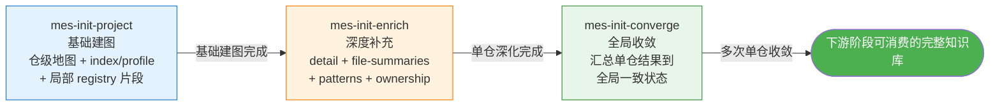
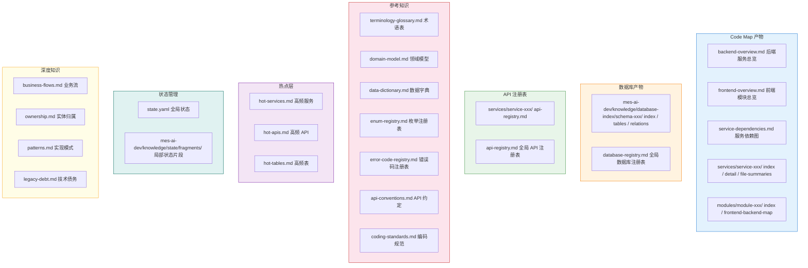

# 阶段一：代码仓初始化 —— 流程图与骨架优势分析

> 本文档用于培训，详细说明 MES-AI-DEV 骨架的初始化阶段流程、为什么不能用常规项目初始化，以及当前骨架的核心优势。

---

## 一、为什么不能用常规项目初始化？

### 1.1 常规初始化的典型做法

```
开发人员拿到新项目
    ↓
手动浏览代码目录结构
    ↓
凭经验理解分层架构
    ↓
问老员工 / 看文档 / 逐步摸索
    ↓
开始写代码（基于不完整理解）
```

### 1.2 常规初始化在 MES 类大仓中的致命问题

| 问题 | 常规做法的后果 | MES-AI-DEV 的解决方式 |
|------|---------------|---------------------|
| **信息丢失** | 靠人记忆，人员离职后知识消失 | 结构化知识库持久化，越做越完整 |
| **理解不完整** | 只看自己负责的模块，不理解全局依赖 | 四层索引架构：总览→索引→摘要→源码 |
| **契约不可追溯** | 不清楚统一响应、错误码、SDK 模型的定义来源 | 从定义点提取契约级知识，区分确认/候选/未知三态 |
| **上下文爆炸** | 大仓百万行代码，AI 直接读全量会爆上下文 | 分层消费 + 热点优先 + 预算守卫 |
| **无基线** | 每次需求都从零开始摸索 | 初始化建立知识基线，后续阶段直接消费 |
| **不可持续** | AI 的理解仅存在于当前对话 | 阶段记忆持久化，跨 session 可恢复 |
| **无治理** | AI 自由发挥，输出不可控 | 门禁审查 + 产物分类 + 步骤级阻断 |

### 1.3 骨架初始化的核心优势

1. **规格驱动开发（SDD）**：先建知识底座，再消费知识做需求/设计/开发，不允许无基线推进
2. **Harness Engineering**：AI 被约束在可检查、可复盘、可追责的工程支架内
3. **长上下文管理**：四层索引架构 + 热点优先 + 预算守卫，解决大仓上下文爆炸
4. **阶段记忆持久化**：初始化知识不是一次性消费，而是后续所有阶段的基础输入
5. **增量式建设**：支持全仓一次性建图、单仓增量建图、按需深化三种模式
6. **断点续传**：大仓初始化中断后可从 checkpoint 继续，不必从头再来
7. **契约级知识识别**：自动识别统一响应、错误码、SDK 模型、认证/MQ 契约等跨服务公共契约

**初始化阶段执行原则**：
- 编码前思考：先明确初始化 scope、仓/模块/Schema 边界、产物层级和未知项标记方式。
- 简洁优先：优先建立下游可消费的最小知识基线，不生成无关深度长文档。
- 精准修改：单仓、定向或深化初始化不得越界扫描或覆盖非当前 scope 共享知识。
- 目标驱动执行：以知识覆盖、局部产物、状态片段和下游消费映射作为完成标准。
- 可按需使用 GitNexus 类代码知识图谱辅助抽取结构关系、调用链、依赖链和热点入口。
- 可按需使用 graphify 类能力形成初始化图谱报告或 wiki 导读，但不得替代确认/候选/未知三态结论。

---

## 二、初始化阶段整体流程图

```mermaid
flowchart TB
    START([启动初始化]) --> MODE{选择初始化模式}

    MODE -->|全仓初始化| FULL["mes-init-project 无参数"]
    MODE -->|单仓定向初始化| SINGLE["mes-init-project --services=xxx"]
    MODE -->|断点续传| RESUME["检测 checkpoint 从未完成 Phase 继续"]

    FULL --> PH1
    SINGLE --> PH1
    RESUME --> PH1

    subgraph PHASE1 ["Phase 1: 仓级扫描"]
        PH1["后端扫描 mes-init-scan-backend"] --> PH2["前端扫描 mes-init-scan-frontend"]
        PH2 --> PH3["数据库索引 mes-init-index-database"]
    end

    subgraph PHASE2 ["Phase 2: 服务深度分析"]
        PH3 --> PH4["服务包结构分析 mes-init-analyze-service"]
        PH4 --> PH5["配置与依赖分析 mes-init-analyze-config"]
        PH5 --> PH6["前端路由分析 mes-init-analyze-routes"]
    end

    subgraph PHASE3 ["Phase 3: API 与依赖建图"]
        PH6 --> PH7["API 端点抽取 mes-init-extract-api"]
        PH7 --> PH8["依赖图构建 mes-init-build-dependency-graph<br>按需结合 GitNexus 图谱辅助校验"]
        PH8 --> PH9["Code Map 构建 mes-init-build-code-map"]
    end

    subgraph PHASE4 ["Phase 4: 业务流与风险扫描"]
        PH9 --> PH10["业务流扫描 mes-init-scan-flows"]
        PH10 --> PH11["热点扫描 mes-init-scan-hotspots"]
        PH11 --> PH12["模式抽取 mes-init-scan-patterns"]
    end

    subgraph PHASE5 ["Phase 5: 参考知识抽取"]
        PH12 --> PH13["业务参考提取 mes-init-extract-reference<br>按需使用 graphify 形成知识导读"]
        PH13 --> PH14["测试资产评估 mes-init-assess-testability"]
    end

    subgraph PHASE6 ["Phase 6: E2E 验证与知识校验"]
        PH14 --> PH15["端到端链路验证 mes-init-verify-e2e-chain"]
        PH15 --> PH16["知识完整性校验 mes-init-verify-knowledge"]
    end

    PH16 --> GATE1{"步骤门禁审查"}

    GATE1 -->|不通过| PH1
    GATE1 -->|通过| STATE_WRITE["写入状态片段 mes-ai-dev/knowledge/state/fragments/*.yaml"]

    STATE_WRITE --> MODE_CHECK{"初始化模式?"}

    MODE_CHECK -->|全仓模式| PHASE7["Phase 7: 局部结果汇总与收拢准备"]
    MODE_CHECK -->|单仓/定向模式| KEEP_LOCAL["仅保留局部产物 待后续 converge 收口"]

    PHASE7 --> CONVERGE["Phase 8A: 最终收拢 统一生成全局共享文件"]

    CONVERGE --> GATE_EXIT{"退出门禁"}
    KEEP_LOCAL --> GATE_EXIT

    GATE_EXIT -->|不通过| PH1
    GATE_EXIT -->|通过| REPORT1["输出阶段完成产物报告 report/stage-output-report.md"]

    REPORT1 --> ENRICH_NEEDED{"需要深化?"}

    ENRICH_NEEDED -->|"是 大仓或超大仓"| ENRICH["mes-init-enrich 按需深化"]
    ENRICH_NEEDED -->|"否 小仓已完整"| INIT_DONE

    subgraph ENRICH_PHASE ["深化阶段"]
        ENRICH --> EN1["服务 detail 深化"]
        EN1 --> EN2["file-summaries 生成"]
        EN2 --> EN3["模式与反模式补充"]
        EN3 --> EN4["ownership 建立"]
        EN4 --> EN5["热点层刷新"]
        EN5 --> EN6["terminology-glossary 充实"]
        EN6 --> EN7["数据库明细生成"]
    end

    EN7 --> GATE_ENRICH{"深化门禁"}
    GATE_ENRICH -->|通过| INIT_DONE(["初始化完成"])
    GATE_ENRICH -->|不通过| EN1

    style START fill:#4CAF50,color:white
    style INIT_DONE fill:#4CAF50,color:white
    style GATE1 fill:#FF9800,color:white
    style GATE_EXIT fill:#FF9800,color:white
    style GATE_ENRICH fill:#FF9800,color:white
    style MODE fill:#2196F3,color:white
```



---

## 三、初始化三命令协作关系



---

## 四、初始化阶段知识产物全景图



---

## 五、初始化阶段门禁检查清单

### 5.1 进入门禁（Enter Gate）

| 检查项 | 层级 | 说明 |
|--------|------|------|
| 确认初始化范围 | must-pass | 全仓 / 单仓 / 定向模块明确 |
| 前置知识库状态检查 | must-pass | 是否已有部分初始化结果可续传 |
| 仓规模评估 | should-check | 小仓一次完成 vs 大仓分批深化 |

### 5.2 步骤门禁（Step Gate）

| 检查项 | 层级 | 说明 |
|--------|------|------|
| 局部产物非空模板 | must-pass | 空模板不可消费，不得注入下游 |
| 契约级知识三态标注 | must-pass | 确认/候选/未知，不得用框架常识补洞 |
| 知识来源可追溯 | must-pass | 每项知识标注真实来源 |
| 真实性校验 | must-pass | 不允许模板、通用常识直接填补 |

### 5.3 退出门禁（Exit Gate）

| 检查项 | 层级 | 说明 |
|--------|------|------|
| 最小知识面完成 | must-pass | 仓边界、调用链、数据库归属、契约、配置、测试资产 |
| 阶段完成产物报告 | must-pass | stage-output-report.md 已生成 |
| coverage 与 state 一致 | must-pass | init-coverage.md 与 state.yaml 一致 |
| terminology-glossary 真实填充 | must-pass | 不得仅保留空模板 |
| 未覆盖范围显式标注 | should-check | 局部可消费 vs 全局可消费的边界 |

---

## 六、常规初始化 vs 骨架初始化 对比流程图

```mermaid
flowchart TB
    subgraph TRADITIONAL ["常规初始化流程"]
        T1["开发人员拿到项目"] --> T2["手动浏览目录"]
        T2 --> T3["问老员工或看文档"]
        T3 --> T4["凭经验理解架构"]
        T4 --> T5["开始写代码"]
        T5 --> T6["发现理解偏差 返工"]
        T6 --> T7["换人接手 知识断层"]
        T7 --> T8["重复踩坑"]
    end

    subgraph SKELETON ["骨架初始化流程"]
        S1["执行 mes-init-project"] --> S2["自动扫描后端前端数据库"]
        S2 --> S3["自动抽取 API 依赖 配置"]
        S3 --> S4["建立四层索引知识库"]
        S4 --> S5["门禁审查确保质量"]
        S5 --> S6["按需深化 mes-init-enrich"]
        S6 --> S7["全局收敛 mes-init-converge"]
        S7 --> S8["结构化知识基线就绪 下游阶段直接消费"]
    end

    style T6 fill:#FFCDD2
    style T7 fill:#FFCDD2
    style T8 fill:#FFCDD2
    style S5 fill:#C8E6C9
    style S8 fill:#C8E6C9
```



---

## 七、关键术语表

| 术语 | 含义 |
|------|------|
| **四层索引** | L0 总览 → L1 索引 → L1.5 文件摘要 → L2 精准源码 |
| **三态规则** | 确认（已验证）/ 候选（有依据待确认）/ 未知（无依据） |
| **局部产物** | 按 repo/module/schema 命名的独立知识文件 |
| **状态片段** | mes-ai-dev/knowledge/state/fragments/*.yaml，记录局部初始化进度 |
| **契约级知识** | 统一响应、错误码、SDK 模型、认证/MQ 契约等跨服务公共约定 |
| **热点层** | hot-services / hot-apis / hot-tables，高频率入口点优先消费 |
| **断点续传** | 初始化中断后从 checkpoint 继续，不必从头再来 |
| **门禁** | must-pass / should-check / advisory 三层检查机制 |
