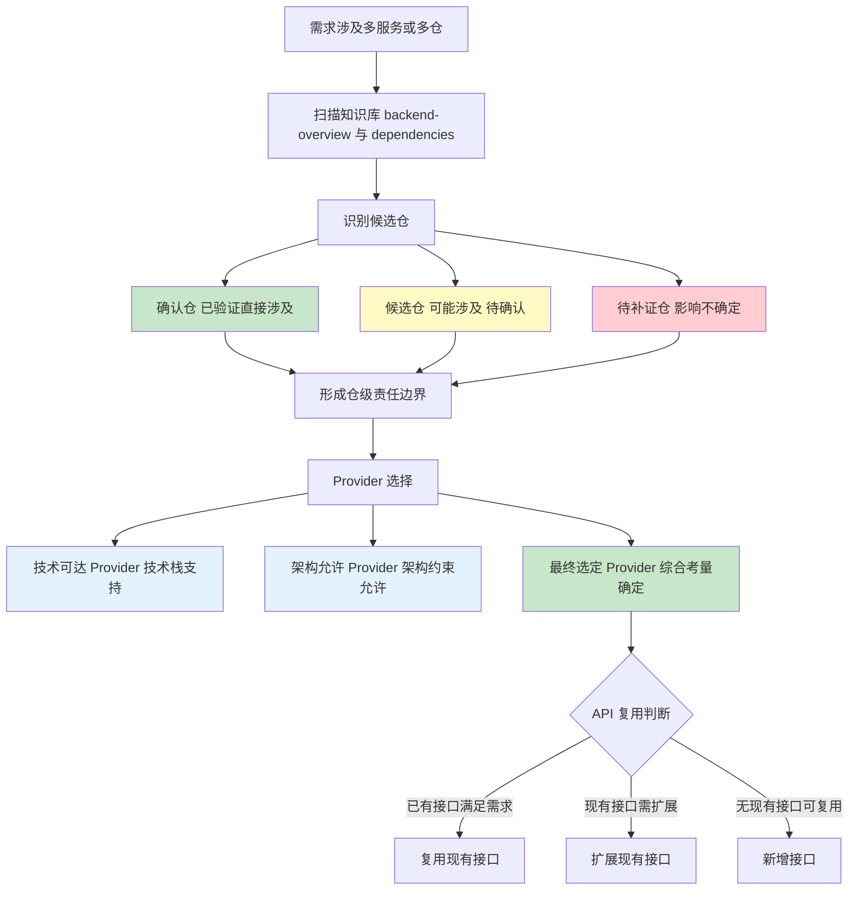
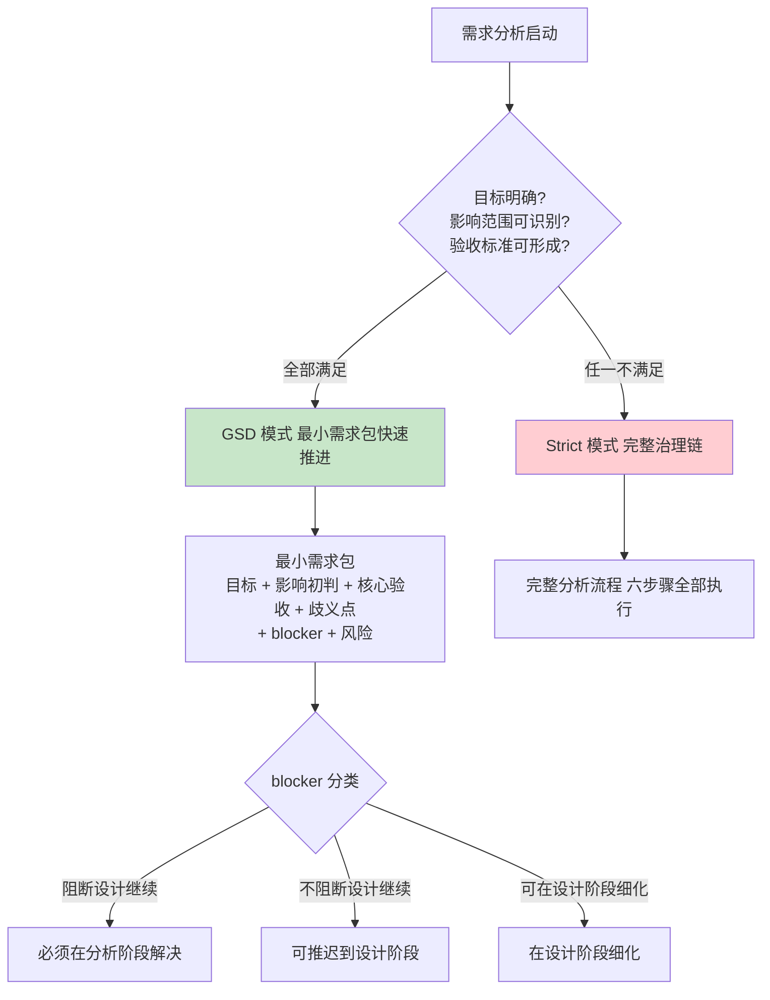

# 阶段二：需求分析 —— 流程图与关键活动说明

> 本文档用于培训，详细说明 MES-AI-DEV 骨架的需求分析阶段流程、技能链、门禁机制和核心产出。

---

## 一、需求分析阶段定位

需求分析阶段是骨架的 **第二个消费阶段**，它在初始化建立的知识基线之上，将原始业务需求转化为结构化的需求规格文档，为后续设计与开发提供可消费的输入。

**核心原则**：先规格、后实现。不允许"需求未清楚就直接写代码"。

**触发命令**：`/mes-analyze-requirement`

**前置条件**：
- 知识库已初始化（执行过 `/mes-init-project`）
- 需求描述已提供（用户输入或文档）
- 契约级知识已可消费（`contracts.md` 等）

---

## 二、需求分析阶段整体流程图

```mermaid
flowchart TB
    START(["收到业务需求"]) --> PRECHECK{"前置检查"}

    PRECHECK -->|"知识库未初始化"| ABORT_INIT["请先执行初始化 mes-init-project"]
    PRECHECK -->|"契约知识不可消费"| ABORT_CONTRACT["先确认 contracts.md 可用"]
    PRECHECK -->|"前置条件满足"| GATE_ENTER{"进入门禁"}

    GATE_ENTER -->|"不通过"| FIX_ENTER["补齐前置条件"]
    FIX_ENTER --> GATE_ENTER
    GATE_ENTER -->|"通过"| STEP1

    subgraph STEP1_PHASE ["Step 1: 需求解析"]
        STEP1["mes-analyze-parse-requirement<br>将原始业务语言解析为结构化要素"] --> STEP1_OUT["产出: 结构化需求要素<br>业务目标 功能范围 约束条件 验收标准"]
    end

    STEP1_OUT --> GATE_S1{"Step 1 门禁"}
    GATE_S1 -->|"不通过"| STEP1
    GATE_S1 -->|"通过"| STEP2

    subgraph STEP2_PHASE ["Step 2: 影响范围识别"]
        STEP2["mes-analyze-identify-repos<br>识别涉及的代码仓 数据库 Schema 与配置"] --> STEP3["mes-analyze-impact-scope<br>分析影响的服务 模块 表"]
    end

    STEP3 --> STEP2_OUT["产出: 影响范围结论<br>受影响仓 服务 模块 表 风险等级 依赖关系"]

    STEP2_OUT --> GATE_S2{"Step 2 门禁"}
    GATE_S2 -->|"不通过"| STEP2
    GATE_S2 -->|"通过"| STEP4

    subgraph STEP3_PHASE ["Step 3: 仓级责任边界与 Provider 决策"]
        STEP4["仓级责任边界形成<br>区分候选仓 确认仓 待补证仓"] --> STEP5["Provider 选择判断<br>技术可达 架构允许 最终选定"]
        STEP5 --> STEP6["API 复用判断<br>复用 扩展 新增"]
    end

    STEP6 --> STEP3_OUT["产出: 仓级责任边界 Provider 选择理由 API 复用结论"]

    STEP3_OUT --> GATE_S3{"Step 3 门禁<br>must-pass: 仓边界已形成<br>must-pass: Provider 已区分"}
    GATE_S3 -->|"不通过"| STEP4
    GATE_S3 -->|"通过"| STEP7

    subgraph STEP4_PHASE ["Step 4: 业务流追踪"]
        STEP7["mes-analyze-trace-flow<br>追踪跨服务调用链 验证数据流向与依赖"] --> STEP7_OUT["产出: 业务调用链<br>数据流向 异常路径 关键依赖节点"]
    end

    STEP7_OUT --> GATE_S4{"Step 4 门禁"}
    GATE_S4 -->|"不通过"| STEP7
    GATE_S4 -->|"通过"| STEP8

    subgraph STEP5_PHASE ["Step 5: 规格文档生成"]
        STEP8["mes-analyze-generate-spec<br>生成 OpenSpec 需求规格 整合前序分析结论"] --> STEP8_OUT["产出: spec.md 需求规格文档"]
    end

    STEP8_OUT --> GATE_S5{"Step 5 门禁"}
    GATE_S5 -->|"不通过"| STEP8
    GATE_S5 -->|"通过"| STEP9

    subgraph STEP6_PHASE ["Step 6: 需求评审"]
        STEP9["mes-analyze-review-spec<br>审查完整性 一致性 可测试性 可实现性"] --> STEP9_OUT["产出: spec-review-report.md 详细审查报告"]
    end

    STEP9_OUT --> GATE_EXIT{"退出门禁"}

    GATE_EXIT -->|"不通过"| STEP1
    GATE_EXIT -->|"通过"| SWEEP["Completion Sweep<br>设计可以继续吗? 最小决策点已压缩? 阻断歧义已区分?"]

    SWEEP --> FINAL["最终输出<br>需求目标 + 影响范围 + 核心验收标准<br>+ 关键歧义点 + blocker + 风险说明 + 推荐下一步"]

    FINAL --> DONE(["需求分析完成 可进入设计阶段"])

    style START fill:#2196F3,color:white
    style DONE fill:#4CAF50,color:white
    style GATE_ENTER fill:#FF9800,color:white
    style GATE_S1 fill:#FF9800,color:white
    style GATE_S2 fill:#FF9800,color:white
    style GATE_S3 fill:#FF9800,color:white
    style GATE_S4 fill:#FF9800,color:white
    style GATE_S5 fill:#FF9800,color:white
    style GATE_EXIT fill:#FF9800,color:white
    style ABORT_INIT fill:#FFCDD2,stroke:#C62828
    style ABORT_CONTRACT fill:#FFCDD2,stroke:#C62828
```



---

## 三、需求分析阶段关键决策点

### 3.1 仓级责任边界决策



### 3.2 GSD vs Strict 模式选择



---

## 四、需求分析阶段产物结构

```
mes-ai-dev/workspace/requirements/REQ-YYYYMMDD-XXX/
├── deliverable/
│   └── spec.md                    # 需求规格文档（OpenSpec 格式）
├── report/
│   ├── stage-output-report.md     # 阶段完成产物报告
│   └── spec-review-report.md      # 需求详细审查报告
├── evidence/
│   └── impact-evidence.md         # 影响范围分析证据
├── memory/
│   └── blocker-record.md          # 歧义分类与代偿动作
├── handoff/
│   └── analyze-to-design-handoff.md  # 分析到设计交接
└── working/
    ├── parsed-requirement.md      # 结构化需求要素
    ├── impact-scope.md            # 影响范围分析
    └── repo-boundary.md           # 仓级责任边界
```

---

## 五、需求分析阶段门禁检查清单

### 5.1 进入门禁（Enter Gate）

| 检查项 | 层级 | 说明 |
|--------|------|------|
| 知识库已初始化 | must-pass | 至少完成 `/mes-init-project` |
| 需求描述已提供 | must-pass | 用户输入或文档 |
| 契约知识可消费 | must-pass | `contracts.md` 已存在且非空模板 |
| 已完成阶段计划 | must-pass | 输出计划并确认 |

### 5.2 步骤门禁（Step Gate）

| 检查项 | 层级 | 说明 |
|--------|------|------|
| 仓级责任边界已形成 | must-pass | 候选仓/确认仓/待补证仓已区分 |
| Provider 已区分 | must-pass | 技术可达/架构允许/最终选定 |
| API 复用判断已完成 | must-pass | 复用/扩展/新增已有结论 |
| 术语使用一致 | should-check | 与 terminology-glossary 一致 |

### 5.3 退出门禁（Exit Gate）

| 检查项 | 层级 | 说明 |
|--------|------|------|
| 需求规格文档已生成 | must-pass | spec.md 符合 OpenSpec 格式 |
| 详细审查报告已生成 | must-pass | spec-review-report.md |
| Completion Sweep 完成 | must-pass | 设计可继续、决策点已压缩 |
| blocker 已分类 | must-pass | 阻断/不阻断/可推迟已区分 |
| 阶段完成产物报告 | must-pass | stage-output-report.md |

---

## 六、关键术语表

| 术语 | 含义 |
|------|------|
| **OpenSpec** | 骨架采用的标准规格文档格式 |
| **仓级责任边界** | 明确每个代码仓在本次需求中的职责范围 |
| **Provider 三分法** | 技术可达（技术支持）/ 架构允许（约束允许）/ 最终选定（综合确定） |
| **API 复用判断** | 复用现有 / 扩展现有 / 新增接口的三路判断 |
| **最小需求包** | GSD 模式下的最小可交付需求结论集 |
| **blocker 分类** | 阻断设计 / 不阻断设计 / 可在设计阶段细化 |
| **Completion Sweep** | 阶段收尾前的强制扫描检查 |
