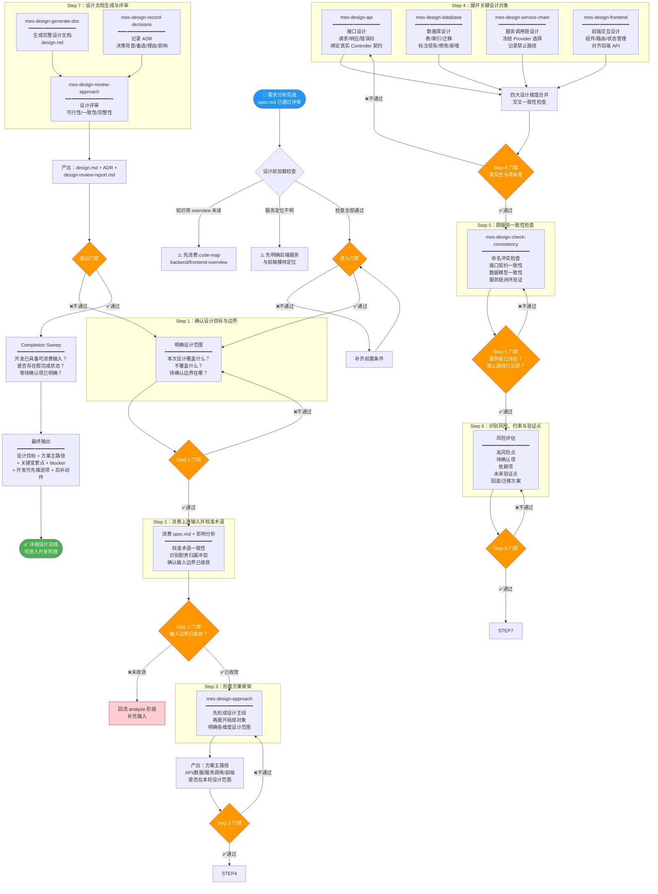
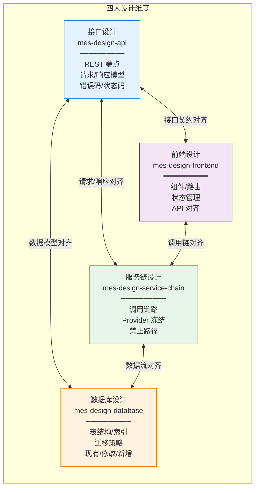
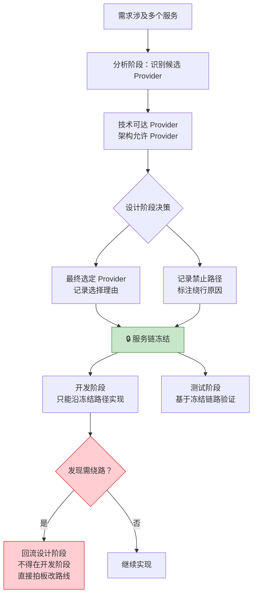
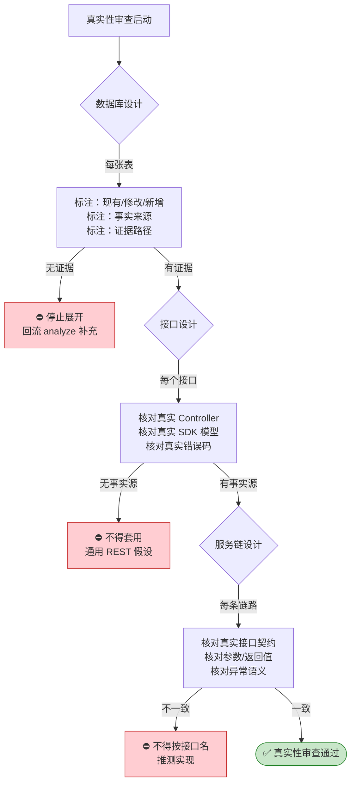
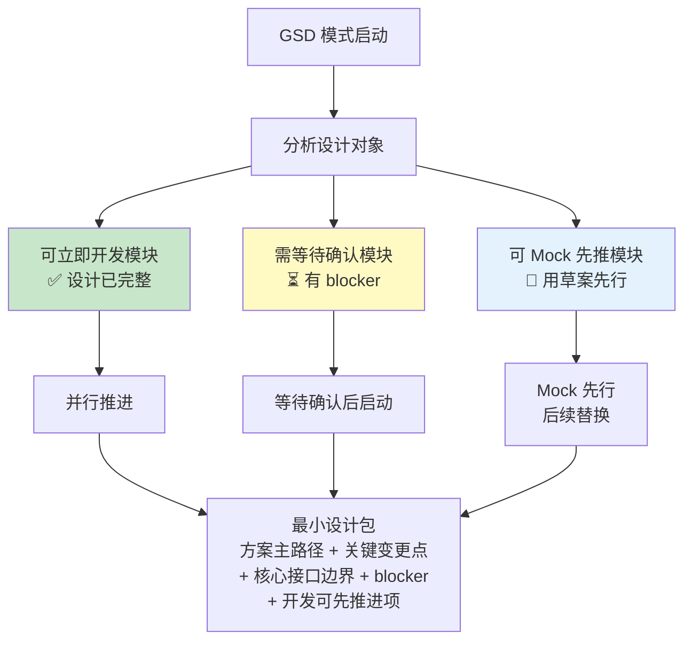

# 阶段三：详细设计 —— 流程图与关键活动说明

> 本文档用于培训，详细说明 MES-AI-DEV 骨架的详细设计阶段流程、技能链、门禁机制和核心产出。

---

## 一、详细设计阶段定位

详细设计阶段将需求分析产出的规格说明转化为 **可开发、可验证、可交接** 的技术设计文档。它是连接"需求是什么"与"代码怎么写"的关键桥梁。

**核心原则**：
- 设计文档必须对开发和测试阶段 **可直接消费**，不能只给抽象口号
- 所有设计对象必须绑定 **真实事实来源**，不得用模板或通用常识补洞
- 服务链必须在设计阶段 **冻结**，开发阶段不得自行改路线

**触发命令**：`/mes-design-detail`

**前置条件**：
- 需求分析已完成（执行过 `/mes-analyze-requirement`）
- 需求规格文档已生成并通过评审

---

## 二、详细设计阶段整体流程图



---

## 三、关键设计对象展开详解

### 3.1 四大设计维度关系



### 3.2 服务链冻结机制



### 3.3 真实性专项审查



---

## 四、详细设计阶段产物结构

```
mes-ai-dev/workspace/designs/REQ-YYYYMMDD-XXX/
├── deliverable/
│   └── design.md                  # 详细设计文档（OpenSpec 格式）
├── report/
│   ├── stage-output-report.md     # 阶段完成产物报告
│   ├── design-review-report.md    # 设计详细审查报告
│   └── truth-review-report.md     # 真实性专项审查报告
├── memory/
│   ├── adr/                       # 架构决策记录
│   │   ├── adr-001-xxx.md
│   │   └── adr-002-xxx.md
│   └── risk-register.md           # 风险登记表
├── handoff/
│   └── design-to-develop-handoff.md  # 设计→开发交接
└── working/
    ├── api-design-draft.md         # 接口设计草案
    ├── db-design-draft.md          # 数据库设计草案
    ├── service-chain-draft.md      # 服务链设计草案
    └── frontend-design-draft.md    # 前端设计草案
```

---

## 五、详细设计阶段门禁检查清单

### 5.1 进入门禁（Enter Gate）

| 检查项 | 层级 | 说明 |
|--------|------|------|
| 需求规格已生成 | must-pass | spec.md 已存在并通过评审 |
| 已加载 code-map overview | must-pass | backend/frontend-overview.md 已读取 |
| 后端服务已定位 | must-pass | 服务名称、代码仓、Schema 已明确 |
| 前端模块已定位 | must-pass | 模块名称、代码仓、路由路径已明确 |
| 已遵循现有模式 | must-pass | 参数开关、数据字典、既有接口等 |

### 5.2 步骤门禁（Step Gate）

| 检查项 | 层级 | 说明 |
|--------|------|------|
| 服务链已冻结 | must-pass | Provider 选择理由已记录 |
| 禁止路径已记录 | must-pass | 绕行原因已标注 |
| 私有契约已引用 | must-pass | 可追溯到定义点 |
| 真实性专项完成 | must-pass | 每个关键对象有事实来源 |

### 5.3 退出门禁（Exit Gate）

| 检查项 | 层级 | 说明 |
|--------|------|------|
| 设计文档已生成 | must-pass | design.md 符合 OpenSpec 格式 |
| 详细审查报告已生成 | must-pass | design-review-report.md |
| ADR 已记录 | must-pass | 关键决策有背景/备选/理由/影响 |
| 开发可消费 | must-pass | 设计信息足以支撑开发阶段 |
| Completion Sweep 完成 | must-pass | 无假完成状态 |
| 阶段完成产物报告 | must-pass | stage-output-report.md |

---

## 六、GSD 模式下的并行开发识别



---

## 七、关键术语表

| 术语 | 含义 |
|------|------|
| **ADR** | Architecture Decision Record，架构决策记录 |
| **服务链冻结** | 设计阶段确定调用路径后不可在开发阶段擅自修改 |
| **禁止路径** | 架构上不允许使用的调用路径，需显式记录 |
| **真实性专项审查** | 确保每个设计对象都来自真实代码/契约，非模板/常识推断 |
| **最小设计包** | GSD 模式下足以支撑开发继续的最小设计结论集 |
| **假完成状态** | 写了很多文档但开发其实没法继续的状态 |
| **私有契约** | 项目特有的接口约定，需从定义点引用 |
