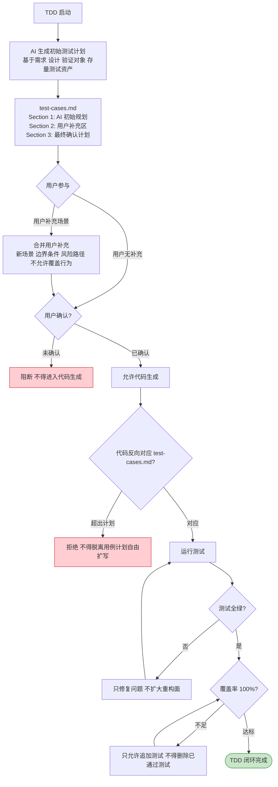
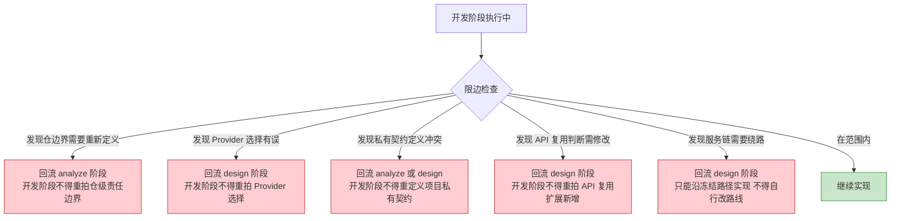
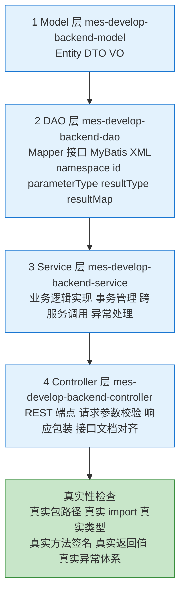
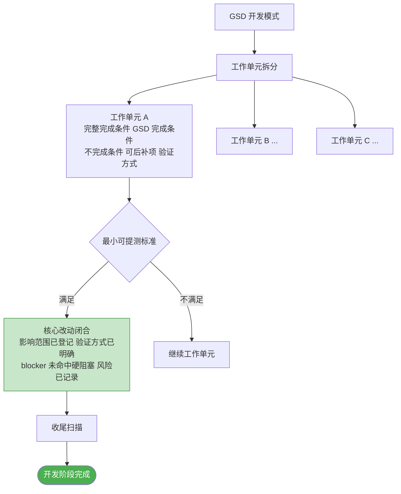

# 阶段四：代码开发 —— 流程图与关键活动说明

> 本文档用于培训，详细说明 MES-AI-DEV 骨架的代码开发阶段流程、技能链、TDD 强制前置、真实性保障和门禁机制。

---

## 一、代码开发阶段定位

代码开发阶段将设计文档转化为 **可编译、可测试、可验证** 的代码产物。它是骨架中工作量最大、执行时间最长的阶段。

**核心原则**：
- **开发阶段只做实现**，不重拍 analyze/design 的主决策
- **TDD 强制前置**，先写测试计划再写代码
- **真实性第一**，每行代码都必须来自真实项目结构
- **存量项目对齐**，不得为生成方便另起平行结构
- **简洁优先**，优先最小必要实现，不制造无关抽象
- **精准修改**，只触碰当前任务直接相关文件，不做顺手格式化、无关重命名或无关重构
- **目标驱动执行**，以编译、测试、覆盖率、TDD 闭环和门禁作为完成标准
- 可按需使用 GitNexus 类代码知识图谱定位最小改动点、消费者与回归路径，但不得据此扩大未确认范围

**触发命令**：`/mes-develop-code`

**前置条件**：
- 详细设计已完成（执行过 `/mes-design-detail`）
- 设计文档已评审通过
- 服务链已冻结、Provider 已选定

---

## 二、代码开发阶段整体流程图

```mermaid
flowchart TB
    START(["详细设计完成 design.md 已评审通过"]) --> PRECHECK{"前置条件检查"}

    PRECHECK -->|"设计文档缺失"| ABORT_DESIGN["先完成设计阶段 mes-design-detail"]
    PRECHECK -->|"契约不可消费"| ABORT_CONTRACT["先确认 contracts.md 与事实源可用"]
    PRECHECK -->|"服务链未冻结"| ABORT_CHAIN["先在设计阶段冻结服务链"]
    PRECHECK -->|"检查全部通过"| GATE_ENTER{"进入门禁"}

    GATE_ENTER -->|"不通过"| FIX_ENTER["补齐前置条件"]
    FIX_ENTER --> GATE_ENTER
    GATE_ENTER -->|"通过"| STEP1

    subgraph S1 ["Step 1: 确认范围与计划"]
        STEP1["明确当前实现目标 确认设计结论 修复目标<br>识别多仓 多服务 DB场景 加载必要场景规则"]
    end

    STEP1 --> STEP2

    subgraph S2 ["Step 2: 读取必要输入"]
        STEP2["消费设计文档与规则<br>读取目标仓现有代码结构 分层 命名 依赖组织<br>读取阶段记忆与交接信息<br>按需使用 GitNexus 辅助定位最小改动集合"]
    end

    STEP2 --> STEP3

    subgraph S3 ["Step 3: TDD 用例计划 强制前置"]
        STEP3["mes-test-plan-cases<br>基于需求 设计 验证对象 生成 test-cases.md<br>AI 初始规划 -> 用户补充区 -> 最终确认计划<br>单元测试计划需考虑跨平台路径与 Mockito 规范"]
    end

    STEP3 --> USER_CONFIRM{"用户确认 test-cases.md?"}
    USER_CONFIRM -->|"用户未确认"| WAIT_USER["等待用户补充与确认"]
    WAIT_USER --> USER_CONFIRM
    USER_CONFIRM -->|"用户已确认"| STEP4

    subgraph S4 ["Step 4: 数据库开发"]
        STEP4["进入数据库开发"] --> STEP4A["mes-develop-database-script DDL 和 DML 脚本"]
        STEP4 --> STEP4B["mes-develop-db-migration 迁移策略与回滚方案"]
    end

    STEP4A --> GATE_S4{"Step 4 门禁 脚本真实性验证"}
    STEP4B --> GATE_S4

    GATE_S4 -->|"不通过"| STEP4A
    GATE_S4 -->|"通过"| STEP5A

    STEP5A["mes-develop-backend-model Entity DTO VO"]
    STEP5B["mes-develop-backend-dao Mapper Repository MyBatis XML"]
    STEP5C["mes-develop-backend-service 业务逻辑层"]
    STEP5D["mes-develop-backend-controller REST 端点"]

    STEP5A --> STEP5B
    STEP5B --> STEP5C
    STEP5C --> STEP5D

    STEP5D --> GATE_S5{"Step 5 门禁 真实性专项审查<br>包路径 import 类型 方法 返回值 异常体系"}
    GATE_S5 -->|"不通过"| STEP5A
    GATE_S5 -->|"通过"| STEP6A

    STEP6A["mes-develop-frontend-api API 调用层 Axios 请求方法"]
    STEP6B["mes-develop-frontend-component Vue UI 组件"]
    STEP6C["mes-develop-frontend-page Vue 页面与路由"]

    STEP6A --> STEP6B
    STEP6B --> STEP6C

    STEP6C --> GATE_S6{"Step 6 门禁 前端对齐后端 API?"}
    GATE_S6 -->|"不通过"| STEP6A
    GATE_S6 -->|"通过"| STEP7

    subgraph S7 ["Step 7: 配置更新"]
        STEP7["mes-develop-backend-config<br>application.yml restService.properties 其他配置文件"]
    end

    STEP7 --> GATE_S7{"Step 7 门禁"}
    GATE_S7 -->|"不通过"| STEP7
    GATE_S7 -->|"通过"| STEP8

    subgraph S8 ["Step 8: 执行验证"]
        STEP8["验证流程<br>1. 新生成测试用例全部通过<br>2. 覆盖率达到 100%<br>3. 静态真实性检查<br>   - Java 引用可解析性<br>   - MyBatis 映射一致性<br>   - Provider 契约一致性"]
    end

    STEP8 --> GATE_S8{"Step 8 门禁<br>测试全绿? 覆盖率达标?"}
    GATE_S8 -->|"不通过 只允许补充测试"| STEP8
    GATE_S8 -->|"通过"| STEP9A

    STEP9A["mes-develop-self-review 代码风格一致性 产物完整性 风险说明"]
    STEP9B["mes-develop-security-review SQL注入 XSS 访问控制 敏感数据"]

    STEP9A --> STEP9B
    STEP9B --> GATE_EXIT{"退出门禁"}

    GATE_EXIT -->|"不通过"| STEP1
    GATE_EXIT -->|"通过"| REPORT["输出阶段完成产物报告<br>development-review-report.md<br>tasks.md 主交接文档"]

    REPORT --> DONE(["代码开发完成 可进入测试阶段"])

    style START fill:#2196F3,color:white
    style DONE fill:#4CAF50,color:white
    style GATE_ENTER fill:#FF9800,color:white
    style USER_CONFIRM fill:#FF9800,color:white
    style GATE_S4 fill:#FF9800,color:white
    style GATE_S5 fill:#FF9800,color:white
    style GATE_S6 fill:#FF9800,color:white
    style GATE_S7 fill:#FF9800,color:white
    style GATE_S8 fill:#FF9800,color:white
    style GATE_EXIT fill:#FF9800,color:white
    style ABORT_DESIGN fill:#FFCDD2,stroke:#C62828
    style ABORT_CONTRACT fill:#FFCDD2,stroke:#C62828
    style ABORT_CHAIN fill:#FFCDD2,stroke:#C62828
```



---

## 三、TDD 强制前置流程详解



---

## 四、开发阶段限边规则（禁止行为）



---

## 五、后端分层开发流程



---

## 六、代码开发阶段产物结构

```
mes-ai-dev/workspace/development/{REQ-ID}/
├── deliverable/
│   └── tasks.md                   # 开发主交接文档（OpenSpec 格式）
├── report/
│   ├── stage-output-report.md     # 阶段完成产物报告
│   ├── development-review-report.md  # 开发详细审查报告
│   ├── truth-review-report.md     # 真实性专项自审结论
│   └── tdd-closure-report.md      # TDD 执行闭环结论
├── evidence/
│   ├── test-results.md            # 测试执行结果
│   ├── coverage-report.md         # 覆盖率报告
│   └── build-output.md            # 构建/编译输出
├── memory/
│   ├── pitfall-log.md             # 坑点记录
│   └── decision-log.md            # 开发期决策日志
├── handoff/
│   └── develop-to-test-handoff.md # 开发到测试交接
└── working/
    ├── test-cases.md              # TDD 用例计划
    └── code-changes-summary.md    # 代码变更摘要
```

---

## 七、代码开发阶段门禁检查清单

### 7.1 进入门禁（Enter Gate）

| 检查项 | 层级 | 说明 |
|--------|------|------|
| 设计文档已通过评审 | must-pass | design.md 存在且已审查 |
| 服务链已冻结 | must-pass | Provider/禁止路径已确定 |
| 契约知识可消费 | must-pass | contracts.md 与事实源可用 |
| 存量项目结构已读取 | must-pass | 目录/分层/命名/依赖/测试组织 |

### 7.2 步骤门禁（Step Gate）

| 检查项 | 层级 | 说明 |
|--------|------|------|
| TDD 用例计划已确认 | must-pass | 用户已补充并确认 test-cases.md |
| 代码遵循冻结路径 | must-pass | 不得绕开架构允许路径 |
| 真实性闭环 | must-pass | 包路径/import/类型/方法/异常 |
| 存量结构贴合 | must-pass | 不另起平行结构 |

### 7.3 退出门禁（Exit Gate）

| 检查项 | 层级 | 说明 |
|--------|------|------|
| 新生成测试全部通过 | must-pass | 0 失败 |
| 行覆盖率、分支覆盖率、方法覆盖率 100% | must-pass | 本轮改动范围内 |
| 真实性专项自审完成 | must-pass | Java/MyBatis/Provider 契约一致性 |
| TDD 执行闭环结论 | must-pass | 计划先行→用户补充→确认→全绿→覆盖率达标 |
| 存量结构贴合结论 | must-pass | 遵循目标仓既有模式 |
| 详细审查报告已生成 | must-pass | development-review-report.md |
| tasks.md 主交接文档 | must-pass | 含 TDD/覆盖率/存量贴合结论 |
| 阶段完成产物报告 | must-pass | stage-output-report.md |

---

## 八、GSD 模式下的工作单元 DoD



---

## 九、关键术语表

| 术语 | 含义 |
|------|------|
| **TDD 强制前置** | 必须先写测试计划并经用户确认，再写代码 |
| **限边规则** | 开发阶段不得重做 analyze/design 的主决策 |
| **真实性专项** | 代码必须来自真实包路径/类型/方法，不得用模板补洞 |
| **存量结构贴合** | 在已有项目中，必须复用既有目录/分层/命名模式 |
| **工作单元 DoD** | Definition of Done，每个工作单元的完成标准 |
| **最小可提测** | GSD 模式下可提交测试的最小闭合改动集 |
| **tasks.md** | 开发阶段主交接文档，固定命名 |
| **覆盖率 100%** | 本轮生成/修改并纳入验证范围的代码行 |
