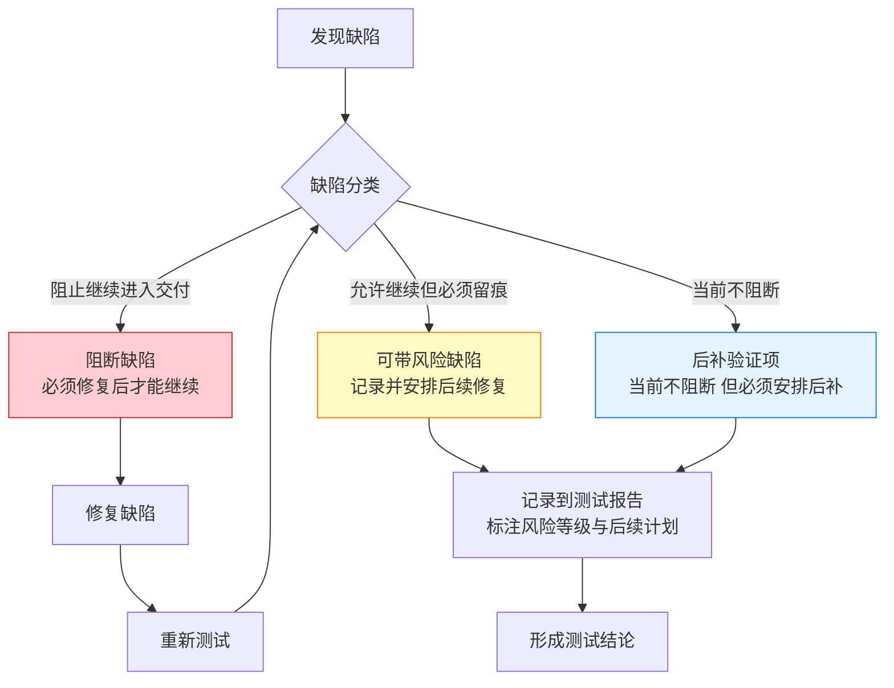

# 阶段五：测试验证 —— 流程图与关键活动说明

> 本文档用于培训，详细说明 MES-AI-DEV 骨架的测试验证阶段流程、技能链、TDD 闭环、缺陷分类和门禁机制。

---

## 一、测试验证阶段定位

测试验证阶段对开发产出的代码进行系统化验证，识别剩余风险与未覆盖范围，形成可供交付阶段消费的测试结论与证据材料。

**核心原则**：
- 测试阶段不重新定义仓边界、provider 或契约，基于上游已冻结结论做验证
- TDD 闭环必须核对，不得绕开已确认的测试范围
- 覆盖率 100% 是硬性要求，只允许追加测试，不允许删除已通过用例

**触发命令**：`/mes-test-verify`

**前置条件**：
- 代码开发已完成（执行过 `/mes-develop-code`）
- 已存在开发阶段先行生成并经用户确认的 `test-cases.md`
- 契约事实源与回归范围已明确

---

## 二、测试验证阶段整体流程图

```mermaid
flowchart TB
    START(["开发完成 tasks.md 已交接"]) --> PRECHECK{"前置条件检查"}

    PRECHECK -->|"test-cases.md 不存在"| ABORT_TDD["先在开发阶段生成 test-cases.md 并经用户确认"]
    PRECHECK -->|"契约回归范围不明"| ABORT_CONTRACT["先确认契约事实源与回归范围"]
    PRECHECK -->|"检查全部通过"| GATE_ENTER{"进入门禁"}

    GATE_ENTER -->|"不通过"| FIX_ENTER["补齐前置条件"]
    FIX_ENTER --> GATE_ENTER
    GATE_ENTER -->|"通过"| STEP1

    subgraph S1 ["Step 1: 测试规划"]
        STEP1["mes-test-plan-cases<br>基于 test-cases.md 已确认计划<br>规划单元测试与集成测试范围<br>识别回归测试点"]
    end

    STEP1 --> GATE_S1{"Step 1 门禁<br>测试范围已明确?"}
    GATE_S1 -->|"不通过"| STEP1
    GATE_S1 -->|"通过"| STEP2

    subgraph S2 ["Step 2: 单元测试生成与执行"]
        STEP2["mes-test-generate-unit<br>为后端各层生成 JUnit 单元测试<br>核对真实包路径 import 类型<br>执行测试并收集结果"]
    end

    STEP2 --> GATE_S2{"Step 2 门禁<br>测试全绿? 覆盖率达标?"}
    GATE_S2 -->|"不通过 只允许补充测试"| STEP2
    GATE_S2 -->|"通过"| STEP3

    subgraph S3 ["Step 3: 集成测试生成与执行"]
        STEP3["mes-test-generate-integration<br>生成跨服务集成测试场景<br>验证服务链路与数据流<br>执行并收集结果"]
    end

    STEP3 --> GATE_S3{"Step 3 门禁<br>集成测试通过?"}
    GATE_S3 -->|"不通过"| STEP3
    GATE_S3 -->|"通过"| STEP4

    subgraph S4 ["Step 4: 性能分析"]
        STEP4["mes-test-performance-analysis<br>识别慢查询与 N+1 问题<br>分析关键路径性能<br>给出优化建议"]
    end

    STEP4 --> GATE_S4{"Step 4 门禁<br>性能达标?"}
    GATE_S4 -->|"不通过"| STEP4
    GATE_S4 -->|"通过"| STEP5

    subgraph S5 ["Step 5: 关键验证补充"]
        STEP5["关键验证补充<br>- 契约消费一致性验证<br>- Provider 路径合规验证<br>- 接口复用无平行实现验证<br>- 空模板误消费阻断验证"]
    end

    STEP5 --> GATE_S5{"Step 5 门禁<br>专项验证通过?"}
    GATE_S5 -->|"不通过"| STEP5
    GATE_S5 -->|"通过"| STEP6

    subgraph S6 ["Step 6: 测试报告生成"]
        STEP6["mes-test-generate-report<br>汇总测试结果与覆盖率<br>记录缺陷分类与风险<br>生成 test-review-report.md"]
    end

    STEP6 --> GATE_EXIT{"退出门禁"}

    GATE_EXIT -->|"不通过"| STEP1
    GATE_EXIT -->|"通过"| SWEEP["Completion Sweep<br>已形成明确测试结论?<br>已区分阻断与可带风险问题?<br>已说明回开发还是可进交付?"]

    SWEEP --> FINAL["最终输出<br>测试目标 + 最小提测集范围 + blocker<br>+ 阻断缺陷列表 + 可带风险缺陷列表<br>+ 是否建议进入交付 + 后补验证动作"]

    FINAL --> DONE(["测试验证完成 可进入交付阶段"])

    style START fill:#2196F3,color:white
    style DONE fill:#4CAF50,color:white
    style GATE_ENTER fill:#FF9800,color:white
    style GATE_S1 fill:#FF9800,color:white
    style GATE_S2 fill:#FF9800,color:white
    style GATE_S3 fill:#FF9800,color:white
    style GATE_S4 fill:#FF9800,color:white
    style GATE_S5 fill:#FF9800,color:white
    style GATE_EXIT fill:#FF9800,color:white
    style ABORT_TDD fill:#FFCDD2,stroke:#C62828
    style ABORT_CONTRACT fill:#FFCDD2,stroke:#C62828
```



---

## 三、缺陷三分类决策



---

## 四、测试验证阶段产物结构

```
mes-ai-dev/workspace/testing/REQ-YYYYMMDD-XXX/
├── deliverable/
│   └── test-report.md             # 测试总结报告
├── report/
│   ├── stage-output-report.md     # 阶段完成产物报告
│   └── test-review-report.md      # 测试详细审查报告
├── evidence/
│   ├── unit-test-results.md       # 单元测试执行结果
│   ├── integration-test-results.md # 集成测试执行结果
│   ├── coverage-report.md         # 覆盖率报告
│   └── performance-report.md      # 性能分析报告
├── memory/
│   └── defect-register.md         # 缺陷登记表
├── handoff/
│   └── test-to-deliver-handoff.md # 测试到交付交接
└── working/
    └── test-execution-log.md      # 测试执行日志
```

---

## 五、测试验证阶段门禁检查清单

### 5.1 进入门禁（Enter Gate）

| 检查项 | 层级 | 说明 |
|--------|------|------|
| 开发已完成 | must-pass | tasks.md 已交接 |
| test-cases.md 已确认 | must-pass | 用户已补充并确认 |
| 契约回归范围已明确 | must-pass | 事实源与回归范围清晰 |

### 5.2 步骤门禁（Step Gate）

| 检查项 | 层级 | 说明 |
|--------|------|------|
| 测试全绿 | must-pass | 0 失败 |
| 覆盖率 100% | must-pass | 本轮改动范围内 |
| 契约消费一致 | must-pass | 来源类型与消费结果一致 |
| Provider 路径合规 | must-pass | 沿架构允许路径调用 |
| 无平行实现 | must-pass | 未在下游重造平行能力 |
| 空模板未误消费 | must-pass | 占位态未被当作正式规范 |

### 5.3 退出门禁（Exit Gate）

| 检查项 | 层级 | 说明 |
|--------|------|------|
| 测试报告已生成 | must-pass | test-review-report.md |
| 缺陷已分类 | must-pass | 阻断/可带风险/后补已区分 |
| 可交付性已有结论 | must-pass | 明确建议进入交付或回开发 |
| 阶段完成产物报告 | must-pass | stage-output-report.md |

---

## 六、关键术语表

| 术语 | 含义 |
|------|------|
| **TDD 闭环** | 开发阶段已生成的 test-cases.md 必须在测试阶段核对闭环 |
| **最小提测集** | 核心主路径 + 关键回归点 + 最易导致交付失败的阻断项 |
| **阻断缺陷** | 阻止继续进入交付阶段的缺陷，必须修复 |
| **可带风险缺陷** | 允许继续但必须留痕记录的缺陷 |
| **后补验证项** | 当前不阻断但必须安排后续补充的验证 |
| **契约消费一致性** | 验证实际使用契约与定义源是否一致 |
| **Provider 路径合规** | 验证是否沿冻结路径调用，非仅验证能调通 |
