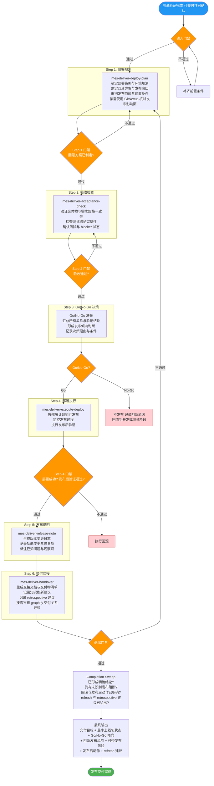
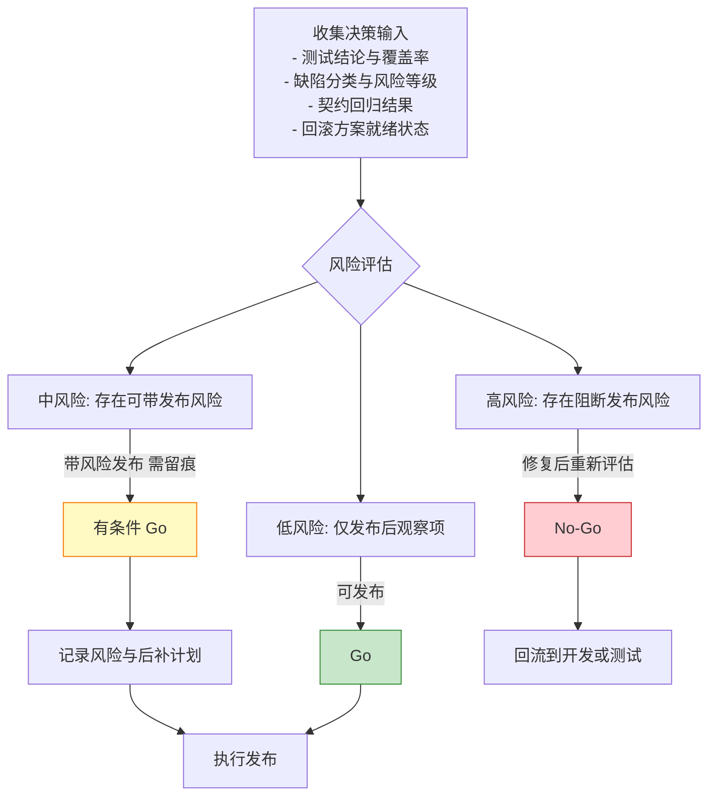
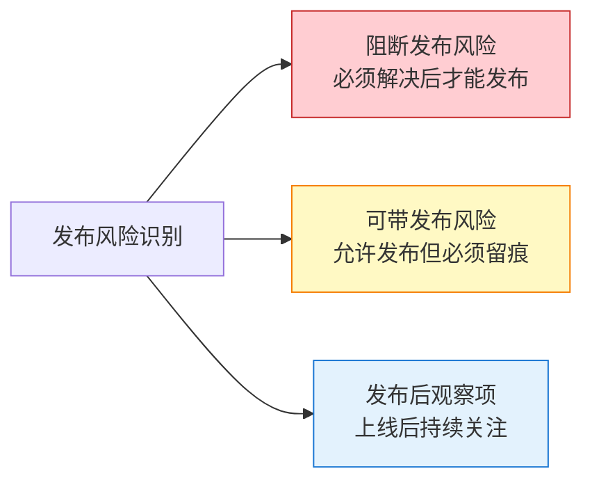

# 阶段六：发布交付 —— 流程图与关键活动说明

> 本文档用于培训，详细说明 MES-AI-DEV 骨架的发布交付阶段流程、Go/No-Go 决策、风险分层和门禁机制。

---

## 一、发布交付阶段定位

发布交付阶段将已完成设计、开发、测试并具备基本交付条件的结果，转化为可执行的发布动作、可审查的验收结论和可恢复的交接状态。

**核心原则**：
- 交付阶段不重新定义契约、provider 或仓边界，基于测试与回归结果做发布判断
- 必须形成明确的 Go/No-Go 倾向与回滚策略
- 发布后观察项与后补治理动作必须显式记录
- 编码前思考：发布前明确交付对象、Go/No-Go 标准、风险分层、回滚策略和观察指标
- 简洁优先：交付材料服务发布判断、回滚恢复和交接消费，不生成无关长文档
- 精准修改：不得在交付阶段重做需求、设计、测试或仓边界决策
- 目标驱动执行：以部署计划、验收结论、回滚路径和交接状态作为完成标准
- 可按需使用 GitNexus 类代码知识图谱核对发布包影响面、调用链、消费者和回滚路径
- 可按需使用 graphify 类能力表达需求项、测试结论、验收结论、发布风险与交接对象之间的关系

**触发命令**：`/mes-deliver-release`

**前置条件**：
- 测试验证已完成（执行过 `/mes-test-verify`）
- 测试报告确认通过
- 契约变更已完成回归验证

---

## 二、发布交付阶段整体流程图



---

## 三、Go/No-Go 决策流程



---

## 四、风险三分类



---

## 五、发布交付阶段产物结构

```
mes-ai-dev/workspace/delivery/{REQ-ID}/
├── deliverable/
│   ├── release-note.md            # 发布说明与版本变更日志
│   └── handover-doc.md            # 交接文档
├── report/
│   ├── stage-output-report.md     # 阶段完成产物报告
│   └── delivery-review-report.md  # 交付详细审查报告
├── evidence/
│   ├── acceptance-evidence.md     # 验收证据
│   ├── deploy-log.md              # 部署执行日志
│   └── go-nogo-record.md          # Go/No-Go 决策记录
├── memory/
│   ├── release-risk-register.md   # 发布风险登记表
│   └── retrospective-notes.md     # 回顾会议记录
├── handoff/
│   └── deliver-to-refresh-handoff.md # 交付到知识刷新交接
└── working/
    ├── deploy-plan-draft.md       # 部署计划草案
    └── rollback-plan.md           # 回滚方案
```

---

## 六、发布交付阶段门禁检查清单

### 6.1 进入门禁（Enter Gate）

| 检查项 | 层级 | 说明 |
|--------|------|------|
| 测试验证已完成 | must-pass | test-review-report.md 已通过 |
| 可交付性已有结论 | must-pass | 测试阶段明确建议可交付 |
| 契约回归已完成 | must-pass | 变更已完成回归验证 |

### 6.2 步骤门禁（Step Gate）

| 检查项 | 层级 | 说明 |
|--------|------|------|
| 回滚方案已制定 | must-pass | 可执行的回滚策略 |
| 验收检查已通过 | must-pass | 交付物与需求一致 |
| Go/No-Go 已决策 | must-pass | 明确发布倾向与理由 |
| 部署执行成功 | must-pass | 发布后验证通过 |

### 6.3 退出门禁（Exit Gate）

| 检查项 | 层级 | 说明 |
|--------|------|------|
| 发布说明已生成 | must-pass | release-note.md |
| 交接文档已生成 | must-pass | handover-doc.md |
| 交付审查报告已生成 | must-pass | delivery-review-report.md |
| refresh 建议已给出 | must-pass | 知识刷新需求已识别 |
| 阶段完成产物报告 | must-pass | stage-output-report.md |

---

## 七、关键术语表

| 术语 | 含义 |
|------|------|
| **Go/No-Go** | 发布决策：Go 允许发布，No-Go 不允许发布 |
| **最小上线包** | 发布对象与范围 + Go/No-Go 倾向 + 风险 + 回滚 + 观察项 |
| **阻断发布风险** | 必须解决后才能发布的风险 |
| **可带发布风险** | 允许发布但必须留痕的风险 |
| **发布后观察项** | 上线后需持续关注的项 |
| **retrospective** | 发布后回顾，识别改进点 |
