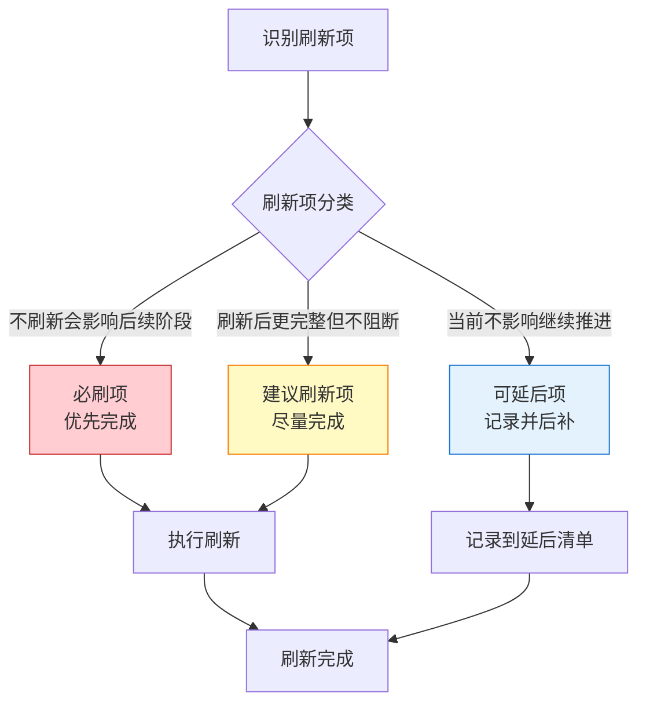

# 阶段七：知识刷新 —— 流程图与关键活动说明

> 本文档用于培训，详细说明 MES-AI-DEV 骨架的知识刷新阶段流程、增量更新策略和门禁机制。

---

## 一、知识刷新阶段定位

知识刷新阶段识别代码与知识之间的差异，执行增量更新，保持知识库与代码仓的同步。它是保持骨架长期有效运行的关键维护机制。

**核心原则**：
- 增量刷新优先，不重新全量扫描
- 优先消费 develop/deliver 产出的 `refresh-hints.md`
- 不得在未识别变更范围时直接覆盖共享知识文件

**触发命令**：`/mes-refresh-knowledge`

**前置条件**：
- 知识库已初始化（执行过 `/mes-init-project`）
- 存在统一状态源（state.yaml）
- 代码仓库 Git 状态正常

**适用时机**：
- 开发完成后同步知识库
- 代码仓库有新提交需要同步
- 定期维护知识库

---

## 二、知识刷新阶段整体流程图

```mermaid
flowchart TB
    START(["触发知识刷新"]) --> HINTS{"存在 refresh-hints.md?"}

    HINTS -->|"是"| USE_HINTS["消费 refresh-hints.md<br>作为增量刷新边界输入"]
    HINTS -->|"否"| DETECT_DIRECT["直接检测变更"]

    USE_HINTS --> STEP1
    DETECT_DIRECT --> STEP1

    subgraph S1 ["Step 1: 检测变化范围"]
        STEP1["mes-refresh-detect-changes<br>对比代码仓与知识库差异<br>识别受影响的代码 模式 与契约<br>生成变更影响清单"]
    end

    STEP1 --> GATE_S1{"Step 1 门禁<br>变更范围已明确?"}
    GATE_S1 -->|"不通过"| STEP1
    GATE_S1 -->|"通过"| STEP2

    subgraph S2 ["Step 2: API 注册表更新"]
        STEP2["mes-refresh-update-api-registry<br>更新受影响的 API 端点信息<br>同步新增 修改 删除的接口<br>更新 api-registry.md"]
    end

    STEP2 --> STEP3

    subgraph S3 ["Step 3: Code Map 更新"]
        STEP3["mes-refresh-update-code-map<br>更新受影响的服务 模块 描述<br>同步文件摘要与索引<br>更新 overview 与 code-map"]
    end

    STEP3 --> STEP4

    subgraph S4 ["Step 4: 依赖图更新"]
        STEP4["mes-refresh-update-dependency<br>更新受影响的服务依赖关系<br>同步数据库归属变更<br>更新 service-dependencies"]
    end

    STEP4 --> GATE_S2{"Step 2-4 门禁<br>局部更新已完成?"}
    GATE_S2 -->|"不通过"| STEP2
    GATE_S2 -->|"通过"| STEP5

    subgraph S5 ["Step 5: 质量验证"]
        STEP5["mes-refresh-validate-quality<br>校验更新后知识的一致性<br>检查覆盖率与可信度<br>识别缺失或冲突"]
    end

    STEP5 --> GATE_S3{"Step 5 门禁<br>质量验证通过?"}
    GATE_S3 -->|"不通过"| STEP5
    GATE_S3 -->|"通过"| CONVERGE_CHECK

    CONVERGE_CHECK{"是否影响全局共享知识?"}
    CONVERGE_CHECK -->|"是"| NEED_CONVERGE["需要后续执行<br>mes-init-converge"]
    CONVERGE_CHECK -->|"否"| NO_CONVERGE["仅局部更新即可"]

    NEED_CONVERGE --> GATE_EXIT
    NO_CONVERGE --> GATE_EXIT

    GATE_EXIT{"退出门禁"}

    GATE_EXIT -->|"不通过"| STEP1
    GATE_EXIT -->|"通过"| SWEEP["Completion Sweep<br>关键知识已同步?<br>当前知识可继续消费?<br>哪些内容仍待后补?"]

    SWEEP --> FINAL["最终输出<br>必刷项列表 + 延后刷新项列表<br>+ 当前知识可用性结论<br>+ 风险 + 后补动作"]

    FINAL --> DONE(["知识刷新完成"])

    style START fill:#2196F3,color:white
    style DONE fill:#4CAF50,color:white
    style GATE_S1 fill:#FF9800,color:white
    style GATE_S2 fill:#FF9800,color:white
    style GATE_S3 fill:#FF9800,color:white
    style GATE_EXIT fill:#FF9800,color:white
    style NEED_CONVERGE fill:#FFF9C4,stroke:#F57C00
```



---

## 三、刷新项三分类



---

## 四、知识刷新阶段产物结构

```
mes-ai-dev/workspace/refresh/
├── deliverable/
│   └── refresh-summary.md         # 刷新总结
├── report/
│   ├── stage-output-report.md     # 阶段完成产物报告
│   └── refresh-review-report.md   # 刷新详细审查报告
├── evidence/
│   └── change-detection-evidence.md # 变更检测证据
└── working/
    ├── change-impact-list.md      # 变更影响清单
    ├── must-refresh-items.md      # 必刷项清单
    └── deferred-items.md          # 延后刷新项清单
```

---

## 五、知识刷新阶段门禁检查清单

### 5.1 进入门禁

| 检查项 | 层级 | 说明 |
|--------|------|------|
| 知识库已初始化 | must-pass | state.yaml 存在 |
| 变更输入已具备 | must-pass | refresh-hints.md 或等价证据 |
| Git 状态正常 | must-pass | 可检测变更 |

### 5.2 步骤门禁

| 检查项 | 层级 | 说明 |
|--------|------|------|
| 变更范围已明确 | must-pass | 不盲目全量刷新 |
| 局部更新已完成 | must-pass | 受影响文件已更新 |
| 质量验证通过 | must-pass | 一致性无冲突 |
| 未覆盖范围已记录 | must-pass | 明确未更新原因 |

### 5.3 退出门禁

| 检查项 | 层级 | 说明 |
|--------|------|------|
| 必刷项已完成 | must-pass | 核心知识已同步 |
| 刷新报告已生成 | must-pass | refresh-review-report.md |
| 知识可用性结论 | must-pass | 是否足以支撑后续阶段 |
| 是否需要 converge | should-check | 全局共享知识影响评估 |
| 阶段完成产物报告 | must-pass | stage-output-report.md |

---

## 六、硬约束

| 约束 | 说明 |
|------|------|
| 不得未识别变更范围就覆盖共享知识 | 必须先检测再更新 |
| 不得缺少证据就写知识不受影响 | 需要验证依据 |
| 不得绕过 refresh-hints | 优先消费上游刷新提示 |
| 不得未说明未更新原因就结束 | 显式记录知识边界 |

---

## 七、关键术语表

| 术语 | 含义 |
|------|------|
| **增量刷新** | 只更新受变更影响的知识，不重新全量扫描 |
| **refresh-hints.md** | develop/deliver 阶段产出的刷新提示文件 |
| **必刷项** | 不刷新会影响后续阶段正确判断的知识项 |
| **可延后项** | 当前不影响继续推进，可后补刷新的知识项 |
| **收敛状态** | 全局共享知识文件的一致性状态，可能需要重新 converge |
