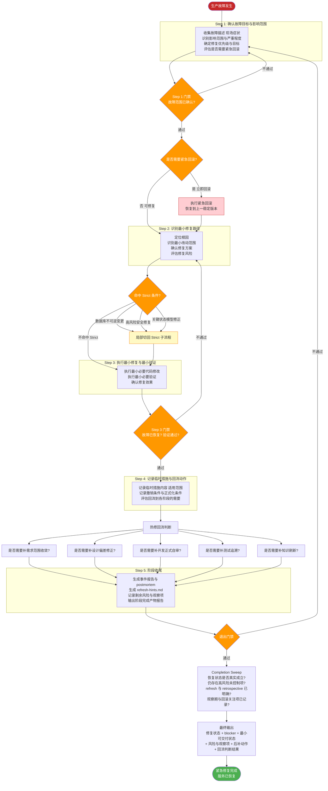
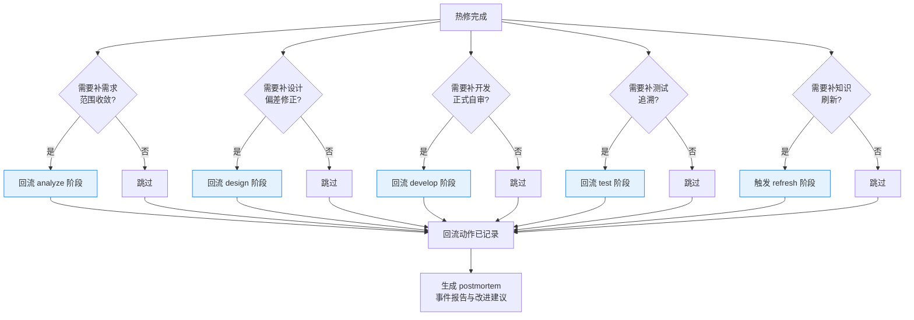
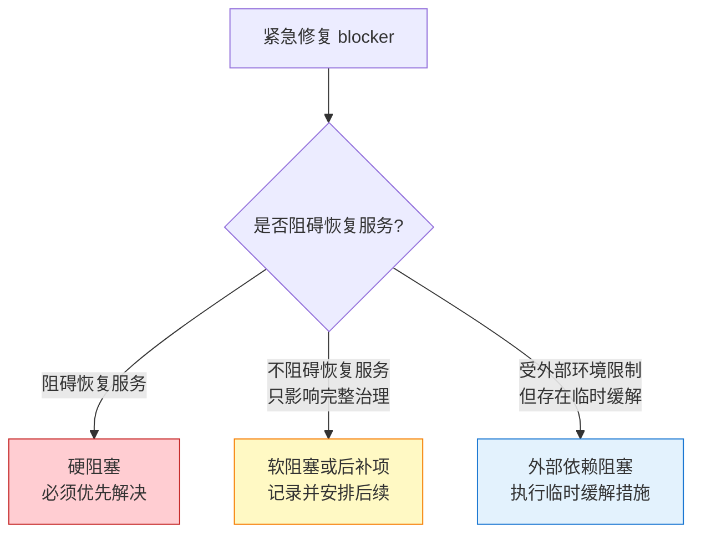

# 阶段八：紧急修复 —— 流程图与关键活动说明

> 本文档用于培训，详细说明 MES-AI-DEV 骨架的紧急修复阶段流程、热修回流机制和门禁机制。

---

## 一、紧急修复阶段定位

紧急修复阶段是骨架中唯一允许绕过正常开发流程的阶段，以最短时间恢复服务。但它不是主治理链的替代路径，完成后必须回流到正常流程补充治理。

**核心原则**：
- 先恢复服务，再补治理
- 修复优先最小改动，不做额外重构
- 热修后必须明确回流到 analyze/design/develop/test/refresh
- 临时措施必须记录撤销条件与正式化条件

**触发命令**：`/mes-emergency-fix`

**前置条件**：无（紧急情况可绕过正常前置条件）

**适用场景**：
- 生产环境核心功能异常
- 发现紧急安全漏洞
- 需要快速回滚

---

## 二、紧急修复阶段整体流程图



---

## 三、热修回流主链



---

## 四、紧急修复 blocker 分类



---

## 五、紧急修复阶段产物结构

```
mes-ai-dev/workspace/emergency/EMG-YYYYMMDD-XXX/
├── deliverable/
│   ├── incident-report.md         # 事件报告
│   └── postmortem.md              # 复盘报告
├── report/
│   ├── stage-output-report.md     # 阶段完成产物报告
│   └── emergency-review-report.md # 紧急修复审查报告
├── evidence/
│   ├── fix-evidence.md            # 修复证据
│   └── verification-evidence.md   # 验证证据
├── memory/
│   ├── temporary-measures.md      # 临时措施记录
│   ├── residual-risks.md          # 剩余风险说明
│   └── reflow-checklist.md        # 回流判断清单
├── handoff/
│   └── emergency-to-refresh-handoff.md # 紧急修复到知识刷新交接
└── working/
    ├── root-cause-analysis.md     # 根因分析
    └── refresh-hints.md           # 知识刷新提示
```

---

## 六、紧急修复阶段门禁检查清单

### 6.1 进入条件

| 检查项 | 层级 | 说明 |
|--------|------|------|
| 存在需要立即处理的生产问题 | must-pass | 高优先级故障 |
| 已具备最小故障描述 | must-pass | 影响范围或现场症状 |

### 6.2 步骤门禁

| 检查项 | 层级 | 说明 |
|--------|------|------|
| 故障影响范围已明确 | must-pass | 不盲目修复 |
| 修复方案为最小改动 | must-pass | 不做额外重构 |
| 最小必要验证已完成 | must-pass | 不得跳过验证 |
| 临时措施已记录 | must-pass | 含撤销条件 |

### 6.3 退出门禁

| 检查项 | 层级 | 说明 |
|--------|------|------|
| 故障已恢复或显著缓解 | must-pass | 恢复状态真实成立 |
| 事件报告已生成 | must-pass | incident-report.md |
| 回流判断已完成 | must-pass | 五阶段回流评估 |
| refresh-hints 已生成 | must-pass | 知识刷新提示 |
| 剩余风险已记录 | must-pass | 观察期与关注项 |
| 阶段完成产物报告 | must-pass | stage-output-report.md |

---

## 七、硬约束

| 约束 | 说明 |
|------|------|
| 不得以紧急修复之名跳过最小验证 | 最小验证不可省略 |
| 不得只修代码而不记录临时措施 | 临时措施必须留痕 |
| 不得将热修结果视为已完成闭环 | 必须回流到主治理链 |
| 不得遗漏回流判断 | 五阶段回流评估不可省略 |
| 数据库不可逆变更必须切回 Strict | 不得以 GSD 绕过 |

---

## 八、关键术语表

| 术语 | 含义 |
|------|------|
| **热修回流** | 紧急修复后回流到正常治理链补充治理 |
| **临时措施** | 短期方案，含适用范围与撤销条件 |
| **postmortem** | 事后复盘，分析根因与改进点 |
| **硬阻塞** | 阻碍恢复服务，必须优先解决 |
| **软阻塞** | 不阻碍恢复但影响完整治理 |
| **Strict 局部切换** | 紧急修复中命中高风险场景时局部切回严格模式 |
| **refresh-hints.md** | 热修后产出的知识刷新提示 |
